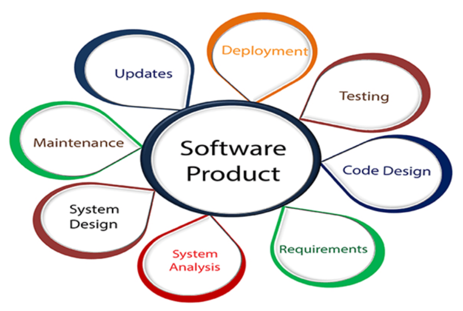
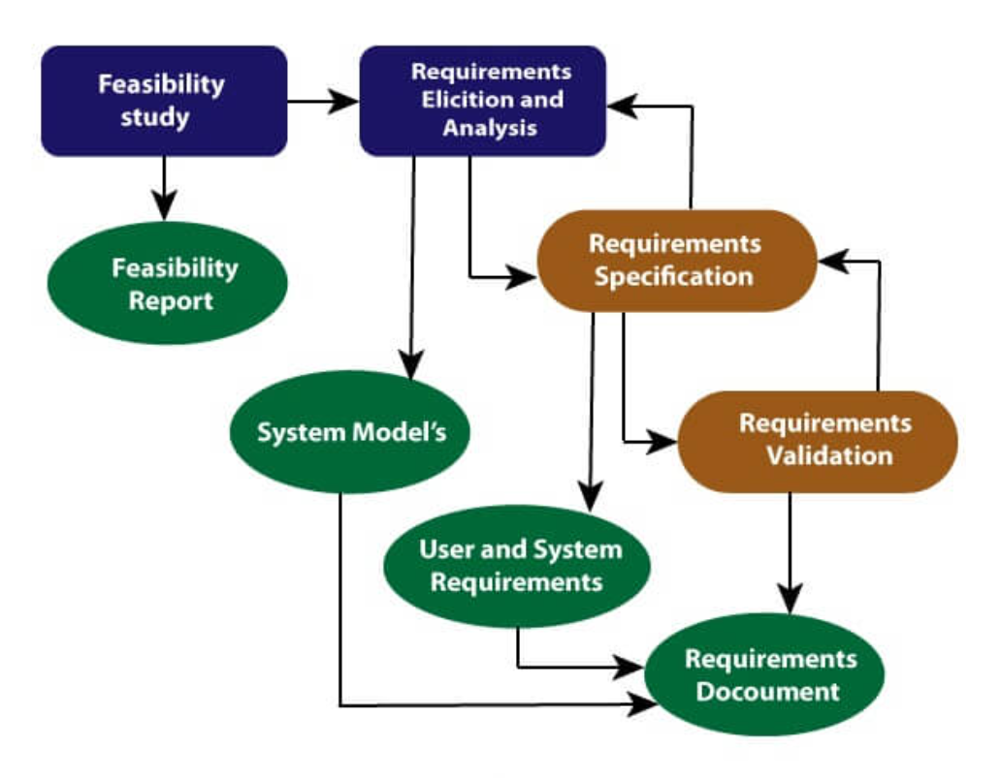
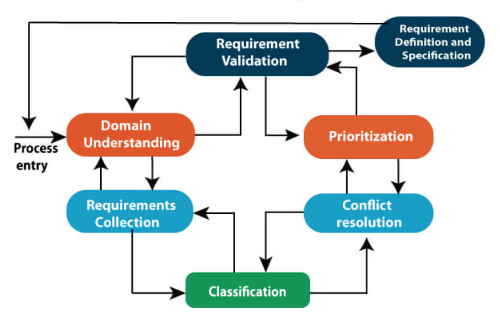

# <u>Chapter 1</u>: INTRODUCTION

## **Topic - 1: Answering The Questions**

### <u>Definitions</u>

- **<u>Software</u>:** Set of integrated programs.
- **<u>Engineering</u>:** Application of scientific principles practically to invent, design, build, maintain, improve the frameworks or processes.
- **<u>Software engineering</u>:** Engineering branch which deals with making & evolution of software products.

### <u>Steps Making Software Products</u>

> **<u>NOTE</u>:**
> Whatever points are in these notes or any of them, they can be expanded & even more points can be added to same concept.

### <u>Requirement Of SE</u>

- Scalability maintenance
- Cost management
- Quality management

## **Topic - 2: Software Processes**

### <u>Introduction</u>

- **<u>Software process</u>:** Set of procedures followed when making a software.

#### Procedures:

- Software constraints specification
- Software development
- Software validation
- Software evolution

### <u>Software Process Model Types</u>

- **Workflow model**
- **Dataflow/activity model**
- **<u>Role/action model</u>:** This category of model involves the human resources & their attributes.

### <u>Software Development Models</u>

- **<u>Waterfall model</u>:** Divides various software development activities into various stages.
- **<u>Evolutionary model</u>:** Divided into just three stages i.e. specification, development & validation.
- **<u>Formal transformation</u>:** Uses mathematical models to know if requirements of each defined stage is met.
- **<u>System assembly from reusable components</u>:** Components already exist, they just need to be integrated.

### <u>Software Crisis</u>

- **<u>Size</u>:** Software are becoming more complex to be managed day by day.
- **<u>Quality</u>:** Poor quality software persist in market which are not thoroughly tested.
- **<u>Cost</u>:** Developing software are becoming expensive day by day.
- **<u>Delayed delivery</u>:** 25% of the large-scale software projects are never completed, increasing cost further.

### <u>Program v/s Software</u>

$$ Software \; = \; Programs \; + \; Documentation \; + \; Manual $$

- **<u>Program</u>:** Combination of source code & object code.
- **<u>Documentation</u>:** Generally contains various diagrams including flowcharts & testing results.
- **<u>Manual</u>:** Involves guides, starting from installation process to operating the program.

## **Topic - 3: Software Development Lifecycle (SDLC)**

### <u>Introduction</u>

- **<u>SDLC model</u>:** Diagrammatic/pictorial representation of a SDLC.

> **<u>TIPS</u>:**
> When reading a term, judge what it could be by its name first.
> Using the image it comes to your head, recall what is common among all examples.

- During one life cycle phase, more than one stage might be carried out.

### <u>Need Of SDLC</u>

- SDLC models have their entry & exit criteria for each phase to follow.
- So, having an SDLC makes sure that the manager monitors the project without any issue.

### <u>SDLC Cycle Phases</u>

#### **<u>Stage 1</u>:** Planning & requirement analysis:

- Requirements are taken from all stakeholders including experts.
- A plan ensuring quality product is created.
- Risks are identified.
- In corporate settings specially, a meeting is set up to discuss requirements.

#### **<u>Stage 2</u>:** Defining requirements:

- After requirements is agreed by everyone, SRS is generated.
- **<u>SRS</u>:** Software Requirement Specification

#### **<u>Stage 3</u>:** Designing the software

#### **<u>Stage 4</u>:** Developing the project:

- This includes programming.

#### **<u>Stage 5</u>:** Testing:

- Types of testing are unit testing, integration testing, system testing, acceptance testing etc.

#### **<u>Stage 6</u>:** Deployment:

- Software are certified to be error free before being deployed.

#### **<u>Stage 7</u>:** Maintenance

## **Topic - 4: SDLC Model**

### <u>Introduction</u>

- SDLC models are also known as **software development process model**.
- Each model follows their own set of phases.

### <u>SDLC Models</u>

- Waterfall model
- RAD model
- Spiral model
- V-model
- Incremental model
- Agile model
- Iterative model
- Big-bang model
- Prototype modelling
- Evolutionary process model

## **Topic - 5: Requirement Engineering (RE)**

### <u>Introduction</u>

- Requirement engineering refers to systematic application of methods to meet requirements of a project.
- Requirement has its own lifecycle with sub-phases.
- Sub-phases in requirement includes defining, documenting & maintaining.

### <u>RE Process Steps</u>

- Feasibility study
- Requirement elicitation & analysis
- Software requirement specification
- Software requirement validation
- Software requirement management

### <u>Feasibility Study</u>

- Feasibility study is done to know the objectives & set strategy to keep project flexible.

#### Types of feasibility:

- Technical feasibility
- Operational feasibility
- Economic feasibility

### <u>Requirement Elicitation & Analysis</u>

- It involves gathering of information.
- Analysis of requirement is done to identify problems in requirements.

### <u>Software Requirement Specification (SRS)</u>

- SRS document is written by a software analyst.
- Software analyst is responsible for converting the requirements in informal  language by customer into technical language for the team.
- This document uses ER diagrams.

#### Model diagrams:

- **<u>Data flow diagram</u>:** DFD shows flow of data through various commercial or technical entities.
- **<u>Data dictionaries</u>:** A record of all the data items mentioned in DFDs.
- **<u>ER diagram</u>:** Used for showing relationship between data entities & their attributes.

### <u>Software Requirement Validation</u>

- This stage involves validating all the gathered requirements.
- Some requirements might be discarded for any sort of reason, including legal consequences.

#### Requirements validation techniques:

- **Manual review**
- **<u>Prototyping</u>:** Review using predefined model.
- **<u>Test-case generation</u>:** Generating set of tests for the requirements.
- **<u>Automated consistency analysis</u>:** Checking for relevancy in the defined design.

### <u>Software Requirement Management</u>

- Its the process of managing changing requirements.
- These change in requirements can also occur among the developers.

### <u>Software Requirements</u>

#### Functional requirements:

- Refers to requirements that facilitate functioning of the system.

#### Non-functional requirements:

- Used for describing quality requirements of the system.
- **Execution qualities -** Security, usability etc.
- **Evolution qualities -** Testability, maintainability, extensibility, scalability etc.

---
