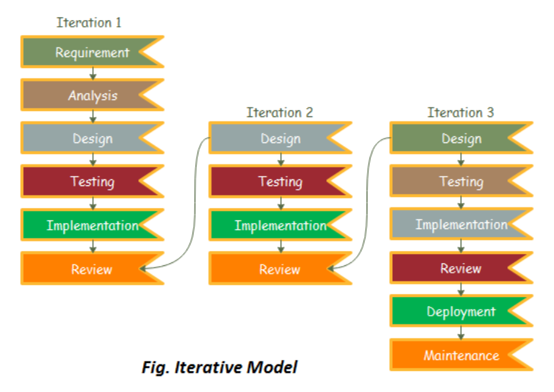
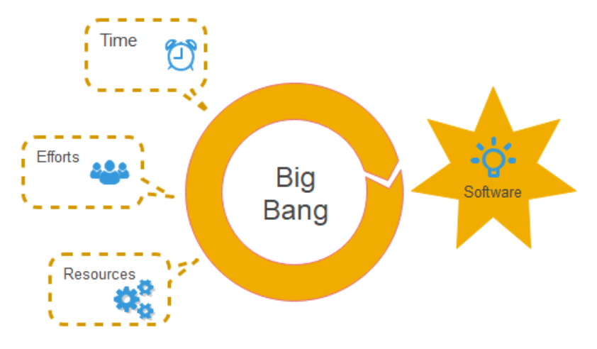
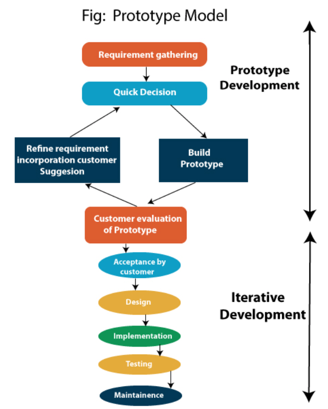

# $\fbox{Chapter 2: DEVELOPMENT MODELS}$

## **Topic - 1: Waterfall Model**

### <u>Introduction</u>

- Introduced by Winston Royce in 1970.
- Derived from Waterfall model.

### <u>Phases</u>

#### i. Requirement analysis & specification:

- This phase is about ***"what"*** and not ***"how"***.
- Also SRS document is created in the same phase, as the name itself says.

#### ii. Design phase:

- This phase deals with designing the software.
- Here, another document called **Software Design Document (SDD)** is made.

#### iii. Implementation & unit testing:

- Codes are also continuously modified before & during testing.
- At last, developers check the execution flow for performance improvement purposes.

#### iv. Integration & system testing:

- Integrated testing to see how each individual module interacts with each other.

#### v. Operation & maintenance phase:

- Performed based on feedbacks by customers.

### <u>Use Cases</u>

- Requirements are rarely subject to change.
- Project is short.
- When resources are available readily.

### <u>Advantages</u>

- Easy to understand.
- Minimal resource requirements.
- Requirements are rarely subject to change.
- Reliable order of phases.
- Trackable by project manager.

### <u>Disadvantages</u>

- Not suitable for complex projects.
- Not responsive to frequent changes in requirement.
- Tough to make changes in already passed phases.

## **Topic - 2: Rapid Application Development Model (RAD)**

### <u>Introduction</u>

- RAD believes that software can be constructed in a very less time if we keep certain things in our mind.
- Derived from Waterfall & incremental model.

#### Things to keep in mind:

- Gathering information from focus groups.
- Early design prototyping.
- Early prototype testing.
- Using automatic code generation tools.
- Re-using old software components instead.
- A strict schedule.
- Little to no formality in team communication.

### <u>Phases</u>

1. **<u>Business modelling</u>:** Shows how data/information will flow through business entities.
2. **<u>Data modelling</u>:** Relation among various attributes of all business entities are drawn.
3. **<u>Process modelling</u>:** It is defined how operations on data will affect other entities involved.
4. **<u>Application generation</u>:** Software is coded.
5. **Testing & turnover**

### <u>Use Cases</u>

- When project has to be developed in a short span of time, typically in few months.
- Requirements are already known.
- Project is not risky.

### <u>Advantages</u>

- Flexible for change.
- Faster development time.

### <u>Disadvantages</u>

- Requires highly skilled people.
- Not good with projects having high technical risks.

## **Topic - 3: Spiral Model**

### <u>Introduction</u>

- Proposed by Boehm.
- Converges both linear & iterative form of model.
- It focuses on making modifications on software in new versions.
- Earlier, only prototype models are produced but later proper modifications are added using spiral model.
- Takes proper time in identifying & solving risk factors.

### <u>Phases</u>

1. **Objective setting**
2. **<u>Risk assessment & reduction</u>:** Various alternatives are evaluated.
3. **Development & validation**
4. **<u>Planning</u>:** Project is reviewed & it is decided if spiral needs to be repeated.

### <u>Use Cases</u>

- Fast version delivery.
- Large project.
- Complex projects.
- Unexpected subjects to change.

### <u>Advantages</u>

- Has a dedicated phase for analyzing & addressing risks.
- Can handle large & complex projects.

### <u>Disadvantages</u>

- Total project cost can be very high.
- Experts are required for each phase.
- Not good with small projects.

## **Topic - 4: V-Model**

### <u>Introduction</u>

- **V** in **V-model** means verification & validation.
- It is a linear development method.

- **<u>Verification</u>:** Analyzing planning & methods to be implemented.
- **<u>Validation</u>:** Analyzing codes after implementation is done.

### <u>Phases</u>

#### Verification phase:

1. **Business requirement specification**
2. **System requirement specification**
3. **<u>High-level design</u>:** Includes making diagrammatic models.
4. **<u>Low-level design</u>:** More detailed version of high-level design.
5. **Coding**

#### Validation phase:

- **<u>System testing</u>:** This testing is performed by the client team.
- **<u>Acceptance testing</u>:** This testing is performed by the end users that clients are targeting.

### <u>Use Cases</u>

- When requirements are well understood & documented.
- Project size is small to medium at max.

### <u>Advantages</u>

- Straightforward model.
- Saves more time than Waterfall.
- Defects are well identified before delivery.

### <u>Disadvantages</u>

- Lack of flexibility.
- Can't be used in complex projects.
- Direct implementation, no prototyping.

## **Topic - 5: Incremental Model**

### <u>Introduction</u>

- Derived from Waterfall model.
- Various requirements are grouped separately & worked parallelly.
- Each group is cyclic, cycled joined by maintenance phase at last.

### <u>Phases</u>

1. **Requirement analysis**
2. **<u>Design & development</u>:** Design and methods for software is planned.
3. **<u>Testing</u>:** Checks the functional & non-functional testing.
4. **<u>Implementation</u>:** Programs are coded for the proposed design.

### <u>Use Cases</u>

- When requirements are heavy.
- Large scale project.
- Not highly skilled members in team.
- Less time given for development.

### <u>Advantages</u>

- Errors are identified & eliminated early.
- Flexible to changes.
- Important modules can be developed early parallelly.

### <u>Disadvantages</u>

- Requires high amount of time for planning.
- High cost for development.

## **Topic - 6: Agile Model**

### <u>Introduction</u>

- Number of iteration, total duration & goals are set before starting.
- **<u>Frame</u>:** An iteration from Agile model.
- Each iteration takes 1-4 weeks.
- Its a series of iterations, not parallelly running multiple iterations.

- Agile promotes CI/CD method of development.
- However, technical phases like designing, development & testing are unpredictable.

### <u>Phases</u>

1. **Requirement gathering**
2. **<u>Design the requirements</u>:** Designing how to add features to existing system.
3. **<u>Construction/iteration</u>:** Development work.
4. **<u>Testing</u>:** Quality assurance team tests the product.
5. **Deployment**
6. **Feedback**

### <u>Agile Testing Methods</u>

- Scrum
- Extreme programming (XP)
- Crystal
- Dynamic software development method (DSDM)
- Feature driven development (FDD)
- Lean software development (LSD)

### <u>Scrum</u>

- Scrum is an Agile development process which tells how to manage a team project.
- A team using Scrum can divide members into 3 roles, that are Scrum master, product owner & Scrum team.
- **<u>Scrum master</u>:** Manager who picks up members & arranges meetings among stakeholders.
- **<u>Product owner</u>:** Tracks the progress in each product release & tells what feature to add in next release.
- **<u>Scrum team</u>:** Skilled workers who take orders from Scrum master & executes the plan.

### <u>Extreme Programming (XP)</u>

- A programming practice that fosters immediate programming without prior planning or design.
- Only a few developers might be involved, who take multiple roles.
- This might come handy when its about fast delivery.

### <u>Crystal</u>

- Concept of Crystal consists of chartering, cyclic delivery & wrap up.
- **<u>Chartering</u>:** Includes team building, requirement studying & designing.
- **<u>Cyclic delivery</u>:** Integrates the features to existing version of product.
- **<u>Wrap up</u>:** Deploying & assigning a build version to the product.

### <u>Dynamic Software Development Model (DSDM)</u>

- DSDM is a practice where active discussion over project by the team is fostered.
- Also each team member gets rights to represent their idea & have some autonomy over work assigned to them.

#### Techniques used in DSDM:

- Time boxing
- MoSCoW rules
- Prototyping

#### Stages in DSDM:

1. Pre-project
2. Feasibility study
3. Business study
4. Functional model iteration
5. Design & build iteration
6. Implementation
7. Post-project

### <u>Feature Driven Development (FDD)</u>

- FDD fosters focus on each part of the new feature that is to be added in existing product.
- And these parts are integrated together & then integrated into the existing product.

### <u>Lean Software Development (LSD)</u>

- This type of development is where the speed of developing product increases with time & the cost reduces.

#### Stages in LSD:

1. Eliminating waste
2. Amplifying learning
3. Defer commitment
4. Early delivery
5. Empowering the team
6. Building integrity
7. Optimizing the whole

### <u>Use Cases</u>

- Requirements might be a subject to change.
- Team is highly experienced.
- Customer is open for meeting most of the time.
- Project size is small.

### <u>Advantages</u>

- Fast development & delivery.
- Constant touch with customers.

### <u>Disadvantages</u>

- High focus on development & delivery leads to low focus on documentation.
- This lack of documentation can further contribute in difficulty in maintenance.

## **Topic - 7: Iterative Model**

### <u>Introduction</u>

- In Iterative model, the objectives of a project is decided without expecting a second iteration.
- But when it is felt that some changes are required to the software, then they are planned & added with the upcoming iteration after review phase.

- See above how requirements & analysis are done just once.
- Next iteration always continues from design.
- Deployment & maintenance are done along the last iteration.

### <u>Phases</u>

1. **Requirement**
2. **Analysis**
3. **Design**
4. **Implementation**
5. **<u>Testing</u>:** Most common methods used are **white box**, **black box** & **grey box** testing.
6. **Deployment**
7. **<u>Review</u>:** Reviewing the product to find error or unexpected things that has to be solved in next iteration.
8. **<u>Maintenance</u>:** Debugging & adding new features.

### <u>Use Cases</u>

- Clear requirements.
- Large scale projects.
- Requirements might be a subject to change.

### <u>Advantages</u>

- Parallel development is possible.
- Flexible to change.
- Fast resolution of issues.

### <u>Disadvantages</u>

- Can't handle small projects.
- No fixed date for completing project.

## **Topic - 8: Big-Bang Model**

### <u>Introduction</u>

- There are no phases or a defined procedure to make the project.
- So, obviously it doesn't deal with any customer requirements.
- Ideal when a very few developers are there to develop a small project.

### <u>Use Cases</u>

- Academic/practical project.
- Small team to manage.
- There is no requirement like thing.
- High flexibility to release date.

### <u>Advantages</u>

- Little to no resources required.
- Easy to manage the team.
- Highly flexible for team members.

### <u>Disadvantages</u>

- Highly risky & uncertainty.
- Can't handle large projects.

## **Topic - 9: Prototype Modelling**

### <u>Introduction</u>

- Prototype modelling believes that a prototype of the product must be built before final product.
- This might be useful as the client may tell the required changes to it beforehand, saving a lot of resources that were to be used in making the actual product.

### <u>Phases</u>

1. **Requirement gathering**
2. **Quick decision**
3. **Build prototype**
4. **User evaluation**
5. **Prototype refinement**
6. **Engineer actual product**

### <u>Advantages</u>

- No requirement misinterpretation.
- Flexible to change.
- Product can be advertised early.

### <u>Disadvantages</u>

- Customer might have to wait a lot.
- Customer might withdraw, causing financial loss.
- Can't judge project finish date.
- Prototyping tools are expensive.
- Time consuming.

## **Topic - 10: Evolutionary Process Model**

### <u>Introduction</u>

- Another iteration based model.
- A small feature is added at the end of each feature.
- Product can't readily used at the end of any iteration, other than the last one.
- Complete product is gained after the last iteration ends.

### <u>Benefits</u>

- Proper feature management at the beginning of each cycle.
- Customers can test individual features early.
- Better progress visibility to management team.

---
