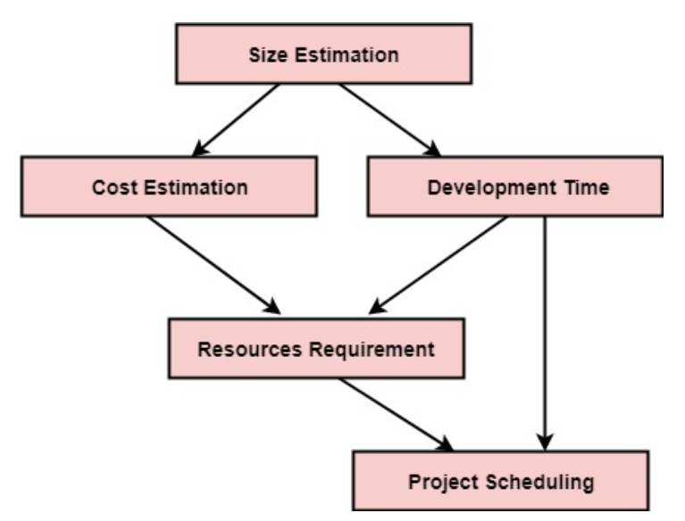
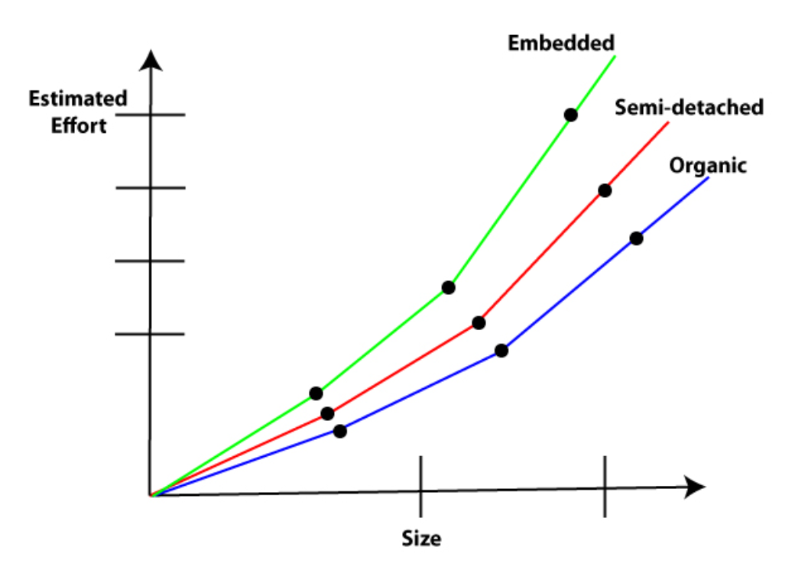
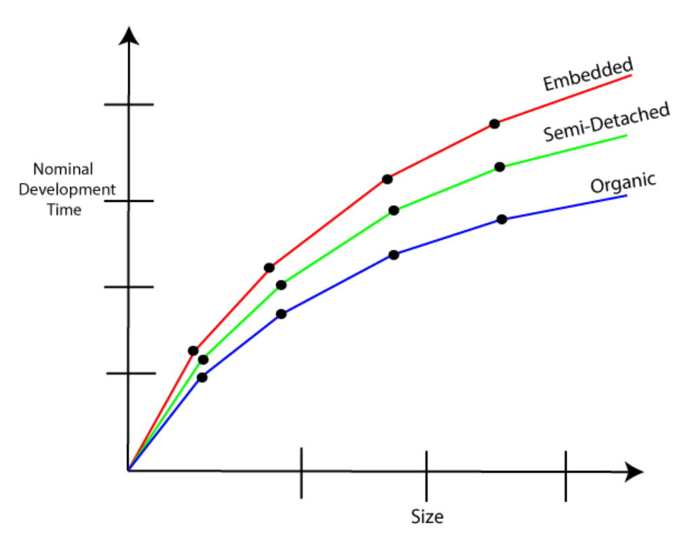
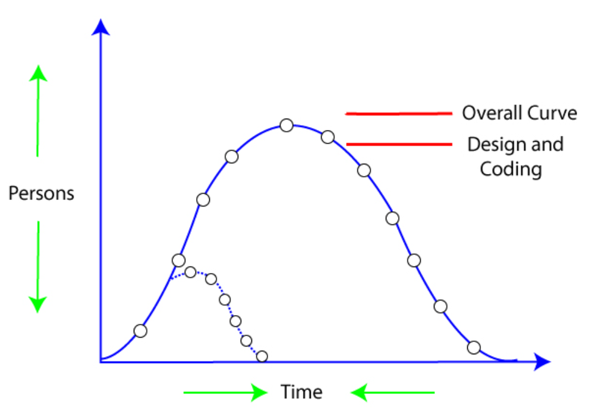

# $\fbox{Chapter 5: PROJECT PLANNING}$

## **Topic - 1: Software Project Planning**

### <u>Introduction</u>

- **<u>Software project planning</u>:** Proper follow of SDLC procedure to complete software project with quality & on time.

### <u>Software Project Manager</u>

- Software managers also make sure that the project completes within the budget.
- And a lot of metrics are also inspected by the manager.

- Size estimation is extremely important for getting an idea about how much resources are to be used.
- Resources & time are carefully considered for making a good project schedule.

## **Topic - 2: Software Cost Estimation**

### <u>Cost Estimation Models</u>

- There are two types of cost estimation models, static or dynamic.
- **<u>Static model</u>:** Only one factor is considered while estimating cost.
- **<u>Dynamic model</u>:** Multiple interdependent variables are considered while estimating cost.

### <u>Static Model</u>

- A single factor is considered for estimating cost.
- $C$ denotes cost.
- $L$ denoted size.
- $a$ and $b$ are constants.

$$ C \; = \; aL^{b} $$

- Software Engineering Laboratory established a static model SEL model.
- SEL model is used for estimating software production.
- $E$ denotes efforts (person per month).
- $DOC$ denotes documentation (number of pages).
- $D$ denotes duration (months).
- $L$ denotes number of lines.

$$ E \; = \; 1.4L^{0.93} $$
$$ DOC \; = \; 30.4L^{0.90} $$
$$ D \; = \; 4.6L^{0.26} $$

### <u>Dynamic Model</u>

- Multiple interdependent factors are considered for estimating cost.
- Also known as multivariable model.
- Walston & Felix developed models at IBM which provides relation between LOCs and effort.

$$ E \; = \; 5.2L^{0.91} $$

- $D$ denotes duration of development.

$$ D \; = \; 4.1L^{0.36} $$

- **Productivity index** says there are 29 interdependent variables.
- $W_{i}$ denotes weighing constant for $i^{th}$ factor.
- $X_{i} \in \{-1,0,1\}$, depends on what effect factor has on productivity.

$$ I \; = \; \sum^{29}_{i=1}W_{i}X_{i} $$

## **Topic - 2: COCOMO Model**

### <u>Introduction</u>

- Developed by Boehm in 1981.
- **<u>COCOMO</u>:** Constructive Cost Estimation Model
- Based on software size, it predicts effort & schedule required for project.

### <u>Steps In COCOMO</u>

1. Estimating effort through delivered KLOCs (KDLOCs).
2. List top 15 factors affecting the project.
3. Multiply the estimation in ***step 1*** & all 15 factors in ***step 2***.

$$ E_{i} \; = \; a*(KDLOC)b $$

- **<u>Nominal effort</u>:** The effort we estimated in *1st step*.
- Formula above is used for estimating that nominal effort.
- Value of $a$ and $b$ depends on type of project.

### <u>Types Of Projects</u>

#### Organic:

- These are non-innovative applications which are very commonly developed.
- Size of development team is small.
- Team members are experienced in developing such applications.

#### Semi-detached:

- Some team members are experienced, while some are not.
- Or members have limited level of experience with developing similar software.
- For example, OS & DBMS etc.

#### Embedded:

- In embedded projects, minute to minute deviation from expected parameters can cause devastating effects.
- For example, ATM & ATC etc.

> **<u>NOTE</u>:**
> 1. Boehm provides expressions to calculate effort & development time while considering the holidays & coffee breaks etc.
> 2. Also, the types of COCOMO models are given by Boehm.

### <u>Types Of COCOMO Model</u>

1. Basic model
2. Intermediate model
3. Detailed model

### <u>Basic COCOMO Model</u>

- Basic model gives an accurate size for parameters involved in project.
- And its formulae are plain & simple.
- $Tdev$ is the estimated time for developing software, expressed in months.
- $a_{i}$ and $b_{i}$ are constants.

$$ E \; = \; a_{1}*KLOC*a_{2} $$
$$ Tdev \; = \; b_{1}*E*b_{2} $$

| Project Type  | $a_{1}$ | $a_{2}$ | $b_{1}$ | $b_{2}$ |
| :-----------: | :-----: | :-----: | :-----: | :-----: |
|    Organic    |   2.4   |  1.05   |   2.5   |  0.38   |
| Semi-detached |   3.0   |  1.12   |   2.5   |  0.35   |
|   Embedded    |   3.6   |  1.20   |   2.5   |  0.32   |

#### Effort v/s product size:

#### Development time v/s product size:

#### Project Cost Dependencies:

- Manpower
- Effort
- Hardware
- Paid software
- Administrative works
- Legal works etc

> **<u>NOTE</u>:**
> 1. Nominal is a synonym of minimum.
> 2. For example, nominal cost we talked about.
> 3. If project completes before deadline, then cost increases.
> 4. Else if it completes at or after the deadline, the cost remains the same.

### <u>Intermediate COCOMO Model</u>

- Intermediate model is an addition over the basic model.
- It considers 15 more factors that affects the cost, known as **cost drivers**.

#### Cost drivers:

- **Product attributes:**
	1. Required software reliability extent (RELY).
	2. Size of the application database (DATA).
	3. The complexity of the product (CPLX).

- **Hardware attributes:**
	1. Runtime performance constraints (TIME).
	2. Memory constraints (STOR).
	3. Volatility of virtual machine environment (VIRT).
	4. Required turnabout time (TURN).

> **<u>NOTE</u>:**
> Turnabout/turnaround time is the time taken for a process to complete after a request is issued for it.

- **Personnel attributes:**
	1. Analyst capability (ACAP).
	2. Software engineering capability (PCAP).
	3. Applications experience (AEXP).
	4. Virtual machine experience (VEXP).
	5. Programming language experience (LEXP).

- **Project attributes:**
	1. Use of software tools (TOOL).
	2. Application of software engineering methods (MODP).
	3. Required development schedule (SCED).

| Cost Driver | Very Low | Low  | Nominal | High | Very High | Extra High |
| :---------: | :------: | :--: | :-----: | :--: | :-------: | :--------: |
|    RELY     |   0.75   | 0.88 |  1.00   | 1.15 |   1.40    |     -      |
|    DATA     |    -     | 0.94 |  1.00   | 1.08 |   1.16    |     -      |
|    CPLX     |   0.70   | 0.85 |  1.00   | 1.15 |   1.30    |    1.65    |
|    TIME     |    -     |  -   |  1.00   | 1.11 |   1.30    |    1.66    |
|    STOR     |    -     |  -   |  1.00   | 1.06 |   1.21    |    1.56    |
|    VIRT     |    -     | 0.87 |  1.00   | 1.15 |   1.30    |     -      |
|    TURN     |    -     | 0.87 |  1.00   | 1.07 |   1.15    |     -      |
|    ACAP     |   1.46   | 1.19 |  1.00   | 0.86 |   0.71    |     -      |
|    AEXP     |   1.29   | 1.13 |  1.00   | 0.91 |   0.82    |     -      |
|    PCAP     |   1.42   | 1.17 |  1.00   | 0.86 |   0.70    |     -      |
|    VEXP     |   1.21   | 1.10 |  1.00   | 0.90 |     -     |     -      |
|    LEXP     |   1.14   | 1.07 |  1.00   | 0.95 |     -     |     -      |
|    MODP     |   1.24   | 1.10 |  1.00   | 0.91 |   0.83    |     -      |
|    SCED     |   1.23   | 1.08 |  1.00   | 1.04 |   1.10    |     -      |

#### Intermediate COCOMO expression:

$$ E \; = \; a_{i}(KLOC)b_{i}*EAF $$
$$ D \; = \; c_{i}(E)d_{i} $$

| Project Type  | $a_{i}$ | $b_{i}$ | $c_{i}$ | $d_{i}$ |
| :-----------: | :-----: | :-----: | :-----: | :-----: |
|    Organic    |   2.4   |  1.05   |   2.5   |  0.38   |
| Semi-detached |   3.0   |  1.12   |   2.5   |  0.35   |
|   Embedded    |   3.6   |  1.20   |   2.5   |  0.32   |

### <u>Detailed COCOMO Model</u>

- In detailed COCOMO, we divide the software into various modules.
- Then we make estimate efforts of each module separately.
- And finally we sum all the efforts.

#### 6 phases of detailed COCOMO:

1. Planning & requirements
2. System structure
3. Complete structure
4. Module code & test
5. Integration & test
6. Cost construction model

## **Topic - 3: Putnam Resource Allocation Model**

- Developed by Lawrence Putnam.
- It uses Norden/Rayleigh curve to estimate effort, schedule & defect rate.

- The graph reaches peak when most people are engaged in project, i.e. during implementation & unit testing.
- $K$ denotes total effort (in person-month).
- $L$ denotes product size (in KLOCs).
- $t_{d}$ denotes total time taken in testing.
- $C_{k}$ denotes technology constant, which helps project progress.
- Technology constant ($C_{k}$) is set using historical data of company.

$$ L \; = \; C_{k}K^{\frac{1}{3}}t_{d}^{\frac{4}{3}} $$

---
