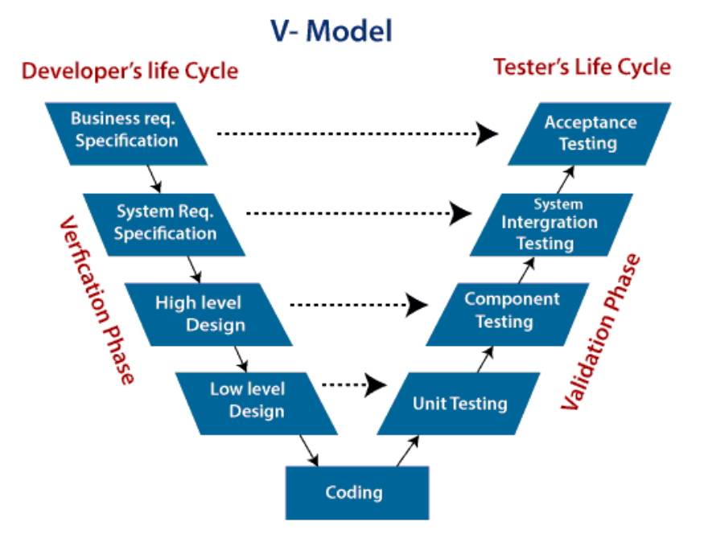

# <u>Chapter 2</u>: MODELS

## **Topic - 1: Waterfall Model**

### <u>Introduction</u>

- Introduced by Winston Royce in 1970.
- Derived from Waterfall model.

### <u>Phases</u>

#### i. Requirement analysis & specification:

- This phase is about ***"what"*** and not ***"how"***.
- Also SRS document is created in the same phase, as the name itself says.

#### ii. Design phase:

- This phase deals with designing the software.
- Here, another document called **Software Design Document (SDD)** is made.

#### iii. Implementation & unit testing:

- Codes are also continuously modified before & during testing.
- At last, developers check the execution flow for performance improvement purposes.

#### iv. Integration & system testing:

- Integrated testing to see how each individual module interacts with each other.

#### v. Operation & maintenance phase:

- Performed based on feedbacks by customers.

### <u>Use Cases</u>

- Requirements are rarely subject to change.
- Project is short.
- When resources are available readily.

### <u>Advantages</u>

- Easy to understand.
- Minimal resource requirements.
- Requirements are rarely subject to change.
- Reliable order of phases.
- Trackable by project manager.

### <u>Disadvantages</u>

- Not suitable for complex projects.
- Not responsive to frequent changes in requirement.
- Tough to make changes in already passed phases.

## **Topic - 2: Rapid Application Development Model (RAD)**

### <u>Introduction</u>

- RAD believes that software can be constructed in a very less time if we keep certain things in our mind.
- Derived from Waterfall & incremental model.
- 

#### Things to keep in mind:

- Gathering information from focus groups.
- Early design prototyping.
- Early prototype testing.
- Using automatic code generation tools.
- Re-using old software components instead.
- A strict schedule.
- Little to no formality in team communication.

### <u>Phases</u>

1. **<u>Business modelling</u>:** Shows how data/information will flow through business entities.
2. **<u>Data modelling</u>:** Relation among various attributes of all business entities are drawn.
3. **<u>Process modelling</u>:** It is defined how operations on data will affect other entities involved.
4. **<u>Application generation</u>:** Software is coded.
5. **Testing & turnover**

### <u>Use Cases</u>

- When project has to be developed in a short span of time, typically in few months.
- Requirements are already known.
- Project is not risky.

### <u>Advantages</u>

- Flexible for change.
- Faster development time.

### <u>Disadvantages</u>

- Requires highly skilled people.
- Not good with projects having high technical risks.

## **Topic - 3: Spiral Model**

### <u>Introduction</u>

- Proposed by Boehm.
- Converges both linear & iterative form of model.
- It focuses on making modifications on software in new versions.
- Earlier, only prototype models are produced but later proper modifications are added using spiral model.
- Takes proper time in identifying & solving risk factors.

### <u>Phases</u>

1. **Objective setting**
2. **<u>Risk assessment & reduction</u>:** Various alternatives are evaluated.
3. **Development & validation**
4. **<u>Planning</u>:** Project is reviewed & it is decided if spiral needs to be repeated.

### <u>Use Cases</u>

- Fast version delivery.
- Large project.
- Complex projects.
- Unexpected subjects to change.

### <u>Advantages</u>

- Has a dedicated phase for analyzing & addressing risks.
- Can handle large & complex projects.

### <u>Disadvantages</u>

- Total project cost can be very high.
- Experts are required for each phase.
- Not good with small projects.

## **Topic - 4: V-Model**

### <u>Introduction</u>

- **V** in **V-model** means verification & validation.
- It is a linear development method.

- **<u>Verification</u>:** Analyzing planning & methods to be implemented.
- **<u>Validation</u>:** Analyzing codes after implementation is done.

### <u>Phases</u>

#### Verification phase:

1. **Business requirement specification**
2. **System requirement specification**
3. **<u>High-level design</u>:** Includes making diagrammatic models.
4. **<u>Low-level design</u>:** More detailed version of high-level design.
5. **Coding**

#### Validation phase:

- **<u>System testing</u>:** This testing is performed by the client team.
- **<u>Acceptance testing</u>:** This testing is performed by the end users that clients are targeting.

### <u>Use Cases</u>

- When requirements are well understood & documented.
- Project size is small to medium at max.

### <u>Advantages</u>

- Straightforward model.
- Saves more time than Waterfall.
- Defects are well identified before delivery.

### <u>Disadvantages</u>

- Lack of flexibility.
- Can't be used in complex projects.
- Direct implementation, no prototyping.

## **Topic - 5: Incremental Model**

### <u>Introduction</u>

- Derived from Waterfall model.
- Various requirements are grouped separately & worked parallelly.
- Each group is cyclic, cycled joined by maintenance phase at last.

### <u>Phases</u>

1. **Requirement analysis**
2. **<u>Design & development</u>:** Design and methods for software is planned.
3. **<u>Testing</u>:** Checks the functional & non-functional testing.
4. **<u>Implementation</u>:** Programs are coded for the proposed design.

### <u>Use Cases</u>

- When requirements are heavy.
- Large scale project.
- Not highly skilled members in team.
- Less time given for development.

### <u>Advantages</u>

- Errors are identified & eliminated early.
- Flexible to changes.
- Important modules can be developed early parallelly.

### <u>Disadvantages</u>

- Requires high amount of time for planning.
- High cost for development.

## **Topic - 6: Agile Model**

### <u>Introduction</u>

- Number of iteration, total duration & goals are set before starting.
- **<u>Frame</u>:** An iteration from Agile model.
- Each iteration takes 1-4 weeks.
- Its a series of iterations, not parallelly running multiple iterations.

- Agile promotes CI/CD method of development.
- However, technical phases like designing, development & testing are unpredictable.

### <u>Phases</u>

1. **Requirement gathering**
2. **<u>Design the requirements</u>:** Designing how to add features to existing system.
3. **<u>Construction/iteration</u>:** Development work.
4. **<u>Testing</u>:** Quality assurance team tests the product.
5. **Deployment**
6. **Feedback**

### <u>Agile Testing Methods</u>

- Scrum
- Crystal
- Dynamic software development method (DSDM)
- Feature driven development (FDD)
- Lean software development
- Extreme programming (XP)
