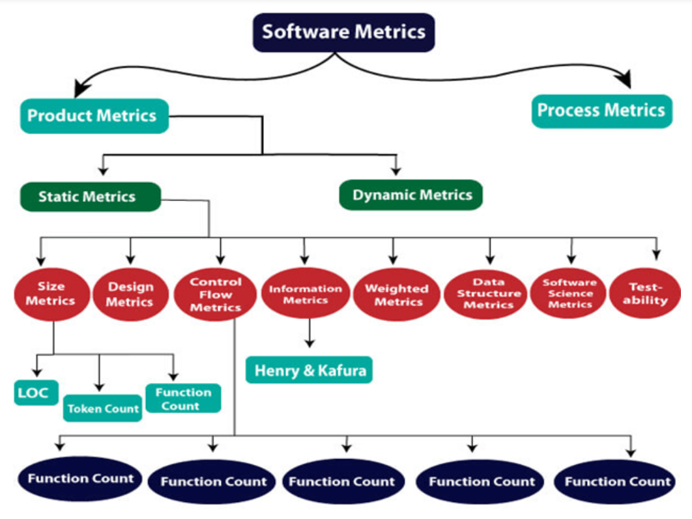
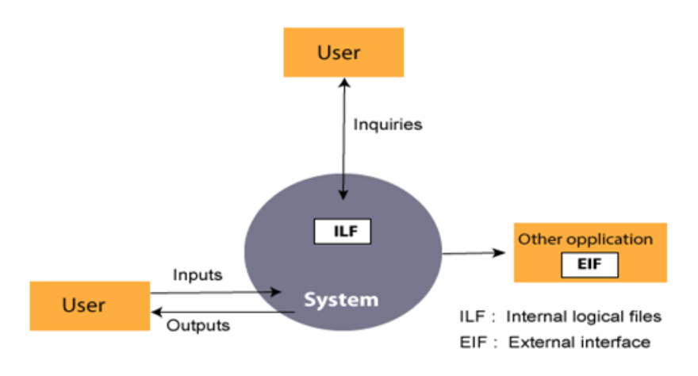

# <u>Chapter 4</u>: SOFTWARE METRICS

## **Topic - 1: Fundamentals Of Software Metrics**

### <u>Introduction</u>

- **<u>Software metrics</u>:** Measurable software characteristics.
- Metric includes measurement of software performance, resources, productivity etc.
- Often based on historical data/record.

### <u>Classification Of Software Metrics</u>

1. **<u>Product metrics</u>:** Measures size, complexity, quality & reliability etc of software.
2. **<u>Process metrics</u>:** Measures efficiency of methods, techniques & tools being used in development.

### <u>Types Of Metrics</u>

- **<u>Internal metrics</u>:** Used to measure properties which are meaningful to the programmer. For example, LOCs.
- **<u>External metrics</u>:** Used to measure properties which are meaningful to the user. For example, portability.
- **<u>Hybrid metrics</u>:** Used to measure properties which are hybrid of product, process & resource metrics. For example, cost per LOC.
- **<u>Project metrics</u>:** Used to measure properties which are important to the project manager. Like cost, time & effort.

### <u>Advantages</u>

- Proper study and analysis of various programming languages & software tools used.
- Verification of tools being standard enough for being used.
- System optimization.
- Various kinds of cost savings.

### <u>Disadvantages</u>

- Applying software metrics might itself be very costly.
- Time consuming & difficult to apply.
- Can't evaluate employee performance.
- Measurements might not be precise.

## **Topic - 2: Size Oriented Metrics**

### <u>LOC Metrics</u>

- This metrics aims to measure productivity of programmers as per LOCs.
- However, this method is old & was used when Fortran and COBOL used to be very popular.
- **<u>Effort</u>:** Measured in units of **person-months**.

$$ Productivity = \frac{KLOC}{Effort} $$

- Measuring productivity through KLOCs is flawed as we know.
- LOC metric can't be used where GUI programming (code blocks) are used.
- Many units can be measure per & using KLOC.

### <u>Advantages</u>

- Simple to measure.

### <u>Disadvantages</u>

- Assembly code would make productivity too high.
- Empty/skipped lines in programs.
- It doesn't judge quality of comments written in programs.
- LOC is about length of program, not their quality.

## **Topic - 3: Halstead's Software Metrics**

### <u>Introduction</u>

***"All computer programs can be broken down into two types of tokens, operators & operands."*** *- Halstead*

### <u>Token Count</u>

#### Token type symbols:

$$ n1 = Total \; unique \; operators $$
$$ n2 = Total \; unique \; operands $$
$$ N1 = Total \; operators $$
$$ N2 = Total \; operands $$

#### Size of program:

$$ N \; = \; N1 \; + \; N2 $$

### <u>Halstead Metrics</u>

#### Program volume ($V$):

- **<u>Program volume</u>:** Size of whole program in bits.

$$ V \; = \; N*log_{2}n $$

#### Potential minimum volume ($V*$):

- **<u>Potential minimum volume</u>:** Minimum volume that can be achieved.
- Meaning the minimum level (best case) possible.

$$ V* \; = \; (2 \; + \; n2*)*log_{2}(2 \; + \; n2*) $$

- $n2*$ is count of all unique inputs & outputs.

#### Program level ($L$):

- **<u>Program level</u>:** A fraction number between 0 and 1, showing what size program is taking to achieve the objective.
- For example, level magnitude as 1 shows that program is achieving the objective with minimal size.

$$ L \; = \; \frac{V*}{V} $$

#### Program difficulty ($D$):

- $D$ is directly proportional to $n2$.

$$ D \; = \; (\frac{n1}{2}) * (\frac{N2}{n2}) $$

#### Programming effort ($E$):

- This unit is based on objective mental discriminations.

$$ E \; = \; \frac{V}{L} \; = \; D*V $$

#### Size of vocabulary ($n$):

$$ n \; = \; n1 \; + \; n2 $$

### <u>Estimated Program Length</u>

- 1st hypothesis of software science (by Halstead) is that a well structured program can be called as a function of just unique operators & operands, i.e. $N$.

#### Estimated program length ($N\textasciicircum$):

$$ N \textasciicircum \; = \; n1*log_{2}n1 \; + \; n2*log_{2}n2 $$

#### Alternatives for $N\textasciicircum$ (estimated program length):

$$ N_{J} \; = \; log_{2}(n1!) \; + \; log_{2}(n2!) $$
$$ N_{B} \; = \; n1*log_{2}n2 \; + \; n2*log_{2}n1 $$
$$ N_{C} \; = \; (n1*\sqrt{n1}) \; + \; (n2*\sqrt{n2}) $$
$$ N_{S} \; = \; \frac{n*log_{2}n}{2} $$

### <u>Language Level</u>

- **<u>Language level</u>:** A unit used to represent the energy put in implementing an algorithm, in a particular language.
- Represented with $L'$.

$$ L' \; = \frac{\frac{V}{D}}{D} $$
$$ \lambda \; = \; L'*(V*) \; = \; L^{2}*V $$

|   Language   | Language Level $\lambda$ | Variance $\sigma$ |
| :----------: | :----------------------: | :---------------: |
|     PL/1     |           1.53           |       0.92        |
|    Algol     |           1.21           |       0.74        |
|   Fortran    |           1.14           |       0.81        |
| CDC Assembly |           0.88           |       0.42        |
|    Pascal    |           2.54           |         -         |
|     APL      |           2.42           |         -         |
|      C       |          0.857           |       0.445       |

### <u>Counting Rules (C Programming)</u>

1. Comments are not counted.
2. Identifiers & function declarations are not counted as well
3. Only first occurrence of each operand is counted.
4. Local variables with same name but in different functions are counted as separate variables.
5. All looping, control, switch & case (statement as a whole) are considered as operators.
6. Keywords other than those in previous point, are considered as operators (as individual).
7. Symbols like brackets, commas & terminators are considered as operators too.
8. `goto` is counted as an operator & its label is counted as an operand.
9. Arithmetic operators are counted separately.
10. In `arr[i]`, `arr` & `i` are counted as operands, while `[]` is counted as operator.
11. In structure involving statements, structures and variables are counted as operands, while symbols like `.` or `->` are counted as operators.
12. Hash directives are not counted.

>**<u>NOTE</u>:**
>Now these rules can be applied to all the software metric formulae we used this far.

## **Topic - 4: Functional Point Analysis (FPA)**

### <u>Introduction</u>

- Developed by **Allan J. Abrecht** from IBM at 1979.
- It was further modified by **International Function Point Users Group (IFPUG)**.
- It is used for measuring how complex & broad a software application is.
- **<u>Funtion point</u>:** Standard measurement unit for software applications.

### <u>Objectives Of FPA</u>

- Objective of FPA is to provide stakeholders an idea about how the software application is going to be like.
- We do it by measuring how much work like programming, testing, maintenance etc has been performed on it.
- But we don't consider what all has been used in these processes.

### <u>Types Of FP Attributes</u>

- Types of FP attributes are also known as **information domain characteristics**.
- FPs are calculated by counting the number of functions used.

| Sno. | Measurement Parameters              | Examples                                             |
| :--: | ----------------------------------- | ---------------------------------------------------- |
|  1.  | Number of external inputs (EI)      | All inputs taken on screen                           |
|  2.  | Number of external outputs (EO)     | All outputs shown on screen                          |
|  3.  | Number of external inquiries (EQ)   | All prompts & interrupts                             |
|  4.  | Number of internal files (ILF)      | Changes made on database & directories               |
|  5.  | Number of external interfaces (EIF) | All databases & files shared with external machines. |

### <u>Functional Unit System</u>

- FP is programming language independent.
- Used mostly where data/information are heavily processed or shared.
- **5-FP attributes** mentioned in previous sub-topic are given weights as per conducted experiments.

| Measurement Parameter | Low | Average | High |
| :-------------------: | :-: | :-----: | :--: |
|          EI           |  7  |   10    |  15  |
|          EO           |  5  |    7    |  10  |
|          EQ           |  3  |    4    |  6   |
|          ILF          |  4  |    5    |  7   |
|          EIF          |  3  |    4    |  6   |

- Functional complexities are multiplied with the corresponding weights above & added up to determine UFP.
- **<u>UFP</u>:** Unadjusted Function Point

$$ CAF \; = \; [0.65 \; + \; 0.01 \; * \; \sum (f_{i})] $$
$$ FP \; = \; Count \; + \; CAF $$

- $Count$ is calculated using the table above.
- $\sum (f_{i})$ can range from 0 to 70.
- **<u>Backfiring</u>:** Estimating LOCs via FPA.

$$ 1 \; FP \; = \; 100 \; COBOL \; lines $$

- We use 14 more GSCs (general standard characteristics) to calculate $TDI$ which gives value of $VAF$.
- If GSCs have weak influence on FPA, then $TDI$ is taken as 0.
- Else for strong influence, $TDI$ is taken as 5.

$$ VFI \; = \; (TDI*0.01) \; + \; 0.65 $$

- Value of $TDI$ ranges from 0.65 to 1.35.

$$ FP \; = \; VAF*UFP $$

## **Topic - 5: Extended Function Point (EFP)**

### <u>Introduction</u>

- These are extensions of FP to calculate more complicated metrics.
- Like, feature points & 3D function points.

### <u>Feature Points</u>

- **<u>Feature point</u>:** Superset of function point.
- It is used in systems where high algorithmic accuracy is required & tight time constraints are bound.
- There is only one weighing factor in feature points.
- There is a 6th parameter called **algorithms**.
- We don't count here.

| Sno. | Measurement Parameter | Weighing Factor |
| :--: | :-------------------: | :-------------: |
|  1.  |          EI           |        4        |
|  2.  |          EO           |        5        |
|  3.  |          EQ           |        4        |
|  4.  |          ILF          |        7        |
|  5.  |          EIF          |        7        |
|  6.  |      Algorithms       |        3        |

- We have same formula as seen in previous topic for function point.

$$ FP \; = \; Count \; + \; [0.65 \; + \; 0.01 \; * \; \sum (f_{i})] $$

- Value of $CAF$ can range from 1 to 14.

### <u>3D Function Points</u>

- We use 3 dimensions to represent 3D function points.
- These are data dimension, functional dimension & control dimension.
- **<u>Data dimension</u>:** These are the measurement parameters we were discussing so far.
- **<u>Functional dimension</u>:** This dimension considers the backend mechanism for input to output transformation.
- **<u>Control dimension</u>:** Some externally visible changes that are being made.

## **Topic - 6: Data Structures Metrics**

### <u>Introduction</u>

- With data structures metrics, we learn to measure how data structures affect the software.

#### Metrics for data structures:

1. Amount of data
2. Data usage
3. Program weakness
4. Data sharing

### <u>Amount Of Data</u>

#### Sub-metrics within:

1. Number of variables ($VARS$)
2. Number of operands ($\eta_{2}$)

$$ \eta_{2} \; = \; VARS \; + Constants \; + \; Labels $$

3. Total variable occurrences ($N2$)

### <u>Data Usage</u>

- Number of live variables are counted.
- **<u>Live variable</u>:** Lifetime of a variable from its first appearance in program to its last one.
- Live variables are denoted by $LV$.

$$ Average \; LV \; = \; \frac{Total \; live \; variables}{Total \; executable \; statements} $$

### <u>Program Weakness</u>

- 