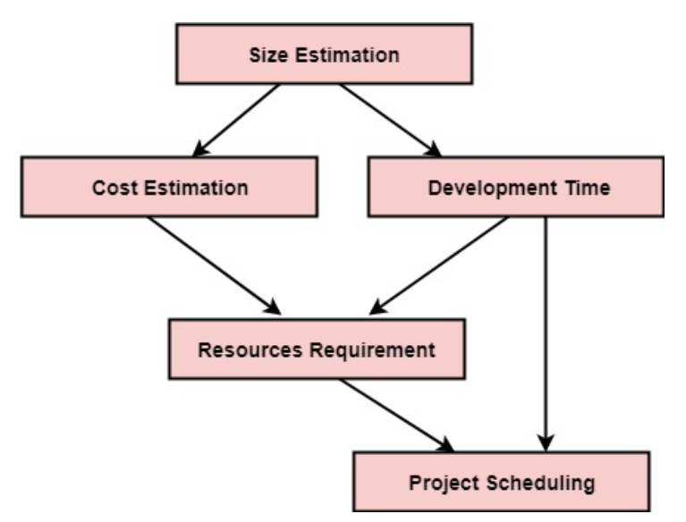

# <u>Chapter 5</u>: PROJECT PLANNING

## **Topic - 1: Software Project Planning (SPP)**

### <u>Introduction</u>

- **<u>Software project planning</u>:** Proper follow of SDLC procedure to complete software project with quality & on time.

### <u>Software Project Manager</u>

- Software managers also make sure that the project completes within the budget.
- And a lot of metrics are also inspected by the manager.

- Size estimation is extremely important for getting an idea about how much resources are to be used.
- Resources & time are carefully considered for making a good project schedule.
