# Potentiology: A Cognitive Energy Framework

Gourav Kumar Mallick
Affiliation: Parul University (Student)
Email: 12b.39gourav@email.com

## Abstract

Potentiology is a theoretical cognitive framework that models perception as a structured system of domains, directions, and energy capacities. The framework defines four fundamental perceptual domains: Experience, Abstraction, Logic, and Morality each of which can operate in either a subjective or objective orientation, yielding eight distinct cognitive functions. Unlike trait-based or behavior-focused typologies, Potentiology describes cognition in terms of perceptual reference, evaluative priority, and dynamic energy allocation.

A central contribution of the framework is an energy-based positioning model, where each cognitive function has finite capacity, depletes with use, and recovers asymmetrically over time. The ego is modeled as defaulting to the function with the highest available energy at a given moment, while conscious choice may override this tendency at a cost. This allows the framework to account for phenomena such as burnout, functional substitution under stress, and persistent dissatisfaction without invoking pathology.

Potentiology is intended as an explanatory and analytical construct rather than a diagnostic or predictive tool. It is presented as a self-contained system with internally defined terminology and mechanics, while remaining conceptually comparable to Jungian and related typological traditions [1,2]. The framework aims to provide a formal language for discussing perceptual bias, evaluative conflict, and environment-cognition fit in theoretical and interdisciplinary contexts.

## 1. Introduction

Potentiology is a cognitive framework that describes **how a subject perceives, evaluates, and stabilizes reality** through distinct modes of perception, referred to as cognitive functions. Rather than focusing on behavior, traits, or personality descriptions, the theory models cognition as a **dynamic system of perceptual domains and energy capacities**.

The framework is built on two foundational distinctions. First, perception operates across four domains: **Experience (X), Abstraction (A), Logic (L), and Morality (M)**. Second, each domain can be oriented **subjectively**, referencing internal impressions, or **objectively**, referencing properties of the external object. The combination of domain and direction produces eight cognitive functions.

Unlike static typology systems, Potentiology introduces an **energy-based positioning model**, where each function has a finite capacity and depletes with use. The ego defaults to the function with the highest available energy at a given moment, while conscious choice may override this tendency at a cost. This allows the theory to account for burnout, dissatisfaction, stress behavior, and functional shifts over time without invoking pathology.

Potentiology is not a diagnostic or predictive tool. It does not claim to measure intelligence, morality, or mental health. Its purpose is explanatory: to provide a **structural language** for discussing perceptual bias, evaluative conflict, and environmental fit.

The theory draws conceptual inspiration from Jungian psychology and related typological systems but is **not derived from them**. All definitions, mechanisms, and type structures in Potentiology are internally defined and operate according to their own logic [1]. The energy-based positioning model aligns conceptually with non-equilibrium views of cognitive effort and resource allocation [4].

This document presents the core terminology, functional domains, directional mechanics, energy model, and resulting cognitive types, followed by guidance on responsible use and interpretation.

## 2. Terminologies

- **Function:** Shorter term for *cognitive function*.
- **Cognitive function:** Mode of perception with a direction of focus.
- **Subject:** Conscious entity which perceives the *object*.
- **Object:** Content of consciousness which is being perceived by *subject*.
- **Ego:** Center of consciousness which *selects*, *integrates*, *organizes*, and *identifies* experiences for the subject.
- **Suppressed:** Consciously holding back something.
- **Repressed:** Unconsciously blocked from awareness.
- **Seed:** The point on timeline from where a function starts fresh after previous crash.
- **Crash:** A temporary shutdown of a function caused by sustained conflict with its opposing function domain, leading to loss of evaluative authority by primary function.
- **Impression:** A compressed, internally stored representation of repeated perceptions within a domain.
- **Leakage:** Conscious or unconscious use of a cognitive function that belongs to negative realm, with cost of high mental energy consumption.

## 3. Function Domains

### 3.1 <u>Experiencer (X)</u>:

#### 3.1.1 Definition:
*"**Experience** is a domain of cognitive functions in which the subject perceives the object **concretely**, as an **experience**."*

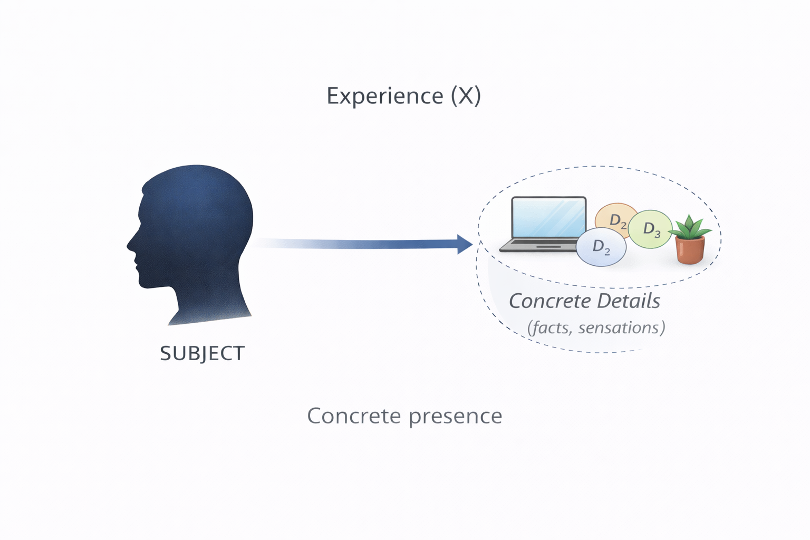

#### 3.1.2 Description:
Experience is **concrete** perception, where the object is perceived as it is in **concrete form**. If using it the subject looks at something, it will take the perception as a **matter of fact**. It won't seek to notice any pattern, logic, or value in it. For example, a subject perceives a printer printing pages using an experiencer function. It will say, *"Okay, so printer prints pages. It could be used in printing pages as per requirement."* It doesn't seek to understand what problem a printer could solve, how it works mechanically, or what moral values it might hold. For an experiencer, its just the input and output he experienced.

### 3.2 <u>Abstraction (A)</u>:

#### 3.2.1 Definition:
*"**Abstraction** is a domain of cognitive functions in which the subject perceives the object in terms of **latent patterns**."*

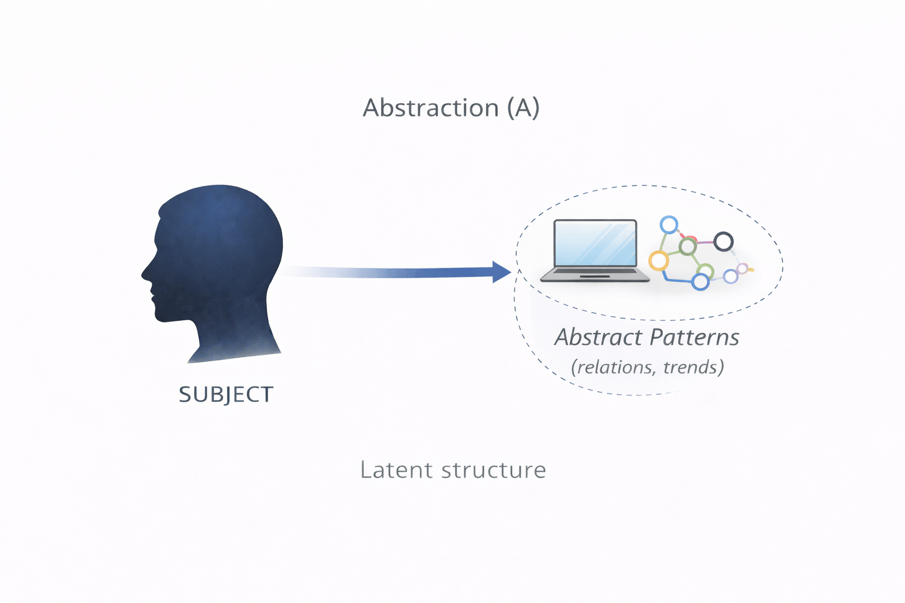

#### 3.2.2 Description:
Abstraction is **pattern** based perception, where the object is perceived in terms of **latent patterns**. If using it the subject looks at something, it will understand the **existing** or **potential patterns** related to it. Taking same example as previous, a subject perceives a printer printing pages using an abstraction function. It will say, *"There are millions of newspapers printed each day, so news publishers must be spending a lot on their maintenance. That could be why their budgets are so high."* It doesn't see the object or focus of consciousness as something concrete, but something explaining or creating patterns.

### 3.3 <u>Logic (L)</u>:

#### 3.3.1 Definition:
*"**Logic** is a domain of cognitive functions in which the subject perceives the object in terms of **logical properties**."*

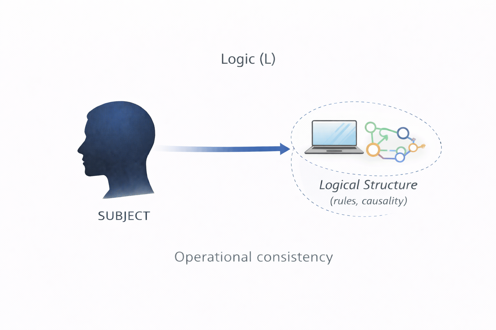

#### 3.3.2 Description:
Logic is **mechanical** perception, where the object is perceived in terms of **logical properties**. If using it the subject looks at something, it will see that in form of **logical connections**. Taking the same printer example, if the subject perceives a printer printing pages using a logic function. It will say, *"Printer prints pages? How is that? What's going on within it? What kind of components is it using? How are they inter-connected?"* It sees the object as something with **logical properties**, governing its nature, noticing its logical details first.

### 3.4 <u>Morality (M)</u>:

#### 3.4.1 Definition:
*"**Morality** is a domain of cognitive functions in which the subject perceives the object in terms of **moral values**."*

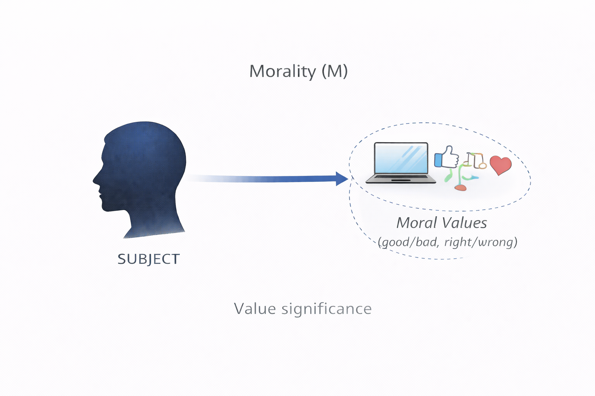

#### 3.4.2 Description:
Morality is **value-based** perception, where the object is perceived in terms of **moral values**. If using it the subject looks at something, it will see that in form of **moral values**. Consider the same printer example from previous examples, if the subject perceives a printer printing pages using a moral function. It will say, *"Such an incredible innovative piece made by someone is what we together are taking leverage of. We should similarly strive to contribute to society, as its a good virtue."* It sees the object as something that **holds some value** in it, or displays moral values in some way.

## 4. Directions For Functions

### 4.1 <u>Subjective (Sbj)</u>:

#### 4.1.1 Definition:
*"Using **subjective functions**, the subject evaluates the object with reference to the **available impressions** of target function domain with the **subject**. This perception is then merged into existing impressions as a single unit, and could be reflected upon, **independent** of object."*

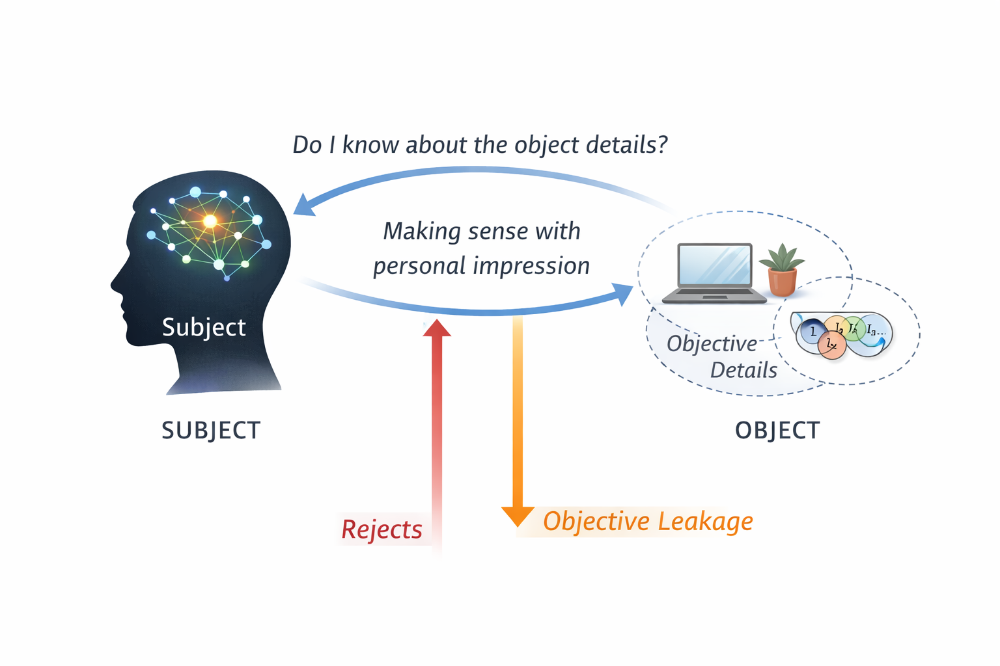

#### 4.1.2 Description:
Subject uses subjective function to understand the object by **recalling** their **past perceptions**. These perceptions exist in a **singular form** as an impression. And this new perceptions finally merges into a **single impression** after being understood, expanding understanding with the particular function. This continues with many perceptions and the subject keeps **accumulating new data**, increasing the overall size of unit impression. The subject could later reflect upon this impression **without** having to depend on an active stimulus from object. And because the subject matches object to each content present in impression, it is usually processes **slower** than objective functions.

### 4.2 <u>Objective (Obj)</u>:

#### 4.2.1 Definition:
*"Using **objective functions**, the subject evaluates the object with reference to the **available details** of target function domain about the **object**. This perception **pulls** the subject towards **mentally adapting** to those details, thus **dependent** on object."*

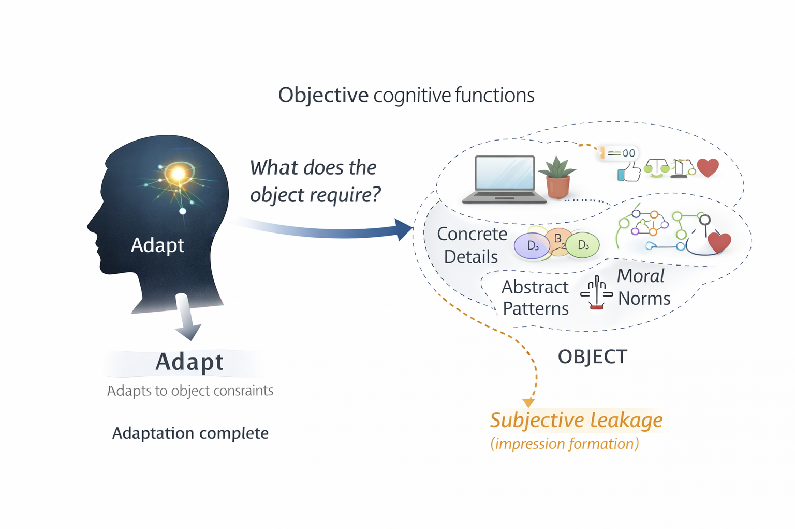

#### 4.2.2 Description:
Subject uses objective functions to understand the object by **noticing the details** that object possesses. These perceptions are seen as something **fresh and new**, not necessarily to do with past perceptions. It is **not** stored as a unit impression, instead it is just adaptation to the object's details **temporarily**, until the subject receives **active stimulus** from the object. After this stimulus ends, there is no use of it. Its not that the subject may not value what he learned from objective details, but he **won't reflect** upon it if he perceives newer objects. And because the subject isolates object as a system, it usually processes **faster** than subjective functions.

## 5. Cognitive Functions

### 5.1 <u>Subjective Experiencer (SbjX)</u>:

#### 5.1.1 Definition:
*"Using **subjective experiencer** function, the subject evaluates the object with reference to available **concrete impressions** with the **subject**. This experience is then merged into existing impressions about experiences as a single experience, and could be reflected upon, **independent** of object."*

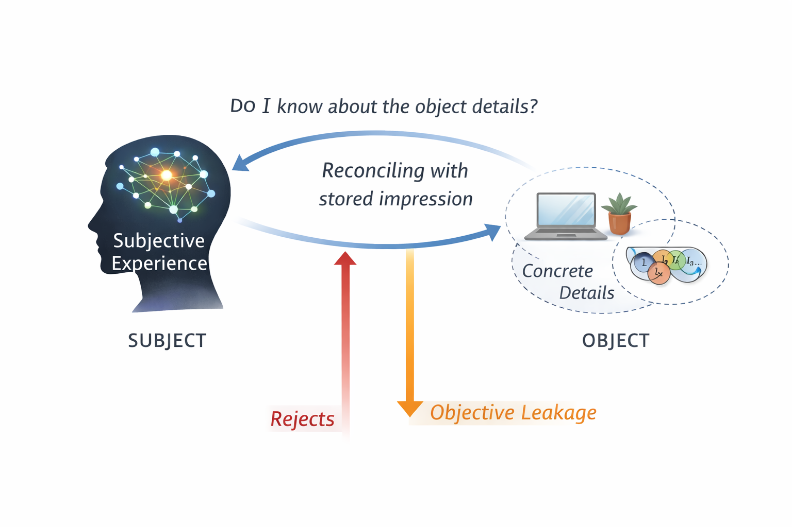

#### 5.1.2 Description:
When a subject uses **SbjX** function, it perceives the object and reflects upon how that experience makes sense to his existing impression of experiences. It accepts the experience if it makes sense with impression, and might reject the experience if it seems different from their experience. But they might still acquire newer experiences through **ObjX** leakages. Example for **SbjX** usage would be, a person understands why one of the two newly brought printers works as the previous one used to be, but won't prefer a printer with different controls. Or even after witnessing its working, he would prefer using the printer with known controls. But he will accept it if there is no other choice, or an **ObjX** leakage occurs.

### 5.2 <u>Objective Experiencer (ObjX)</u>:

#### 5.2.1 Definition:
*"Using **objective experiencer** function, the subject evaluates the object with reference to available **concrete details** about the **object**. This experience **pulls** the subject towards **mentally adapting** to those experiences, thus **dependent** on object."*

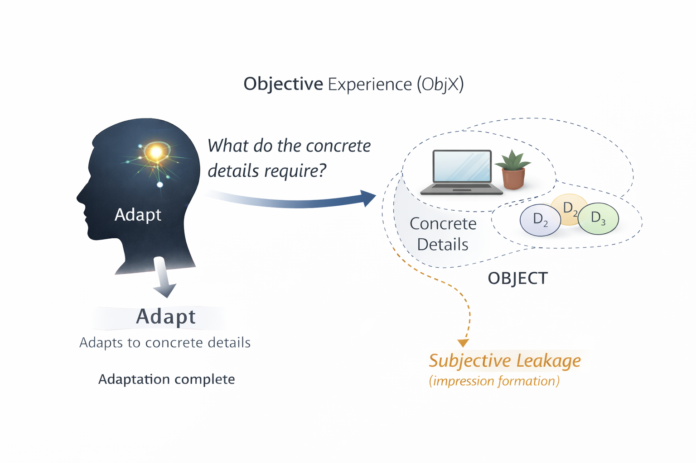

#### 5.2.2 Description:
When a subject uses **ObjX** function, it perceives the object and notices the concrete details with it, and then seeks to mentally adapt to those experiences. It is open to adapting newer experiences when required even if they don't align with personal experiences. But they might still form impressions through **SbjX** leakages. Example for **ObjX** usage would be, a person sees the difference in two newly brought printers with differing controls. He will be drawn towards using the printer with different controls than the existing one if it is situationally better to use. But he will use the printer with known working if there is none other available, or a **SbjX** leakage occurs.

### 5.3 <u>Subjective Abstraction (SbjA)</u>:

#### 5.3.1 Definition:
*"Using **subjective abstraction** function, the subject evaluates the object with reference to available **abstract impressions** with the **subject**. This abstract is then merged into existing impressions about patterns as a single abstract, and could be reflected upon, **independent** of object."*

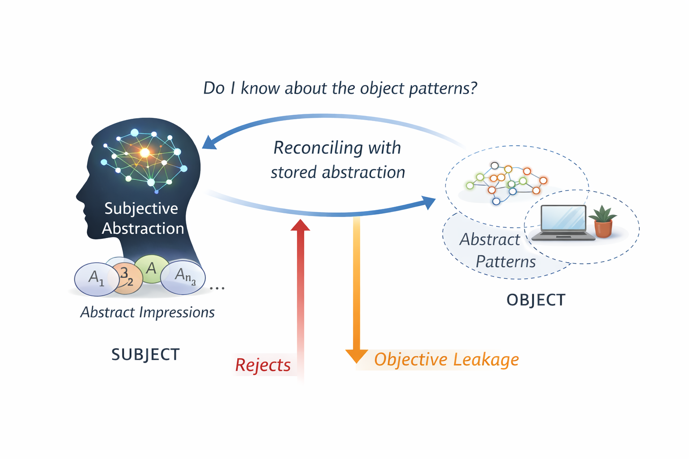

#### 5.3.2 Description:
When a subject uses **SbjA** function, it perceives the object and reflects upon how that abstraction makes sense to his existing impression of abstracts. It accepts the abstract if it makes sense with impression, and might reject the experience if it seems different from their abstraction. But they might still acquire newer abstractions through **ObjA** leakages. Example for **SbjA** usage would be, a person sees a new printer. He already possesses abstract model for previous printers, with different controls. He will look at its controls, and figures out how they must work by referring to those abstractions. And if it doesn't work, he either interprets the printer as something else, or looks for other abstract patterns under pressure, or due to **ObjA** leakage.

### 5.4 <u>Objective Abstraction (ObjA)</u>:

#### 5.4.1 Definition:
*"Using **objective abstraction** function, the subject evaluates the object with reference to available **abstract details** about the **object**. This abstraction **pulls** the subject towards **mentally adapting** to those patterns, thus **dependent** on object."*

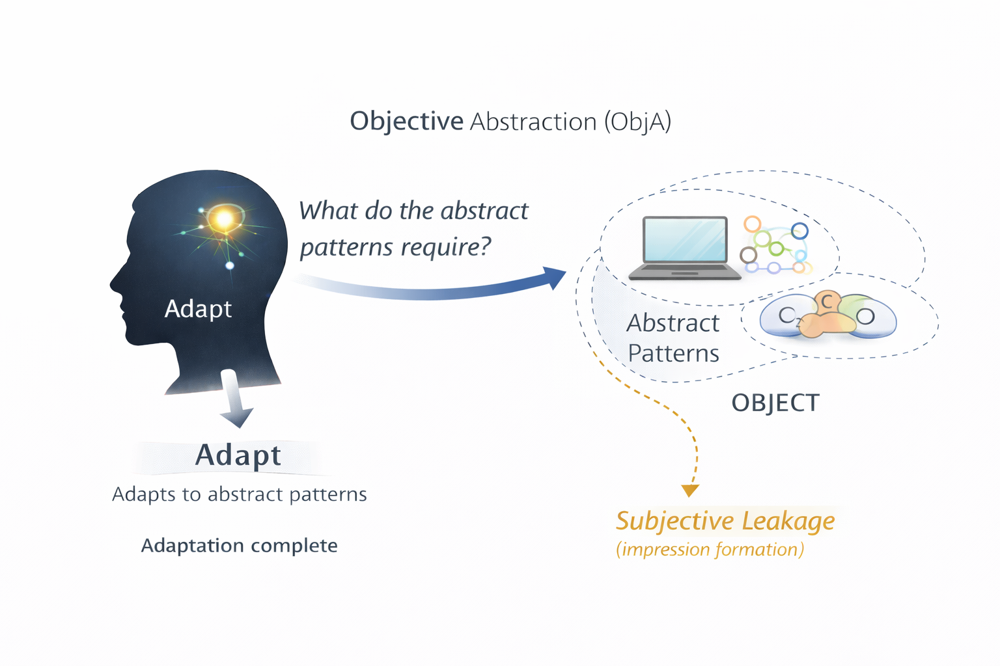

#### 5.4.2 Description:
When a subject uses **ObjA** function, it perceives the object and notices the abstract details with it, and then seeks to mentally adapt to those patterns. It is open to adapting newer abstractions when required even if they don't align with personal abstract understanding. But they might still form impressions through **SbjA** leakages. Example for **ObjA** usage would be, a person sees a new printer. He looks for the abstract details present in the printer itself, and understands the pattern its controls form altogether. Then he will try running it as per the pattern he figured out in its controls. If it doesn't work, he will look for a different pattern in it instead of interpreting it as something else. But he will use past impressions if not able to figure out for too long, or through **SbjA** leakage.

### 5.5 <u>Subjective Logician (SbjL)</u>:

#### 5.5.1 Definition:
*"Using **subjective logician** function, the subject evaluates the object with reference to available **logical impressions** with the **subject**. This logic is then merged into existing impressions as a single logic, and could be reflected upon, **independent** of object."*

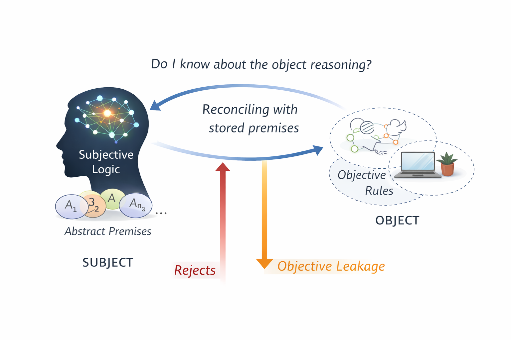

#### 5.5.2 Description:
When a subject uses **SbjL** function, it perceives the object and reflects upon how that logic makes sense to his existing impression of logic. It accepts the logical property if it makes sense with impression, and might reject the logic if it seems different from their logic. But they might still acquire newer logic through **ObjL** leakages. Example for **SbjL** usage would be, a person sees a new printer in office, and to make sense of its working he checks how it works within. But will reject it if that doesn't match his understanding of logic, or can't figure out its working through existing logical understanding. He might still adapt to work with printer's own logic if there is no other choice, or an **ObjA** leakage occurs.

### 5.6 <u>Objective Logician (ObjL)</u>:

#### 5.6.1 Definition:
*"Using **objective logician** function, the subject evaluates the object with reference to available **logical details** about the **object**. This logic **pulls** the subject towards **mentally adapting** to those logical properties, thus **dependent** on object."*

#### 5.6.2 Description:
When a subject uses **ObjL** function, it perceives the object and notices the logical details with it, and then seeks to mentally adapt to those logic. It is open to adapting newer logic when required even if they don't align with personal logical understanding. But they might still form impressions through **SbjL** leakages. Example for **ObjL** usage would be, a person sees a new printer. He looks for the logical properties present in the printer itself to make sense of how they work. If it doesn't work, they might then try figuring it out as per how they must work using their personal understanding of logical properties through **SbjL** logic.

### 5.7 <u>Subjective Moral (SbjM)</u>:

#### 5.7.1 Definition:
*"Using **subjective moral** function, the subject evaluates the object with reference to available **moral impressions** with the **subject**. This value is then merged into existing impressions about morality as a single unit, and could be reflected upon, **independent** of object."*

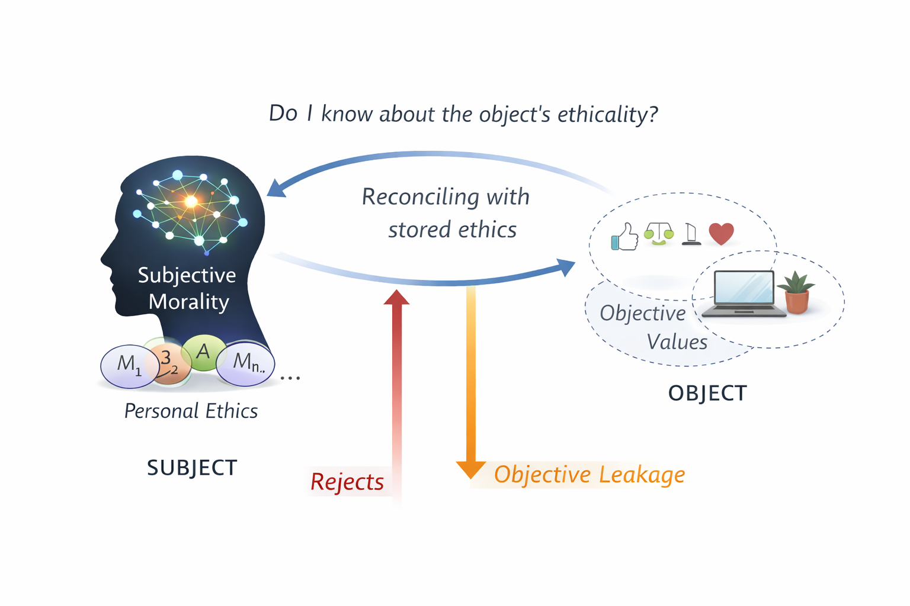

#### 5.7.2 Description:
When a subject uses **SbjM** function, it perceives the object and reflects upon how that value makes sense to his existing impression of morality. It accepts the value if it makes sense with impression, and might reject the value if it seems different from their morals. But they might still acquire newer values through **ObjM** leakages. Example for **SbjM** usage would be, a person is considering buying a new printer. And the company which manufactured it is known for certain tactics to market their products. Now he will not buy it if his past moral impressions take those tactics as immoral. But he might buy if an important work has to be done and there is no other choice, or an **ObjM** leakage occurs with no one else using it in same office has any problem.

### 5.8 <u>Objective Moral (ObjM)</u>:

#### 5.8.1 Definition:
*"Using **objective moral** function, the subject evaluates the object with reference to available **moral details** about the **object**. This morality **pulls** the subject towards **mentally adapting** to those morals, thus **dependent** on object."*

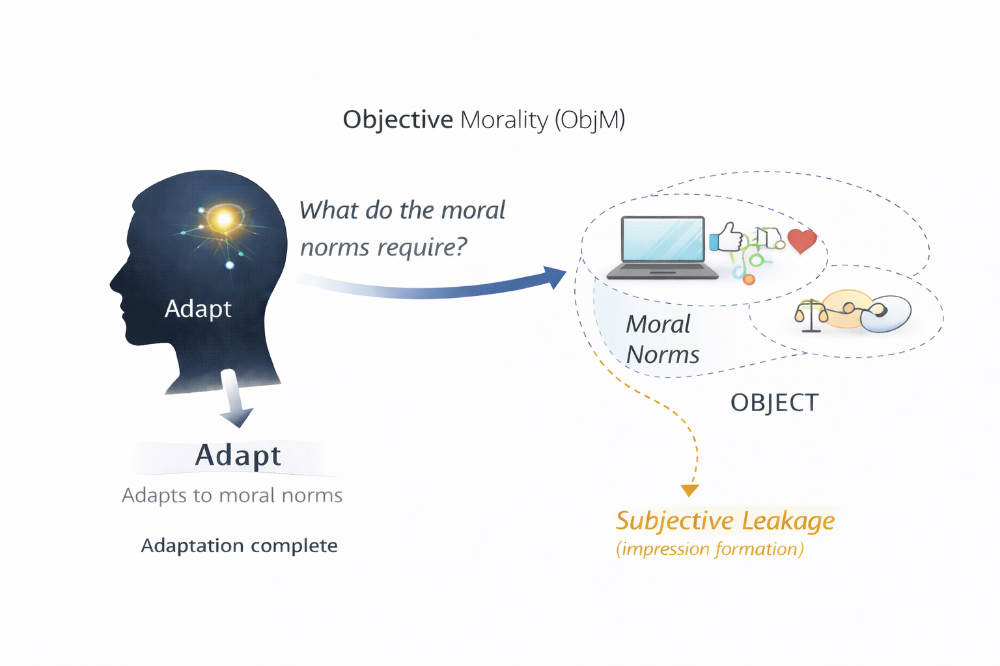

#### 5.8.2 Description:
When a subject uses **ObjM** function, it perceives the object and notices the moral details with it, and then seeks to mentally adapt to those values. It is open to adapting newer values when required even if they don't align with personal morals. But they might still form impressions through **SbjM** leakages. Example for **ObjM** usage would be, a person considers buying new printer. And the company uses questionable marketing tactics like previous example. Now he will check if everyone else in the office who would be using it has any problem with that. If no, he will proceed to buy it and adapt to group's morals. But he might reject it if other users have problem with it, or a **SbjM** leakage occurs.

## 6. Positioning System

### 6.1 <u>Energy Theory</u>:

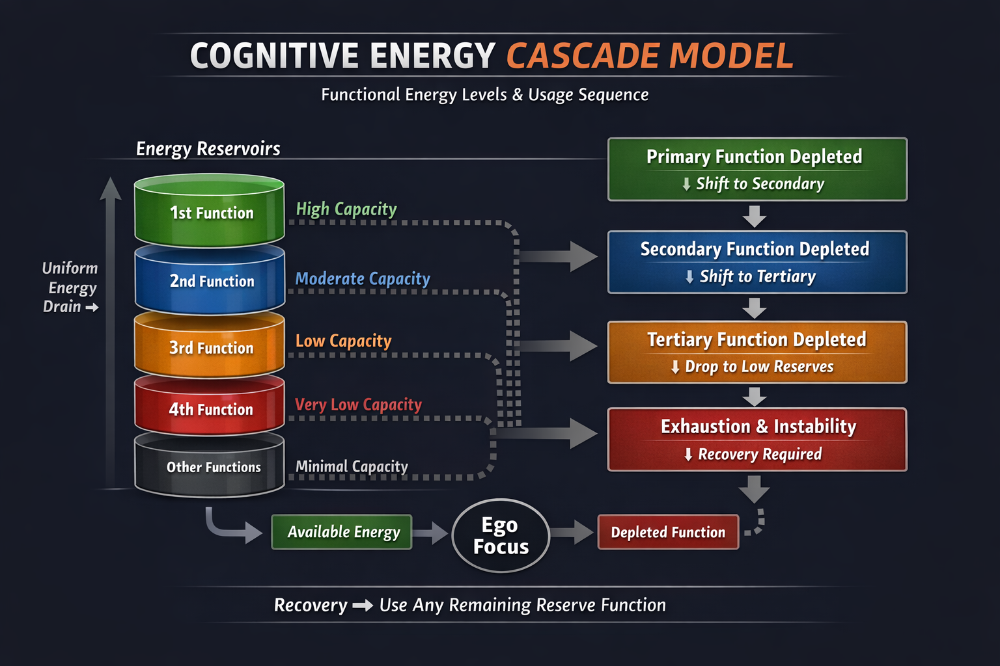

There are **8 cognitive functions** as discussed before, which are arranged in **decreasing order** of their energy capacity. Meaning, the first function in order (**1st** function) has the highest energy storage capacity, second in series (**2nd function**) has the second highest energy capacity, and so on. And finally the last function in series (**8th function**) has least capacity for storing energy. And the ego tends to default to the function which at a given frame of time has highest energy in them, but after switching a fixed energy cost is paid by the chosen function, or energy in it is less than that cost, it outright crashes to point where no energy is left.

So that way, when all the functions have theoretically full energy as per their respective capacities, the ego defaults to **1st function**. And when the energy level for **1st function** drops below **2nd function** with minimal energy cost paid, the ego will default to using **2nd function** as perceiving function. And when energy level of **2nd function** falls below the third's level with minimal cost paid, ego switches to using **3rd function** for perceiving. Or if **1st function** charges to a level more than **3rd function**, ego returns to using **1st function**.

Cognitive functions **deplete** energy during use but recover only when **disengaged**. Recovery is not automatic and occurs under conditions specific to each function’s domain. In general, recovery is slower than depletion, introducing asymmetry that allows burnout, cascade, and delayed stabilization. The model therefore avoids equilibrium assumptions while preserving long-term functional reuse.

What ego chooses by default, and what the subject manually chooses to use **aren't same**. Ego works as per the defined **energy theory**, but the subject might choose a function with lower energy level and at any position, **by choice**. Ego just **directs the tendency** of subject towards the function with highest energy, **not** control the subject's decision which they can consciously take **against tendency**. But its usually **unhealthy** when subject chooses so, resulting in frequent burnout and dissatisfaction. The tendency of ego towards a particular mode of perception if used at right area of focus, it adds to satisfaction of the subject.

### 6.2 <u>Positioning Logic</u>:

If first function is **Sbj** type, all other odd positions (**3rd**, **5th**, **7th**) are also of **Sbj** type, and the even positions (**2nd**, **4th**, **6th**, **8th**) are of **Obj** type. Else if first function is **Obj** type, all other odd positions (**3rd**, **5th**, **7th**) are also of **Obj** type, and the even positions (**2nd**, **4th**, **6th**, **8th**) are of **Sbj** type.

**Experience (X)** & **Abstraction (A)** in same direction (both **Sbj**/**Obj**) are completely opposite to each other, just like **Logic (L)** & **Morality (M)** in same direction are. This is because **X** & **A**, and **L** & **M** in same direction are two alternative choice subject gets to perceive, where only one can be used. So for example **ObjA**, its complete opposite function would be **ObjX**. Because theoretically when each function is at equal level, the ego will choose the one which has highest energy capacity.

The capacitive position of complete opposite type depends on how far they are from center of positioning. Both the functions must have equal radius from center. So if a function say **ObjM** is at **1st**, **ObjL** would be at **8th**. Or if **ObjM** is at **2nd**, **ObjL** would be at **7th**, and so on.

### 6.3 <u>Types Table</u>:

- The table below shows each 16 type with their most capacitive function (**1st function**) to least capacitive function (**8th function**).

| **Type**  | **1st** | **2nd** | **3rd** | **4th** | **5th** | **6th** | **7th** | **8th** |
| --------- | ------- | ------- | ------- | ------- | ------- | ------- | ------- | ------- |
| **SbjXL** | SbjX    | ObjL    | SbjM    | ObjA    | ObjX    | SbjL    | ObjM    | SbjA    |
| **SbjXM** | SbjX    | ObjM    | SbjL    | ObjA    | ObjX    | SbjM    | ObjL    | SbjA    |
| **ObjLX** | ObjL    | SbjX    | ObjA    | SbjM    | SbjL    | ObjX    | SbjA    | ObjM    |
| **ObjMX** | ObjM    | SbjX    | ObjA    | SbjL    | SbjM    | ObjX    | SbjA    | ObjL    |
| **SbjLX** | SbjL    | ObjX    | SbjA    | ObjM    | ObjL    | SbjX    | ObjA    | SbjM    |
| **SbjMX** | SbjM    | ObjX    | SbjA    | ObjL    | ObjM    | SbjX    | ObjA    | SbjL    |
| **ObjXL** | ObjX    | SbjL    | ObjM    | SbjA    | SbjX    | ObjL    | SbjM    | ObjA    |
| **ObjXM** | ObjX    | SbjM    | ObjL    | SbjA    | SbjX    | ObjM    | SbjL    | ObjA    |
| **SbjAL** | SbjA    | ObjL    | SbjM    | ObjX    | ObjA    | SbjL    | ObjM    | SbjX    |
| **SbjAM** | SbjA    | ObjM    | SbjL    | ObjX    | ObjA    | SbjM    | ObjL    | SbjX    |
| **ObjLA** | ObjL    | SbjA    | ObjX    | SbjM    | SbjL    | ObjA    | SbjX    | ObjM    |
| **ObjMA** | ObjM    | SbjA    | ObjX    | SbjL    | SbjM    | ObjA    | SbjX    | ObjL    |
| **SbjLA** | SbjL    | ObjA    | SbjX    | ObjM    | ObjL    | SbjA    | ObjX    | SbjM    |
| **SbjMA** | SbjM    | ObjA    | SbjX    | ObjL    | ObjM    | SbjA    | ObjX    | SbjL    |
| **ObjAL** | ObjA    | SbjL    | ObjM    | SbjX    | SbjA    | ObjL    | SbjM    | ObjX    |
| **ObjAM** | ObjA    | SbjM    | ObjL    | SbjX    | SbjA    | ObjM    | SbjL    | ObjX    |

### 6.4 <u>Porting Equivalent Types</u>:

- References to Jungian typology, MBTI, and Socionics are provided for comparative orientation only and do not imply theoretical equivalence [1–3].
- The table below shows ported types from Potentiology to other Jungian typologies.
- These are approximation to closest type, but not static for difference in theories across each of them.

| Potentiology | Classic Jungian | MBTI | Socionics |
| :----------: | :-------------: | :--: | :-------: |
|    SbjXL     |      IS(T)      | ISTJ |    SLI    |
|    SbjXM     |      IS(F)      | ISFJ |    SEI    |
|    ObjLX     |      ET(S)      | ESTJ |    LSE    |
|    ObjMX     |      EF(S)      | ESFJ |    ESE    |
|    SbjLX     |      IT(S)      | ISTP |    LSI    |
|    SbjMX     |      IF(S)      | ISFP |    ESI    |
|    ObjXL     |      ES(T)      | ESTP |    SLE    |
|    ObjXM     |      ES(F)      | ESFP |    SEE    |
|    SbjAM     |      IN(F)      | INFJ |    IEI    |
|    SbjMA     |      IF(N)      | INFP |    EII    |
|    ObjMA     |      EF(N)      | ENFJ |    EIE    |
|    ObjAM     |      EN(F)      | ENFP |    IEE    |
|    SbjAL     |      IN(T)      | INTJ |    ILI    |
|    SbjLA     |      IT(N)      | INTP |    LII    |
|    ObjLA     |      ET(N)      | ENTJ |    LIE    |
|    ObjAL     |      EN(T)      | ENTP |    ILE    |

## 7. Types Explanations

# 7. Types Explanations

Each type is defined by its most capacitive function (**1st**) and evaluative axis. Descriptions use only the defined domains and directions. The ego defaults to the highest-energy function. Satisfaction occurs when the environment matches the primary function’s natural mode.

### 7.1 <u>SbjXL</u>:

**One-line definition:** Stabilizes reality through subjective concrete impressions, using objective logic to preserve experiential consistency.
**Dominant:** SbjX (Subjective Experiencer)
**Core orientation:** Perceives via stored concrete impressions, new experiences are accepted only if they match existing ones.
**Satisfaction/Stress:** Satisfaction when familiar experiences are supported by clear mechanical rules, stress/crash when forced into unfamiliar concrete details (ObjX).
**Signature:** Prefers proven tools and routines, resists new systems unless the interface feels exactly like the old one.

### 7.2 <u>SbjXM</u>:

**One-line definition:** Stabilizes reality through subjective concrete experience, using objective morality to preserve value consistency.
**Dominant:** SbjX
**Core orientation:** Trusts familiar concrete impressions as the baseline of reality.
**Satisfaction/Stress:** Satisfaction in environments aligned with lived moral impressions, crash when forced moral adaptation (ObjM) or unfamiliar concrete input (ObjX) occurs.
**Signature:** Loyal to morally familiar practices; learns values through direct lived consequences.

### 7.3 <u>ObjLX</u>:

**One-line definition:** Stabilizes reality through objective logical properties, grounded by concrete experience.
**Dominant:** ObjL (Objective Logician)
**Core orientation:** Perceives mechanical/logical properties in objects directly.
**Satisfaction/Stress:** Satisfaction solving concrete problems with clear rules, stress when internal logic (SbjL) is forced over external validation.
**Signature:** Spots system inefficiencies instantly; values functional correctness over tradition.

### 7.4 <u>ObjMX</u>:

**One-line definition:** Stabilizes reality through objective moral norms, using concrete experience as alignment feedback.
**Dominant:** ObjM (Objective Moral)
**Core orientation:** Adapts to shared external moral values and norms.
**Satisfaction/Stress:** Satisfaction in stable moral-social frameworks, stress when personal moral impressions (SbjM) conflict with group norms.
**Signature:** Highly attuned to prevailing moral climate, chooses options that maintain external consensus.

### 7.5 <u>SbjLX</u>:

**One-line definition:** Stabilizes reality through subjective logical impressions, supported by concrete experience.
**Dominant:** SbjL (Subjective Logician)
**Core orientation:** Evaluates objects against internal logical impressions.
**Satisfaction/Stress:** Satisfaction when external experience aligns with internal logic, crash under chaotic concrete input (ObjX).
**Signature:** Prefers logically coherent explanations, skeptical of procedures that lack internal justification.

### 7.6 <u>SbjMX</u>:

**One-line definition:** Stabilizes reality through subjective moral impressions, grounded by concrete experience.
**Dominant:** SbjM (Subjective Moral)
**Core orientation:** Judges situations by consistency with personal moral impressions.
**Satisfaction/Stress:** Satisfaction when actions match internal right/wrong, fatigue when forced external moral alignment (ObjM).
**Signature:** Strong personal value integrity, rejects pragmatic compromises that violate lived moral impressions.

### 7.7 <u>ObjXL</u>:

**One-line definition:** Stabilizes reality through objective concrete details, organized by subjective logic.
**Dominant:** ObjX (Objective Experiencer)
**Core orientation:** Adapts directly to concrete object details.
**Satisfaction/Stress:** Satisfaction with free concrete adaptation plus logical organization, crash when familiar impressions (SbjX) are violated.
**Signature:** Hands-on and adaptable, quickly masters new tools by trying them directly.

### 7.8 <u>ObjXM</u>:

**One-line definition:** Stabilizes reality through objective concrete experience, filtered by subjective morality.  
**Dominant:** ObjX
**Core orientation:** Adapts to concrete demands, then checks against personal moral impressions.
**Satisfaction/Stress:** Satisfaction when concrete situations align with internal values, stress from moral-value conflict (ObjM).
**Signature:** Practical yet value-driven, learns through direct trial while protecting personal ethics.

### 7.9 <u>SbjAL</u>:

**One-line definition:** Stabilizes reality through subjective latent patterns, verified by objective logic. 
**Dominant:** SbjA (Subjective Abstraction)
**Core orientation:** Perceives via stored internal pattern impressions.
**Satisfaction/Stress:** Satisfaction when patterns are mechanically confirmed, crash when forced external patterns (ObjA) disrupt internal model.
**Signature:** Sees long-term structures, accepts new information only if it fits existing latent framework.

### 7.10 <u>SbjAM</u>:

**One-line definition:** Stabilizes reality through subjective latent patterns, oriented by moral values.  
**Dominant:** SbjA
**Core orientation:** Maps reality through internal pattern impressions.
**Satisfaction/Stress:** Satisfaction when patterns align with group norms, stress from conflicting personal moral values (SbjM).
**Signature:** Idealistic pattern-seeker guided by group norms coherence.

### 7.11 <u>ObjLA</u>:

**One-line definition:** Stabilizes reality through objective logical properties, supported by subjective patterns.
**Dominant:** ObjL
**Core orientation:** Analyzes mechanical/logical properties in objects.
**Satisfaction/Stress:** Satisfaction in logically coherent systems with clear patterns, stress when internal logic (SbjL) overrides external validation.
**Signature:** Strategic systems thinker, values logical elegance and emergent structure.

### 7.12 <u>ObjMA</u>:

**One-line definition:** Stabilizes reality through objective moral norms, interpreted via subjective patterns.
**Dominant:** ObjM
**Core orientation:** Adapts to shared external moral values.
**Satisfaction/Stress:** Satisfaction when moral norms form coherent internal patterns, stress from personal moral conflict (SbjM).
**Signature:** Socially attuned strategist who sees underlying moral trends.

### 7.13 <u>SbjLA</u>:

**One-line definition:** Stabilizes reality through subjective logical impressions, expanded by objective patterns.
**Dominant:** SbjL
**Core orientation:** Evaluates via internal logical impressions.
**Satisfaction/Stress:** Satisfaction when new patterns enrich internal logic, crash when forced external logic (ObjL) contradicts impressions.
**Signature:** Theoretical thinker who values logical pattern coherence.

### 7.14 <u>SbjMA</u>:

**One-line definition:** Stabilizes reality through subjective moral impressions, informed by objective patterns.
**Dominant:** SbjM
**Core orientation:** Judges by consistency with personal moral impressions.
**Satisfaction/Stress:** Satisfaction when patterns support internal moral framework, stress from external moral pressure (ObjM).
**Signature:** Value-driven pattern seeker guided by personal ethics.

### 7.15 <u>ObjAL</u>:

**One-line definition:** Stabilizes reality through objective latent patterns, organized by subjective logic.
**Dominant:** ObjA (Objective Abstraction)
**Core orientation:** Perceives fresh latent patterns in objects.
**Satisfaction/Stress:** Satisfaction in pattern-rich environments with logical organization, crash when internal patterns (SbjA) are forced.
**Signature:** Innovative pattern spotter who values logical insight.

### 7.16 <u>ObjAM</u>:

**One-line definition:** Stabilizes reality through objective latent patterns, evaluated by subjective morality.
**Dominant:** ObjA
**Core orientation:** Adapts to external latent patterns.
**Satisfaction/Stress:** Satisfaction when patterns align with personal moral impressions, stress from internal moral conflict (SbjM).
**Signature:** Visionary who sees ethical possibilities in emerging patterns.

## 8. Important Note

### 8.1 <u>For Mental Health Professionals</u>:

Potentiology is **not a diagnostic or clinical framework** and must not be used as a substitute for established psychological or psychiatric models. It describes **cognitive perception styles and energy dynamics**, not mental health conditions or pathology.

Types, crashes, leakages, and dissatisfaction in Potentiology do **not** indicate disorders. They represent **energy conflicts or misalignment** between a subject’s dominant functions and their environment, which may coexist with but do not imply clinical issues.

For professionals, Potentiology may serve as a **supplementary interpretive tool**, useful for understanding burnout, chronic dissatisfaction, value conflict, or why certain coping strategies repeatedly fail. It can help reframe distress in terms of **energy depletion and perceptual mismatch**, rather than personal weakness.

Potentiology should always be applied **alongside**, never **in place of**, evidence-based assessment, diagnosis, and treatment.

### 8.2 <u>For Educators & Researchers</u>:

Potentiology is intended as a **theoretical and exploratory cognitive model**, not a validated educational or scientific instrument. It may be useful for **conceptual analysis, comparative theory, and hypothesis generation**, but it should not be presented as established psychological fact.

Educators and researchers may use Potentiology to examine **modes of perception, evaluative bias, energy depletion, and environmental fit**, especially in interdisciplinary contexts such as cognitive science, systems theory, or human–machine interaction. However, empirical claims drawn from the model must be **clearly labeled as speculative** unless independently validated.

Potentiology should be treated as a **framework for structured thinking**, not as a replacement for experimentally grounded models or standardized pedagogical tools.

### 8.3 <u>For Hobbyists & General Users</u>:

Potentiology is a **self-exploratory and explanatory framework**, not a test, label, or measure of worth. Types describe **how perception and evaluation tend to operate**, not intelligence, maturity, or success.

Use the model to understand **patterns of satisfaction, burnout, and preference**, not to box yourself or others into rigid identities. People can and do operate outside their dominant functions, often at an energy cost.

Potentiology works best as a **tool for reflection**, not comparison. Treat it as a map for understanding tendencies, not a rulebook for judging behavior.

## 9. References

[1] Jung, C. G. (1921). *Psychological Types*. Princeton University Press.
[2] Myers, I. B., & McCaulley, M. H. (1985). *Manual: A Guide to the Development and Use of the Myers-Briggs Type Indicator*. Consulting Psychologists Press.
[3] Augusta, A. (1995). *The Theory of Information Metabolism*. Vilnius.
[4] Kahneman, D. (1973). *Attention and Effort*. Prentice-Hall.

## 10. License

Licensed under Creative Commons Attribution 4.0 International (CC BY 4.0)
https://creativecommons.org/licenses/by/4.0/

---
