# Temporal Cognitive Model

Gourav Kumar Mallick
Parul University
12b.39gourav@email.com

## Abstract

1. Explain how term makes sense
2. Expand definition
3. Provide an example
4. Contrast with stereotypes

## 1. Terminologies

- **Function:** Shorter term for *cognitive function*.
- **Cognitive function:** Mode of perception with a direction of focus.
- **Subject:** Conscious entity which perceives the *object*.
- **Object:** Content of consciousness which is being perceived by *subject*.
- **Impression:** A compressed, internally stored representation of repeated perceptions within a domain.

## 2. Types Of Function Domains

### 2.1 <u>Dynamic Function Domains (S/N)</u>:

*"Function domains that are **dependent** on **temporal traversal**, focused on **progressive** time frames, and process events in terms of the **timeline**."*

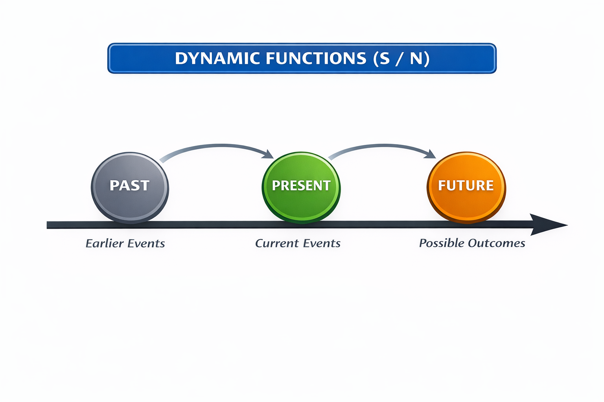

It is termed as *dynamic function* for being an active carrier of time, related *"dynamically"* to time. The function domains, and their derivative cognitive function are directly related to flow of time. They can be represented on a timeline ranging from negative infinity to positive infinity, and could refer to past, present, future, or imaginary timeline. They just observe the flow of time from any part of the timeline, without evaluating its contents. For someone using it, the conscious energy flows towards the recall of timeline, or simulating one that doesn't exist or haven't been experienced. For someone who often imagines or often recalls past, they might probably possess a *lens* which is a dynamic function.

### 2.2 <u>Static Function Domains (T/F)</u>:

*"Function domains that are **independent** of **temporal traversal**, focused on the **evaluation** of time frames, and process events in terms of **values**."*

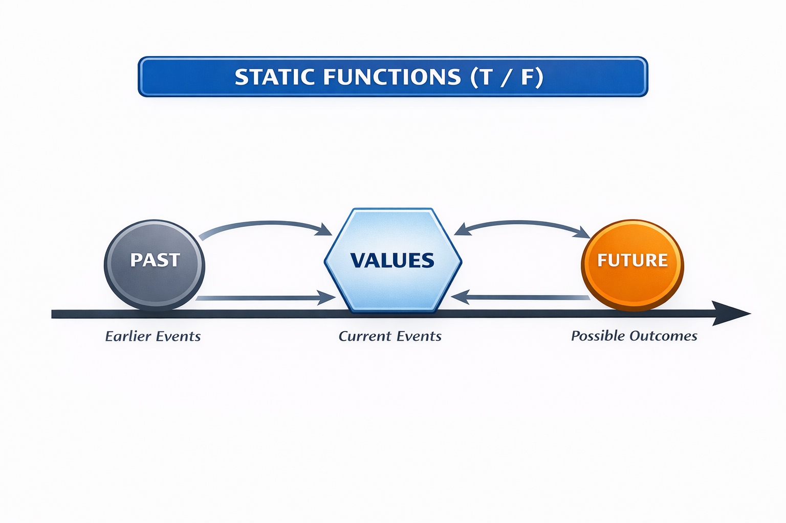

It is termed as *static function* for not actively experiencing flow of time (past, present, future, or imaginary), being *"static"* in relation to it, thus engaging with the values in content that these time frames or the experience brings. These analysis are conducted using any form of values, which might make sense or not, possible to be represented or not, but they are related to values. And these values can be represented in terms of numbers, labels, or preferences, etc. Someone using static function as their *lens* would be concerned about logical, moral, or preference-driven correctness for a system that is being analyzed. Flow of time or alternatives aren't their primary source of energy utilization.

## 3. Function Domains

### 3.1 <u>Sensing (S)</u>:

*"Dynamic function domain which processes events based on the **lived timeline**, i.e., directly experienced moments, having **endpoints**."*

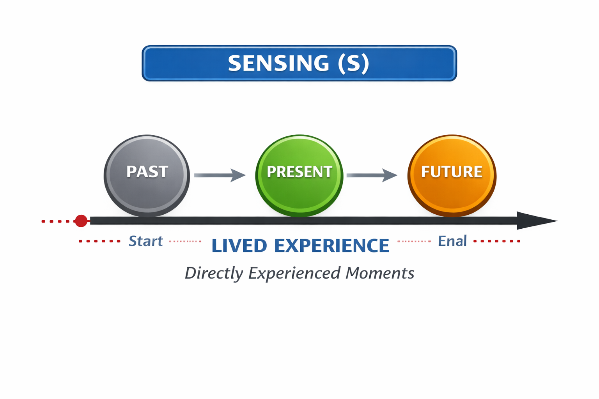

***Sensing*** is the dynamic function domain in which the conscious energy is concentrated towards recalling or observation of *lived timeline*, which is simply everything that a subject has *experienced* through their *five senses*. So its basically that part of timeline which the subject has gone through, starting from its *birth to the present moment* that is being experienced actively. Those having their lens as a sensing function are often practical, believing in what they have experienced or see themselves. And they might not be very willing to process something that is out of bound from their experienced timeline.

### 3.2 <u>Intuition (N)</u>:

"*Dynamic function domain which processes events based on a **simulated timeline**, i.e., indirectly experienced moments, having **no endpoints**.*"

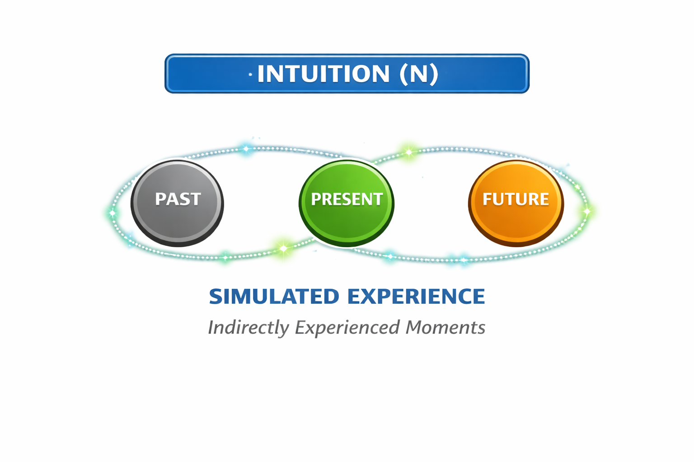

Intuition is the dynamic function domain in which the conscious energy is concentrated towards simulating a timeline that the subject hasn't witnessed through its senses directly. So its basically the function in which the subject refers to the simulated alternative timeline, which it hasn't necessarily gone through. Even in experienced cases, it will prefer simulation of new scenarios. Those having their lens as an intuition function often think out of bounds to their lived or experienced timeline, being imaginative and anticipating truth and foresights, based on real-world or imaginary alternative worlds.

### 3.3 <u>Thinking (T)</u>:

*"Static function domain that processes events in terms of values based on the **structural properties** of the object in focus."*

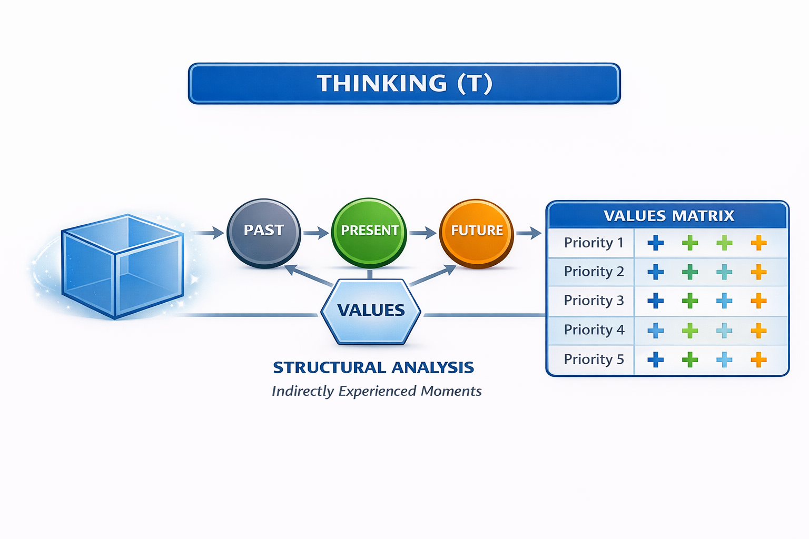

Thinking is the static function domain in which the conscious energy is concentrated towards evaluation of time frames of objects based on values of its structural properties. However, it might be confused as intuition for being related to digging insights. So using thinking function, one might use logical formulae or methods to jump through time frames or simulate it, but not referring to time in its raw form. Those having their lens as a thinking function often analyze a given system or structure for their respective motivations, using values. Values here are related to the properties of logical system, whether measured in size, mass, or performance, etc.

### 3.4 <u>Feeling (F)</u>:

*"Static function domain that processes events in terms of values based on the **abstract importance** of the object in focus."*

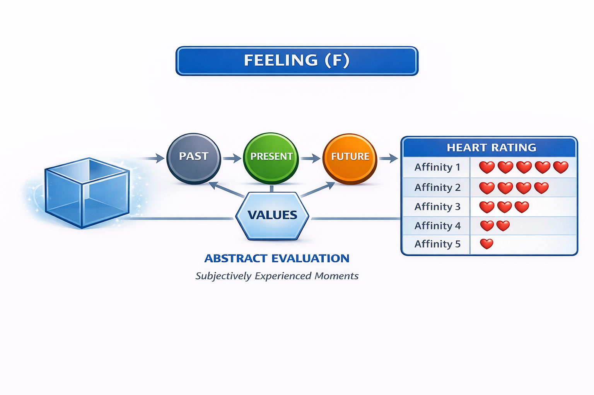

Feeling is the static function domain in which the conscious energy is concentrated towards evaluation of time frames based on its abstract importance. It is different from thinking given this type of value can't be logically deducted or inferred from any source. These are rather more abstract analysis based on how someone gives it importance, or has strong feeling towards. This is different from sensational feeling, more about norms, morality, or principles, etc. Those having their lens as a feeling function often have strong moral standards or preferences which might not be explainable or provable in terms of logic or efficiency.

## 4. Modes Of Reference

### 4.1 <u>Introversion (i)</u>:

*"A mode of reference in which the conscious energy is concentrated at a **resting impression**, relying on a **stable source** of data."*

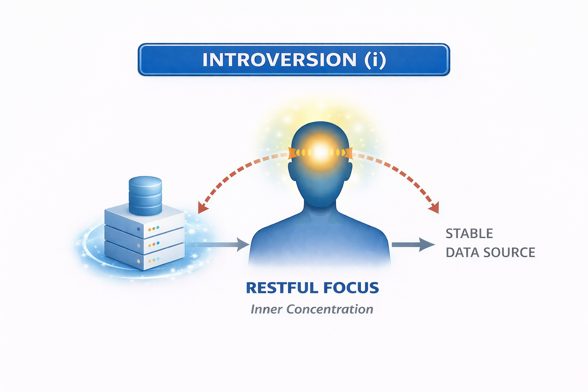

Introversion is a mode of reference in which the conscious energy is concentrated on source of impression that is stable and resting in balance. This impression is isn't actively relying on any stimuli or source to be updated with new data. Any changes made to this resting impression is slow and steady. A subject whose lens is introverted in nature, usually engages with a singular stable impression. While what they do with it whether that's creation, formation, speculation, understanding, depends completely on them. For any given function, what's predictable is how that is used by subject to process. Not their intent or goal.

### 4.2 <u>Extroversion (e)</u>:

*"Mode of reference in which the conscious energy is concentrated at an **active impression**, relying on the **latest source** of data."*

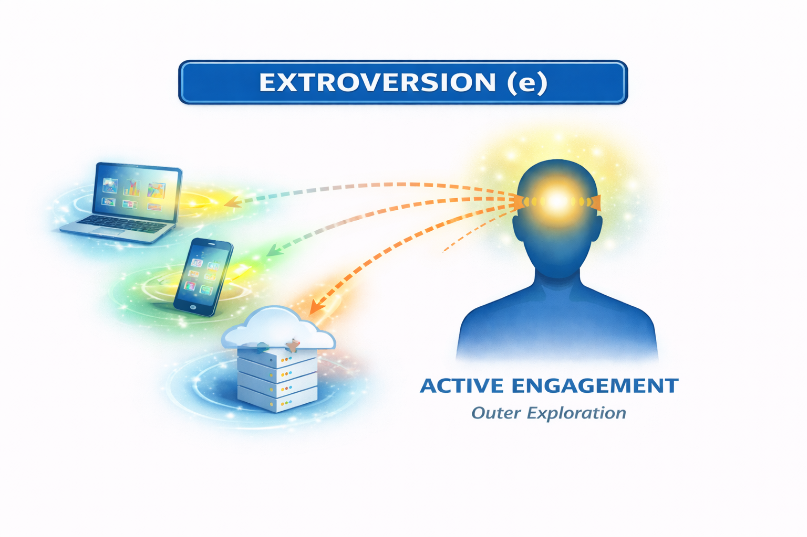

Extroversion is a mode of reference in which the subject's conscious energy concentrates on latest sources of data. This impression might change actively, as new sources of impression appear. The source of impression can be anything latest, including what someone has recently witnessed, trends, moral values people possess, newest statistical records, manual that has been recently updated with best practices, etc. The subject doesn't rely on itself or its own impressions as his lens, but what impression is latest. Just like those with function as any introverted lens, people with extroverted lens function will use it to process, but what they do after that is completely on them.

## 5. Cognitive Functions

### 5.1 <u>Introverted Sensing (Si)</u>:

*"Cognitive function in which the conscious energy is concentrated on the **whole timeline** that the subject has experienced, i.e., since birth to **every moment that has passed** by, as a **resting impression**."*

$$ \text{Sensing (S) + Introversion (i) = Si} $$

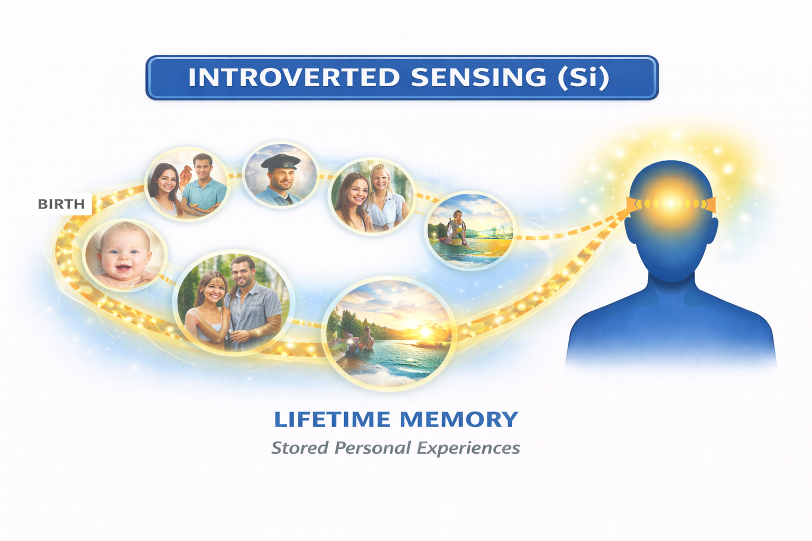

Introverted sensing is the cognitive function in which the conscious energy of the subject concentrates on the part of timeline that subject has personally experienced through his five senses, i.e. in form of sight, taste, hearing, touch, or odors. It is not about their ability of precisely or accurately recalling events, but the act of reference to their memory. Having this as their lens, they will refer to their past experiences time-to-time for making decisions or carrying out activities. But what they do with those reference points completely depends on them. They might not necessarily be stuck in routine or be closed-minded, given its theoretical possible for them to adjust to new conditions by processing new experiences as similar to how their past was.

### 5.2 <u>Extroverted Sensing (Se)</u>:

*"Cognitive function in which the conscious energy is concentrated on the **end of the timeline** in the subject's experience, i.e., the **present moment**, it is facing actively, as an **active impression**."*

$$ \text{Sensing (S) + Extroversion (e) = Se} $$

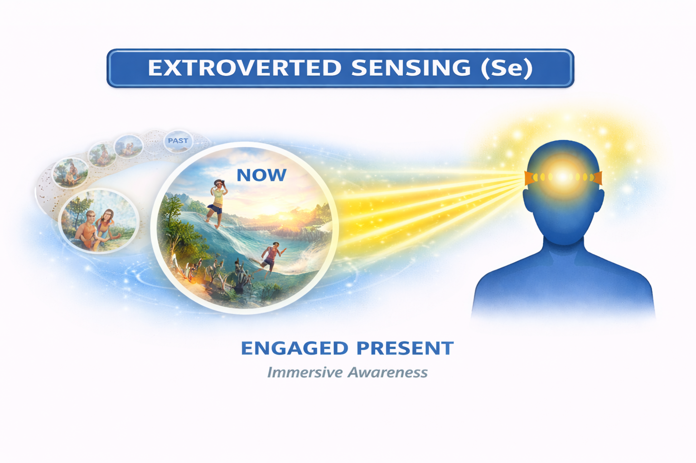

Extroverted sensing is the cognitive function in which the conscious energy of the subject is concentrated on the very end of their lived experience, i.e. the present moment. It is because the last lived experience is technically the final time frame that the subject experienced, constantly sticking to the the latest time frame as the recent source of data. Those who have their lens as extroverted sensing, have very high awareness to what's going on around them every now and then. This doesn't necessarily has anything to do with seeking new or exciting experiences, with optimistic or reckless attitude, given its on the motivations of the subject and how they use it. But they don't often concentrate much on past, future consequences, or possibilities.

### 5.3 <u>Introverted Intuition (Ni)</u>:

*"Cognitive function in which the conscious energy is concentrated on the **whole timeline** that the **subject simulates** on an eternal scale, as a **resting impression**."*

$$ \text{Intuition (N) + Introversion (i) = Ni} $$

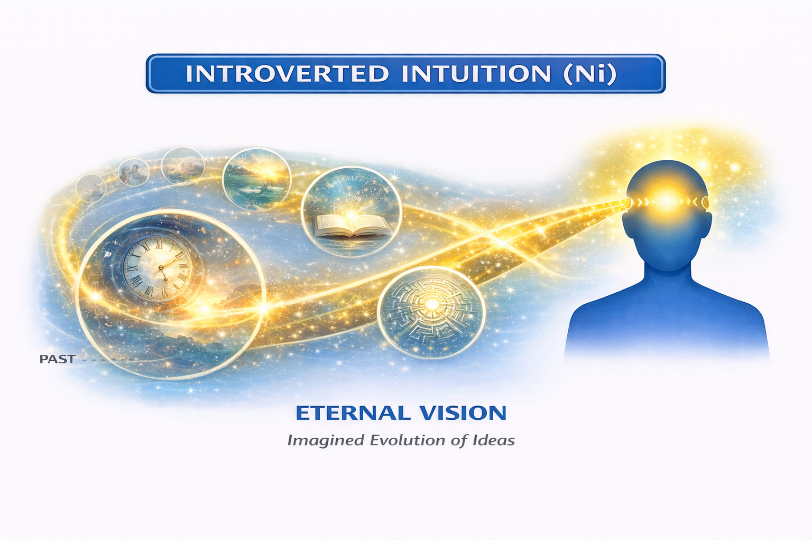

Introverted intuition is the cognitive function in which the conscious energy of the subject is concentrated on the whole eternal timeline that it simulates. This timeline is something that the subject has possibly never experienced with his senses personally. And even if they have, they will prefer to simulate a separate timeline instead of using their past impressions. This eternal scale allows them to keep the timeline very open, flexible, and able to bring something totally out of the box into perspective no one thought of. But its worth noting that there goal might require not whole simulated timeline. Like any other function, for someone with this function as lens, it completely depends on them how they use this function, and what emotions that evokes.

### 5.4 <u>Extroverted Intuition (Ne)</u>:

*"Cognitive function in which the conscious energy is concentrated on the **end of the timeline** that the **subject simulates**, thus hopping time to time for **no theoretical endpoint** on an eternal scale, as an active impression."*

$$ \text{Intuition (N) + Extroversion (e) = Ne} $$

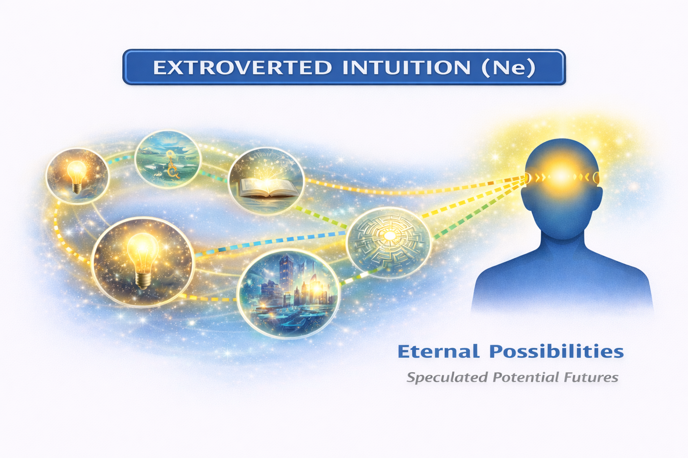

Extroverted intuition is the cognitive function in which the conscious energy of the subject is concentrated on the very end of the simulated eternal timeline. But because the eternal timeline has no starting or ending point, and thus has no theoretical endpoints, the subject hops across the simulated timeline's multiple segments. They might appear changing topics, making multiple predictions, having many interests, etc, all rising from single stimulus. This is different from those with introverted intuition lens, which simulates and focuses on the whole timeline as a single conclusive impression. While extroverted intuition receives one stimulus, and then it starts searching for the endpoint of that timeline, ending up seeing multiple possibilities.

### 5.5 <u>Introverted Thinking (Ti)</u>:

*"Cognitive function in which the conscious energy is concentrated on **evaluation** or **generation** of structural properties by relying on the **subject itself** for reference, as a **resting impression**."*

$$ \text{Thinking (T) + Introversion (i) = Ti} $$

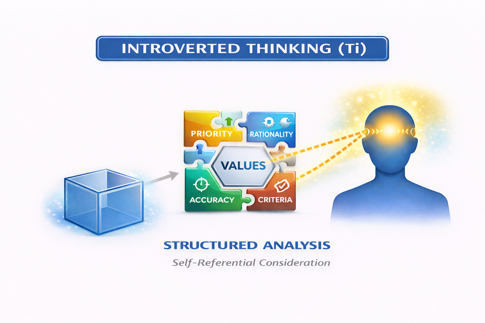

Introverted thinking is the cognitive function in which the conscious energy of the subject concentrates on the structural values that subject strongly believes in. Structural values mean anything that refers to the logical properties of an object. This object can be a physical system, theoretical system, an environment, or network of people, etc. Anything where logic can be used to describe the object is considered as a structural value. But those with introverted thinking as their lens, this structural value or logic is very subjective to how they understand about matters. It might not match with structural values that others possess, or even representable on a universal scale. But it is also possible that some people will possess same or similar understanding.

### 5.6 <u>Extroverted Thinking (Te)</u>:

*"Cognitive function in which the conscious energy is concentrated on **evaluation** or **generation** of structural properties by relying on **external sources** for reference, as an **active impression**."*

$$ \text{Thinking (T) + Extroversion (e) = Te} $$

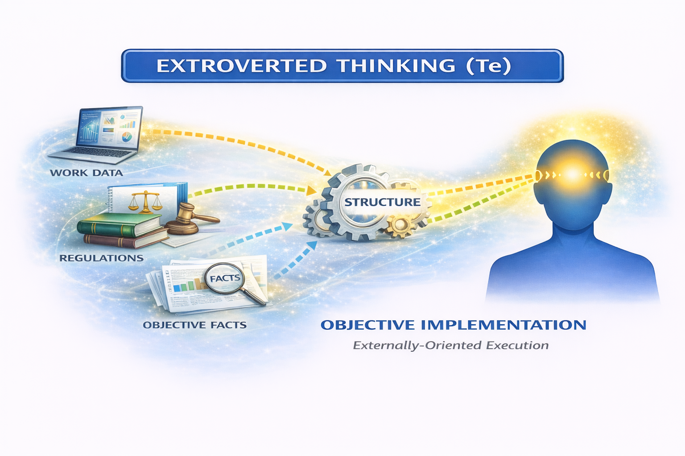

Extroverted thinking is the cognitive function in which the conscious energy of the subject is focused on the structural properties as defined by external sources. Unlike introverted thinking, extroverted thinking concentrates on universal facts that can be proven with direct inference like statistics, mass poll, or official reports, etc. Or could be derived from existing external sources. Just like introverted thinking, it might choose to analyze, generate, or prove something, etc, but i.e. with universally provable logic, data, and representation. These external sources and facts are latest sources of data, changing immediately if needs or requirements change. But goal of those using this function as their lens can be anything enabled by the way it processes.

### 5.7 <u>Introverted Feeling (Fi)</u>:

*"Cognitive function in which the conscious energy is concentrated on **evaluation** or **judgment** of abstract importance by relying on the **subject itself** for reference, as a **resting impression**."*

$$ \text{Feeling (F) + Introversion (i) = Fi} $$

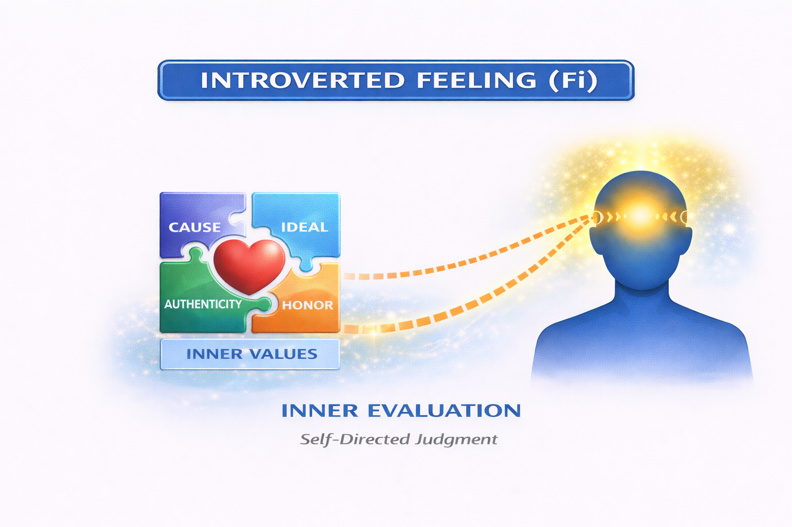

Introverted feeling is a cognitive function in which the cognitive energy of the subject concentrates of abstract values that the subject strongly believes in, without relying on externally represented values. They possess personal beliefs which is the stable impression, and based on that they judge an object to categorize, accept, reject, or understand, etc. These values aren't logically describable or representable, using custom or universal scales. But those values work more as preference-based symbolic labels, very abstract in their nature. Someone having their lens as introverted feeling function would judge isolated systems or time frames in terms of how they personally value them, or its contents, without relying on external or universal sources.

### 5.8 <u>Extroverted Feeling (Fe)</u>:

*"Cognitive function in which the conscious energy is concentrated on **evaluation** or **judgment** of abstract importance by relying on **external sources** for reference, as an **active impression**."*

$$ \text{Feeling (F) + Extroversion (e) = Fe} $$

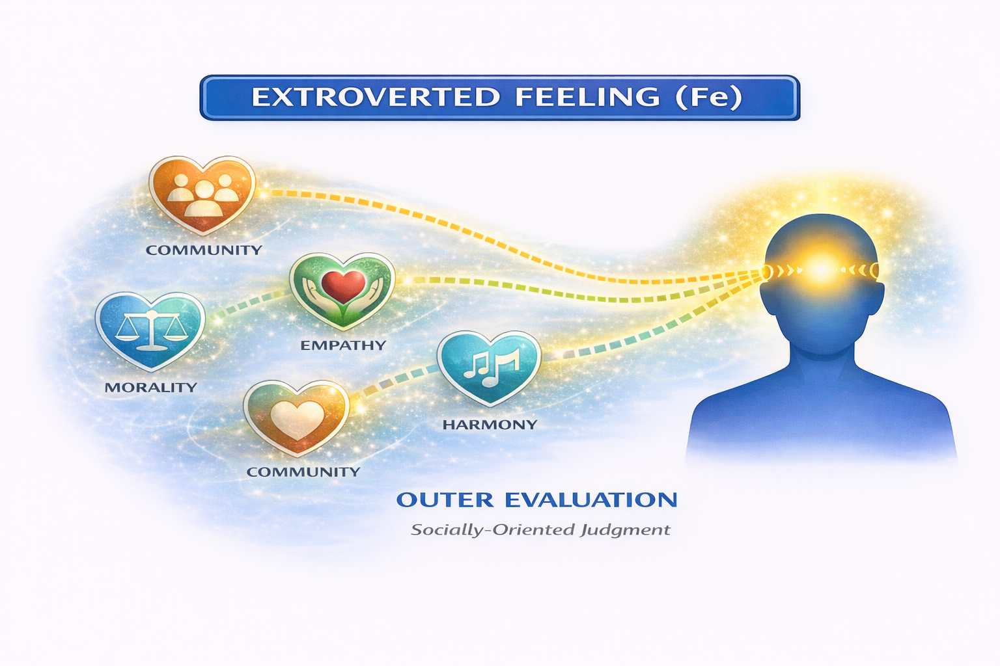

Extroverted feeling is a cognitive function in which the conscious energy of the subject is concentrated on abstract values from external sources as latest impressions. Unlike introverted feeling lens users which refer to the internally stabilized impression containing abstract values, extroverted feeling lens users refer to external sources and global rulebooks for values. So some of those references would be what a system or a group collectively values, or what a particular scripture or religious book says about values, etc. But its worth noting that such references aren't limited to groups and scrolls, and using them in right or wrong practices completely depends on its user, not on the function itself.

## 6. Positioning System

### 6.1 <u>Lens</u>:

*"Primary function used by a subject to **color its world view**, running **most of the time** yet utilizing **least of its energy**, and defines their core processing style."*

### 6.2 <u>Tool</u>:

*"Supporting function to the primary function (**lens**), acting as an **enabling tool** for **execution and refinement** utility to it."*

### 6.3 <u>Spark</u>:

*"An **inconsistent function** used as an **escape mechanism**, appearing as a balancing function when lens and tool are **overused** for long periods."*

### 6.4 <u>Drain</u>:

*"Unconsciously suppressed function, repressed **to let** the primary function (lens) do its work. It sometimes appears for **brief period** of time yet **most energy-expensive**."*

## 7. Type Notations

### 7.1 <u>Function Stack</u>:

### 7.2 <u>Notation Rules</u>:

## 8. Important Note

## 9. References

## 10. License

Licensed under Creative Commons Attribution 4.0 International (CC BY 4.0)
https://creativecommons.org/licenses/by/4.0/

---
