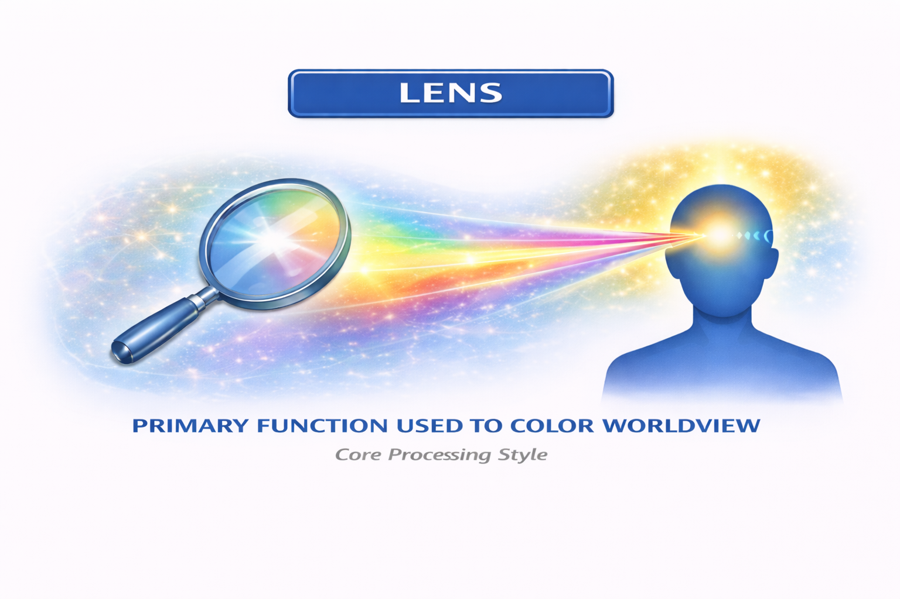
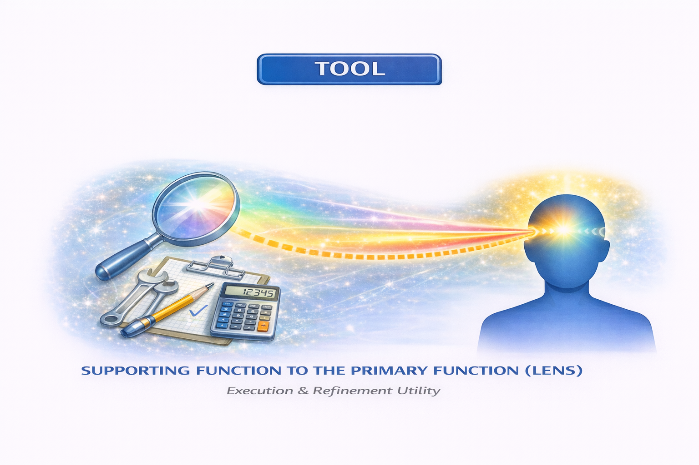
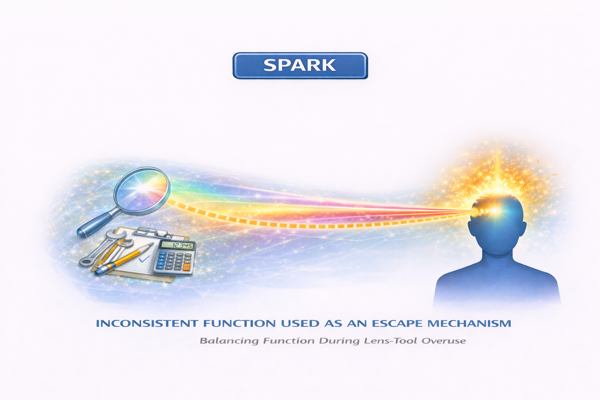
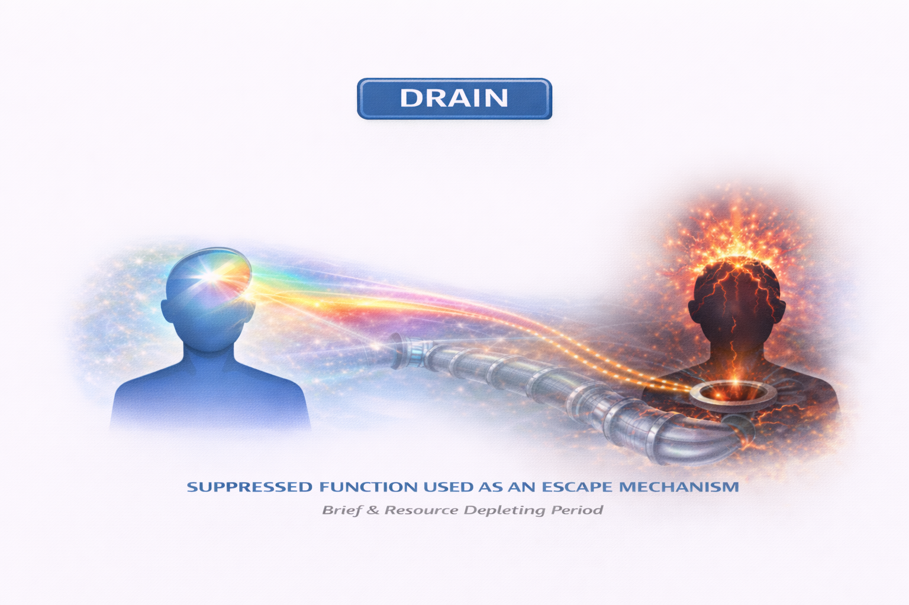
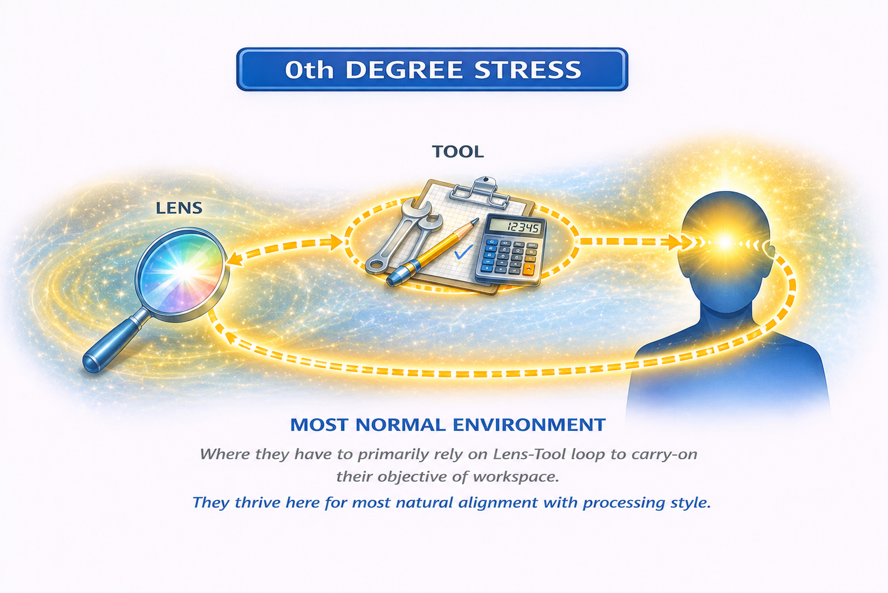
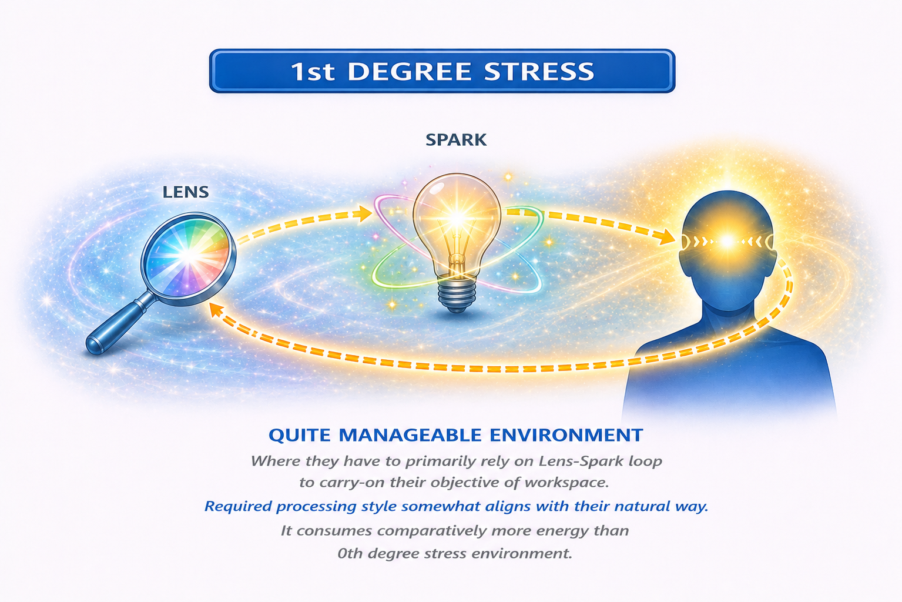
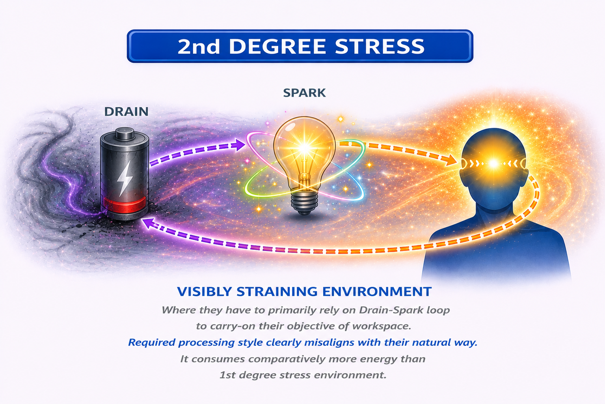
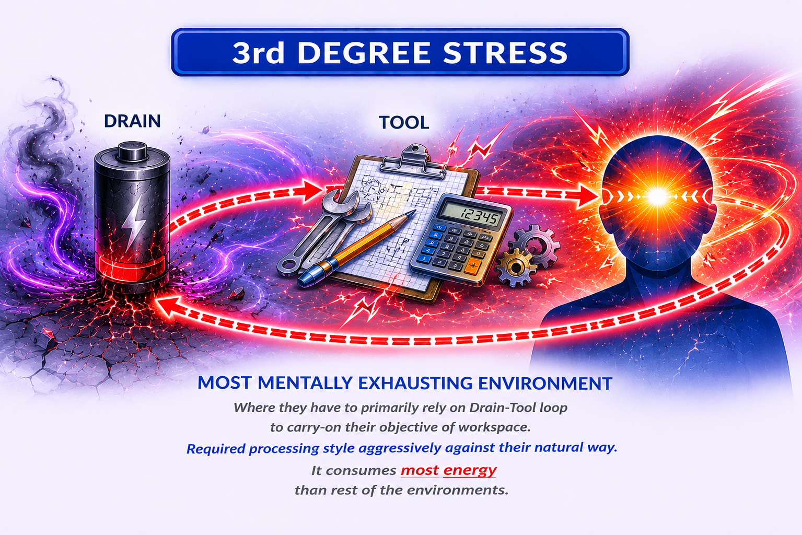

# Temporal Reference Cognition

Gourav Kumar Mallick
Parul University
12b.39gourav@email.com

## Abstract

_Temporal Reference Cognition (TRC)_ proposes a generative, mechanistic framework for modeling human cognition that differs from Jungian theory, Socionics, and MBTI by deriving cognitive functions from minimal compositional primitives rather than treating them as descriptive archetypes. The model decomposes cognition into three orthogonal primitives: **function domains** (Sensing/Intuition as dynamic timeline processors; Thinking/Feeling as static evaluative processors), and **modes of reference** (Introversion/Extroversion as internally stabilized versus externally updated reference frames). Within this architecture, each cognitive function emerges as a composition of a processing domain and a reference mode, enabling all eight classical functions to be **systematically derived rather than loosely interpreted**. TRC further introduces a hierarchical function stack comprising **lens** (primary processor), **tool** (stabilizing executor), **spark** (inconsistent compensatory function), and **drain** (repressed high-cost function), allowing cleaner analysis of cognitive prioritization, adaptation, workspace compatibility, and energetic failure under prolonged stress through recursive processing loops. By reframing perception as **timeline traversal** and judgment as **value assignment independent of temporal flow**, the framework unifies fragmented interpretations of intuition (e.g., foresight, branching, creativity) and thinking/feeling (e.g., correctness versus importance) into a coherent temporal-processing system. TRC also introduces a compact three-letter notation encoding reference mode and functional domains, enabling systematic derivation of 16 stable cognitive configurations while remaining extensible to distorted or non-ideal states. Compared to existing typological systems, TRC emphasizes **structural clarity, temporal mechanics, minimal primitives, safe component decomposition, and generative capability**, providing a scalable foundation for cognition modeling beyond descriptive personality typologies.

## 1. Terminologies

- **Function:** Shorter term for *cognitive function*.
- **Cognitive function:** Defines how the conscious energy processed an *object* based on a situation.
- **Subject:** Conscious entity which uses its conscious energy to process an *object*.
- **Object:** Content of consciousness which is being perceived by *subject*, it could be real or hypothetical scenario which the subject focuses on for any underlying reason.
- **Impression:** An idea of third-party object the subject focuses on in order to process the primary object.
- **Leakage:** Use of cognitive function which is not part of a subject's function stack, utilizing a lot of conscious energy but with low concentration and duration.
- **Forgery:** Special way to use cognitive functions to replace the reliance on other function in same domain with opposite mode of reference. Most useful in workspace energy loop theory.

## 2. Types Of Function Domains

### 2.1 <u>Dynamic Function Domains (S/N)</u>:

*"Function domains that are **dependent** on **temporal traversal**, focused on **progressive** time frames, and process events in terms of the **timeline**."*

It is termed as *dynamic function* for being an active carrier of time, related *"dynamically"* to time. The function domains, and their derivative cognitive function are directly related to *flow of time*. They can be represented on a timeline ranging from *negative infinity* to *positive infinity*, and could refer to past, present, future, or imaginary timeline. They just observe the flow of time from any part of the timeline, without evaluating its contents. For someone using it, the conscious energy flows towards the *recall* of timeline, or *simulating* one that doesn't exist or haven't been experienced. For someone who often imagines or often recalls past, they might probably possess a *lens* which is a dynamic function.

### 2.2 <u>Static Function Domains (T/F)</u>:

*"Function domains that are **independent** of **temporal traversal**, focused on the **evaluation** of time frames, and process events in terms of **values**."*

It is termed as ***static function*** for not actively experiencing flow of time (past, present, future, or imaginary), being *"static"* in relation to it, thus engaging with the values in content that these time frames or the experience brings. These analysis are conducted using some form of *values*, which might make sense or not, possible to be represented or not, but they are related to values. And these values can be represented in terms of numbers, labels, or preferences, etc. Someone using static function as their *lens* would be concerned about logical, moral, or preference-driven correctness for a system that is being analyzed. Flow of time or alternatives aren't their primary source of energy utilization.

## 3. Function Domains

### 3.1 <u>Sensing (S)</u>:

*"Dynamic function domain which processes events based on the **lived timeline**, i.e., directly experienced moments, having **endpoints**."*

***Sensing*** is the dynamic function domain in which the conscious energy is concentrated towards recalling or observation of *lived timeline*, which is simply everything that a subject has *experienced* through their *five senses*. So its basically that part of timeline which the subject has gone through, starting from its *birth to the present moment* that is being experienced actively. Those having their lens as a sensing function are often practical, believing in what they have experienced or see themselves. And they might not be very willing to process something that is out of bound from their experienced timeline.

### 3.2 <u>Intuition (N)</u>:

"*Dynamic function domain which processes events based on a **simulated timeline**, i.e., indirectly experienced moments, having **no endpoints**.*"

***Intuition*** is the *dynamic function domain* in which the conscious energy is concentrated towards *simulating* a timeline that the subject *hasn't witnessed* through its senses directly. So its basically the function in which the subject refers to the simulated alternative timeline, which it hasn't necessarily gone through. Even in experienced cases, it will prefer simulation of new scenarios. Those having their *lens* as an intuition function often think out of bounds to their lived or experienced timeline, being imaginative and anticipating truth and foresights, based on real-world or imaginary alternative worlds.

### 3.3 <u>Thinking (T)</u>:

*"Static function domain that processes events in terms of values based on the **structural properties** of the object in focus."*

***Thinking*** is the *static function* domain in which the conscious energy is concentrated towards *evaluation of time frames* of objects based on values of its *structural properties*. However, it might be confused as intuition for being closely related to *digging insights*. So using thinking function, one might use logical formulae or reasoning to *jump through* time frames or simulate it, but not referring to time in its raw form. Those having their *lens* as a thinking function often analyze a given system or structure for their respective motivations, using *values*. Values here are related to the properties of logical system, whether measured in shape, mass, performance, or numbers, etc.

### 3.4 <u>Feeling (F)</u>:

*"Static function domain that processes events in terms of values based on the **abstract importance** of the object in focus."*

***Feeling*** is the *static function domain* in which the conscious energy is concentrated towards *evaluation of time frames* based on its *abstract importance*. It is different from thinking given this type of value *can't be* logically deducted or inferred from any source. These are rather more abstract analysis based on how someone gives importance to the *object*, or has strong feeling towards. This is different from sensational feeling, more about *norms*, *morality*, or *principles*, etc. Those having their lens as a feeling function often have strong moral standards or preferences which might not be explainable or provable in terms of logic or efficiency.

## 4. Modes Of Reference

### 4.1 <u>Introversion (i)</u>:

*"A mode of reference in which the conscious energy is concentrated at a **resting impression**, relying on a **stable source** of data."*

***Introversion*** is a *mode of reference* in which the conscious energy is concentrated on source of impression that is *stable and resting* in balance. This impression is isn't actively relying on any stimuli or source to be updated with new data. Any changes made to this resting impression is *slow and steady*. A subject whose lens is introverted in nature, usually engages with a *singular stable impression*. While what they do with it whether that's creation, formation, speculation, understanding, depends completely on them. For any given function, what's predictable is *how* that is used by subject to process. Not their intent or goal.

### 4.2 <u>Extroversion (e)</u>:

*"Mode of reference in which the conscious energy is concentrated at an **active impression**, relying on the **latest source** of data."*

***Extroversion*** is a *mode of reference* in which the subject's conscious energy concentrates on *latest sources* of data. This impression might *change actively*, as new sources of impression appear. The source of impression can be anything latest, including what someone has recently witnessed, *trends*, moral values people possess, *newest* statistical records, manual that has been *recently updated* with best practices, etc. The subject doesn't rely on itself or its own impressions as his *lens*, but what impression is latest. Just like those with function as any introverted lens, subject with extroverted lens function will use it to process, but what they do after that is completely on them.

## 5. Cognitive Functions

### 5.1 <u>Introverted Sensing (Si)</u>:

*"Cognitive function in which the conscious energy is concentrated on the **whole timeline** that the subject has experienced, i.e., since birth to **every moment that has passed** by, as a **resting impression**."*

$$ \text{Sensing (S) + Introversion (i) = Si} $$

***Introverted sensing*** is the *cognitive function* in which the conscious energy of the subject concentrates on the part of timeline that subject has *personally experienced* through his five senses, i.e. in form of *sight*, *taste*, *hearing*, *touch*, or *odors*. It is *not* about their ability of precisely or accurately recalling events, but the *act of reference* to their memory itself. Having this as their lens, they will refer to their *past experiences* time-to-time for making decisions or carrying out activities. But what they do with those reference points completely depends on them. They might not necessarily be stuck in routine or be closed-minded, given its theoretical possible for them to adjust to new conditions by processing new experiences as how it is similar to their past. Not necessarily, but this function is very much responsible for evoking the sense of *nostalgia*.

### 5.2 <u>Extroverted Sensing (Se)</u>:

*"Cognitive function in which the conscious energy is concentrated on the **end of the timeline** in the subject's experience, i.e., the **present moment**, it is facing actively, as an **active impression**."*

$$ \text{Sensing (S) + Extroversion (e) = Se} $$

***Extroverted sensing*** is the *cognitive function* in which the conscious energy of the subject is concentrated on the *very end* of their lived experience, i.e. the *present moment*. It is because the last lived experience is technically the final time frame that the subject experienced, constantly sticking to the the *latest time frame* as the recent source of data. Those who have their *lens* as extroverted sensing, have very high awareness to what's going on around them every now and then. This *doesn't* necessarily has anything to do with seeking new or exciting experiences, with optimistic or reckless attitude, given its on the motivations of the subject and how they use it. But they don't often concentrate much on past, future consequences, or possibilities. Its completely on the subject to focus on it without caring for *consequences*, or use it to *control them*.

### 5.3 <u>Introverted Intuition (Ni)</u>:

*"Cognitive function in which the conscious energy is concentrated on the **whole timeline** that the **subject simulates** on an eternal scale, as a **resting impression**."*

$$ \text{Intuition (N) + Introversion (i) = Ni} $$

***Introverted intuition*** is the *cognitive function* in which the conscious energy of the subject is concentrated on the *whole eternal timeline* that it simulates. This timeline is something that the subject has possibly never experienced with his senses personally. And even if they have, they will *prefer to simulate* a separate timeline instead of using their past impressions. This eternal scale allows them to keep the timeline very open, flexible, and able to bring something *totally out of the box* into perspective no one thought of. But its worth noting that there goal might not require whole simulated timeline. Like any other function, for someone with this function as lens, it depends on them how they use this function, and what emotions that evokes. Its open-ended and aligned with *world's* trajectory instead of closed systems, sometimes as strong gut feeling.

### 5.4 <u>Extroverted Intuition (Ne)</u>:

*"Cognitive function in which the conscious energy is concentrated on the **end of the timeline** that the **subject simulates**, thus hopping time to time for **no theoretical endpoint** on an eternal scale, as an active impression."*

$$ \text{Intuition (N) + Extroversion (e) = Ne} $$

***Extroverted intuition*** is the *cognitive function* in which the conscious energy of the subject is concentrated on the very *end of the simulated eternal* timeline. But because the eternal timeline has no starting or ending point, and thus has *no theoretical endpoints*, the subject *hops* across the simulated timeline's *multiple segments*. They might appear changing topics, making multiple predictions, having many interests, etc, all rising from *single stimulus*. This is different from those with introverted intuition *lens*, which simulates and focuses on the whole timeline as a *single conclusive impression*. While extroverted intuition receives one stimulus, and then it starts searching for the endpoint of that timeline, ending up simulating *multiple possibilities*. What makes this lens different from those with it at lower position is disconnection among changing object itself.

### 5.5 <u>Introverted Thinking (Ti)</u>:

*"Cognitive function in which the conscious energy is concentrated on **evaluation** or **generation** of structural properties by relying on the **subject itself** for reference, as a **resting impression**."*

$$ \text{Thinking (T) + Introversion (i) = Ti} $$

***Introverted thinking*** is the *cognitive function* in which the conscious energy of the subject concentrates on the *structural values* that makes *sense logically* to the subject. Structural values mean anything that refers to the *logical properties* of an object. This object can be a physical system, theoretical system, an environment, or network of people, etc. Anything where logic can be used to *describe* the object is considered as a structural value. But those with introverted thinking as their lens, this structural value or logic is very subjective to how they understand about various matters. It might not match with structural values that others possess, or even representable on a *universal* scale. But it is also possible that some people will possess same or similar understanding. This somehow may risk sacrificing real-world operational optimization.

### 5.6 <u>Extroverted Thinking (Te)</u>:

*"Cognitive function in which the conscious energy is concentrated on **evaluation** or **generation** of structural properties by relying on **external sources** for reference, as an **active impression**."*

$$ \text{Thinking (T) + Extroversion (e) = Te} $$

***Extroverted thinking*** is the *cognitive function* in which the conscious energy of the subject is focused on the *structural properties* as defined by *external sources*. Unlike *introverted thinking*, extroverted thinking concentrates on *working logic* in outside world that can be proven with direct *inference* like statistics, mass poll, or official reports, etc. Or could be *derived* from existing external sources. Just like introverted thinking, it might choose to *analyze*, *generate*, or *prove* something, etc, but i.e. without having to make sense of it to trust it, trust rather comes from its proven mettle or mass usage. These external sources and facts are latest sources of data, *changing immediately* if needs or requirements change. But goal of those using this function as their lens can be anything enabled by the way it processes. This may somehow risk theoretical correctness or scalability.

### 5.7 <u>Introverted Feeling (Fi)</u>:

*"Cognitive function in which the conscious energy is concentrated on **evaluation** or **judgment** of abstract importance by relying on the **subject itself** for reference, as a **resting impression**."*

$$ \text{Feeling (F) + Introversion (i) = Fi} $$

***Introverted feeling*** is a *cognitive function* in which the cognitive energy of the subject concentrates of *abstract values* that the subject *strongly believes* in, without relying on *externally represented values*. They possess *personal beliefs* which is the *stable impression*, and based on that they judge an object to categorize, accept, reject, or understand, etc. These values *aren't logically describable or representable*, using custom or universal scales. But those values work more as preference-based symbolic labels, very abstract in their nature. Someone having their lens as introverted feeling function would judge *isolated systems* or *time frames* in terms of how they personally value them, or its contents, without relying on external or universal sources. Its not that they are willingly rude to people for mismatch in values, but they are their *own filter* for value-based judgement.

### 5.8 <u>Extroverted Feeling (Fe)</u>:

*"Cognitive function in which the conscious energy is concentrated on **evaluation** or **judgment** of abstract importance by relying on **external sources** for reference, as an **active impression**."*

$$ \text{Feeling (F) + Extroversion (e) = Fe} $$

***Extroverted feeling*** is a *cognitive function* in which the conscious energy of the subject is concentrated on *abstract values* from *external sources* as *latest impressions*. Unlike introverted feeling *lens* users which refer to the internally stabilized impression containing abstract values, extroverted feeling lens users refer to *external sources* and *global rulebooks* for values. So some of those references could be what a system or a group *collectively* values, or what a particular *scripture* or *religious book* says about values, etc. In simple language, their filter of judging object is not within them, but in *outside world*. But its worth noting that such references aren't limited to groups and scrolls, and using them in right or wrong practices completely depends on its user, not on the function itself.

## 6. Function Stack

### 6.1 <u>Lens</u>:

*"Primary function used by a subject to **color its world view**, running **most of the time** yet utilizing **least of its energy**, and defines their core processing style."*

***Lens*** is the *primary cognitive function* that a subject uses to color its *general worldview*. Everything that it perceives or witnesses is *mostly filtered* with this function only. So that means an *extroverted sensor* would be anchored with *real time experiences* most of the time actively, and an *introverted sensor* would be referring to their *past experiences* most of the time, etc. But in what they utilize those references completely depends on them. As a reminder, this function is one of the *8 cognitive functions* formed with function domains and a mode of reference.

### 6.2 <u>Tool</u>:

*"Supporting function to the primary function (**lens**), acting as an **enabling tool** for **execution and refinement** utility to it."*

***Tool*** is the *secondary cognitive function* in a subject's stack which *supports* and *enables* the lens function through *execution*. If the lens is a *dynamic function*, then tool must be *static* and vice-versa. And if the lens is *introverted*, the tool has to be *extroverted* and vice-versa. It might help to  implement it, to prove it, or to strengthen the speculation, analysis, or judgement of it. So for example, if a subject has *introverted intuition* as their lens to simulate *concrete scenarios*, then *extroverted thinking* if that's their tool might help in implementation using *proven protocols*.

### 6.3 <u>Spark</u>:

*"An **inconsistent function** used as an **escape mechanism**, appearing as a balancing function when lens and tool are **overused** for long periods."*

***Spark*** is the *balancing cognitive function* that balances the effects which rise from *overuse* of *lens* and *tool* together. It is *partially suppressed*, sometimes even unconsciously. It appears as a *temporary replacement* to the tool. For a *dynamic tool* function, *spark* is the *other dynamic function*. And for *static tool*, its the *other static function*. And its mode of reference is *opposite* to tool's, i.e. same as lens's. So for someone with *introverted thinking* tool, the *extroverted feeling* spark might come up inconsistently sometimes to cope with overused lens and tool.

### 6.4 <u>Drain</u>:

*"Unconsciously suppressed function, repressed **to let** the primary function (lens) do its work. It sometimes appears for **brief period** of time yet **most energy-expensive**."*

***Drain*** is the *highly suppressed cognitive function* which comes up as a *compensation* to burnout, mental fatigue, or stress, etc. This function is suppressed for a *very long duration*, and unlike spark it *doesn't appear inconsistently*, but appears together for a brief amount of time, along with high intensity. It could be considered as a *periodical* and natural healthy process, or as an unhealthy *obsession*. If lens is a *static function*, then drain is the other *static function*. And if lens is a *dynamic function*, then drain is the other *dynamic function*. Its mode of reference is opposite to lens.

## 7. Workspace Energy Loops

### 7.1 <u>0th Degree Stress</u>:

*"**Most normal** environment for a subject, where they have to primarily rely on **Lens-Tool** loop to carry-on their objective of workspace. They thrive here for **most natural alignment** with their processing style. Its also **least draining** energy-wise for them on long run."*

We will take $RTN$ as an example to answer how it works. Naturally $RTN$ are aligned to use $Ti-Ne$ loop *without spending* a lot of mental energy. This would typically include environment where they need to rely on their *personal clarity* and *custom methods* to analyze or generate closed systems with logical principles ($Ti$). And to aid or balance their analysis or generation of structural properties, they would simulate a timeline of working system at *various points* of the timeline in search of latest frame ($Ne$), and then refine their model accordingly.

### 7.2 <u>1st Degree Stress</u>:

*"**Quite manageable** environment for a subject, where they have to primarily rely on **Lens-Spark** loop to carry-on their objective of workspace. Required processing style **somewhat aligns** with their natural way. It consumes comparatively more energy than **0th degree stress** environment.*"

Continuing the $RTN$ example, sometimes $RTN$ are compelled to use $Ti-Si$ loop *without spending* a truly significant amount of mental energy. This would typically include environment where they need to rely on their *personal clarity* and *custom methods* to analyze or generate closed systems with logical principles ($Ti$). And to aid or balance their analysis or generation of structural properties, they have to recall their *past experiences* and *sensory recalls*, *spiraling within psyche* for having two resting/introverted functions, and then refine their model accordingly.

### 7.3 <u>2nd Degree Stress</u>:

*"**Visibly straining** environment for a subject, where they have to primarily rely on **Drain-Spark** loop to carry-on their objective of workspace. Required processing style **clearly misaligns** with their natural way. It consumes comparatively more energy than **1st degree stress** environment.*"

Continuing the $RTN$ example, it becomes quite considerable to change workspace if it forces subject to use $Fe-Si$ loop which spends quite *significant mental energy*. This would typically include environment where they need to rely on *external sources* to *adopt abstract values* of a given system ($Fe$). And to aid or balance their analysis or generation of structural properties, they have to recall their past experiences and sensory recalls. Even if *more costly* in terms of mental energy than $Ti-Si$, it somehow provides more balance among usage of functions.

### 7.4 <u>3rd Degree Stress</u>:

*"**Most mentally exhausting** environment for a subject, where they have to primarily rely on **Drain-Tool** loop to carry-on their objective of workspace. Required processing style **aggressively against** their natural way. It consumes **most energy** than rest of the environments.*"

Continuing the $RTN$ example, the workspace becomes *very dissatisfying and tiring* if it forces subject to use $Fe-Ne$ loop which spends *aggressive amount* of mental energy. This would typically include environment where they need to rely on *external sources* to adopt abstract values of a given system ($Fe$). And to aid or balance their *adoption to abstract values* through external sources, they would simulate a timeline of whole value system at *various points* of the timeline in search of latest frame ($Ne$), and then adopt better with that system accordingly.

## 8. Type Notations

### 8.1 <u>Function Stack</u>:

| Type    |     Callsign      | Lens | Tool | Spark | Drain | Closest Jungian | Closest Socionics |
| :------ | :---------------: | :--: | :--: | :---: | :---: | --------------: | ----------------: |
| **RST** |   *"Tradition"*   | $Si$ | $Te$ | $Fi$  | $Ne$  |       **IS(T)** |           **SLI** |
| **RSF** |   *"Nostalgia"*   | $Si$ | $Fe$ | $Ti$  | $Ne$  |       **IS(F)** |           **SEI** |
| **AST** |  *"Experiment"*   | $Se$ | $Ti$ | $Fe$  | $Ni$  |       **ES(T)** |           **SLE** |
| **ASF** |    *"Energy"*     | $Se$ | $Fi$ | $Te$  | $Ni$  |       **ES(F)** |           **SEE** |
| **RNT** |   *"Planning"*    | $Ni$ | $Te$ | $Fi$  | $Se$  |       **IN(T)** |           **ILI** |
| **RNF** |   *"Awareness"*   | $Ni$ | $Fe$ | $Ti$  | $Se$  |       **IN(F)** |           **IEI** |
| **ANT** |   *"Curiosity"*   | $Ne$ | $Ti$ | $Fe$  | $Si$  |       **EN(T)** |           **ILE** |
| **ANF** |     *"Dream"*     | $Ne$ | $Fi$ | $Te$  | $Si$  |       **EN(F)** |           **IEE** |
| **RTS** |   *"Guarding"*    | $Ti$ | $Se$ | $Ni$  | $Fe$  |       **IT(S)** |           **LSI** |
| **RTN** |  *"Improvement"*  | $Ti$ | $Ne$ | $Si$  | $Fe$  |       **IT(N)** |           **LII** |
| **ATS** |     *"Duty"*      | $Te$ | $Si$ | $Ne$  | $Fi$  |       **ET(S)** |           **LSE** |
| **ATN** |    *"Mission"*    | $Te$ | $Ni$ | $Se$  | $Fi$  |       **ET(N)** |           **LIE** |
| **RFS** |  *"Protection"*   | $Fi$ | $Se$ | $Ni$  | $Te$  |       **IF(S)** |           **ESI** |
| **RFN** | *"Understanding"* | $Fi$ | $Ne$ | $Si$  | $Te$  |       **IF(N)** |           **EII** |
| **AFS** |  *"Connection"*   | $Fe$ | $Si$ | $Ne$  | $Ti$  |       **EF(S)** |           **ESE** |
| **AFN** |   *"Community"*   | $Fe$ | $Ni$ | $Se$  | $Ti$  |       **EF(N)** |           **EIE** |

### 8.2 <u>Notation Rules</u>:

1. Every type is represented by three letters.
2. First letter represents the mode of reference for lens function ($R$/$A$).
3. $R$ stands for resting or introverted mode of reference, while $A$ stands for active or extroverted mode of reference.
4. Second letter represents the function domain of lens function.
5. Third letter represents the function domain of tool function.

## 9. Important Notes

### 9.1 <u>For Mental Health Professionals</u>:

- Temporal Reference Cognition (TRC) is a **cognitive processing model**, not a diagnostic or clinical framework. It should **not be used as a substitute for established diagnostic tools** such as DSM-5 or ICD classifications.
- The model can be useful for understanding **how clients process experiences**, particularly in distinguishing between:
	- Timeline-oriented processing (S/N)
	- Evaluative processing (T/F)
	- Internal vs external referencing (i/e)
- The **function stack (lens, tool, spark, drain)** may provide insight into:
	- Coping strategies (spark usage)
	- Stress responses and breakdown patterns (drain activation)
- However, interpretations must remain **non-pathologizing**, as variations in function usage are not inherently dysfunctional.
- TRC may complement therapeutic approaches by helping clients **articulate internal processing styles**, but should always be integrated with evidence-based practices.

### 9.2 <u>For Educators</u>:

- TRC can be used to understand **learning styles as processing differences**, not ability differences.
- Students may vary in:
	- Engaging with **lived vs simulated timelines** (S vs N)
	- Preferring **structural vs value-based evaluation** (T vs F)
	- Relying on **internal vs external references** (i vs e)
	- Reaching strategies can be diversified by:
	- Combining concrete examples (S) with hypothetical exploration (N)
	- Balancing logical structure (T) with meaningful relevance (F)
- The **lens–tool dynamic** suggests that students:
	- Grasp concepts best through their lens
	- Apply them effectively through their tool
- Avoid rigid labeling; the model is intended to **enhance instructional flexibility**, not categorize students permanently.

### 9.3 <u>For Researchers</u>:

- TRC presents a **minimal, generative framework** for cognitive modeling, where functions are derived from:
	- Function domains ($S$/$N$, $T$/$F$)
	- Modes of reference ($i$/$e$)
- It offers a **testable structure** for:
	- Examining cognitive consistency across contexts
	- Studying function interaction (lens/tool/spark/drain)
	- Modeling cognitive distortion under stress
- The framework invites:
	- Empirical validation of timeline-based perception ($S$/$N$)
	- Operationalization of evaluation types ($T$/$F$)
	- Investigation into reference anchoring ($i$/$e$)
- TRC is compatible with, but not limited to, Jungian and post-Jungian systems, and may serve as a **unifying abstraction layer**.
- Future work may include:
	- Psychometric development
	- Computational modeling
	- Longitudinal studies on function dynamics

### 9.4 <u>For Hobbyists & General Users</u>:

- TRC is a tool for **understanding how you process information**, not for labeling identity or limiting yourself.
- Your type reflects:
	- How you naturally interpret situations (lens)
	- How you act on them (tool)
- Occasional use of other functions (spark, drain) is normal and expected, especially under:
	- Stress
	- Fatigue
	- New environments
- Avoid using the model to:
	- Stereotype others
	- Justify rigid behavior patterns
- Instead, use it to:
	- Recognize your strengths
	- Understand your blind spots
	- Improve communication with others
- Types are **stable tendencies, not fixed identities**, and growth involves expanding beyond habitual patterns.

## 10. References

- Jung, C. G. (1921). *Psychological Types*. Zürich: Rascher Verlag.  
- Myers, I. B., McCaulley, M. H., Quenk, N. L., & Hammer, A. L. (1998). *MBTI Manual: A Guide to the Development and Use of the Myers-Briggs Type Indicator* (3rd ed.). Consulting Psychologists Press.  
- Augusta, A. (1978). *The Theory of Intertype Relations*. (Original socionics manuscripts).  
- Gulenko, V. (2009). *Cognitive Styles*. Kyiv: International Institute of Socionics.  
- Beebe, J. (2004). *Understanding Consciousness through the Theory of Psychological Types*. In J. Cambray & L. Carter (Eds.), *Analytical Psychology: Contemporary Perspectives in Jungian Analysis*.  
- Nardi, D. (2011). *Neuroscience of Personality: Brain Savvy Insights for All Types of People*. Radiance House.

## 11. License

Licensed under Creative Commons Attribution 4.0 International (CC BY 4.0)
https://creativecommons.org/licenses/by/4.0/

---
