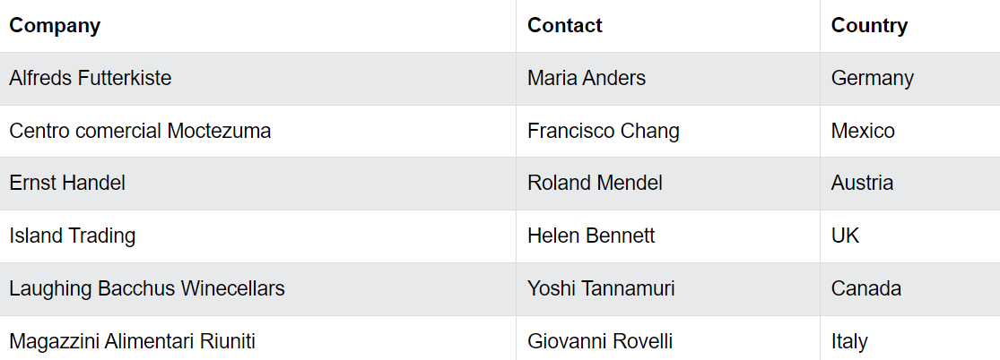
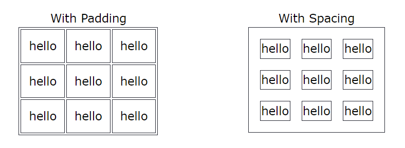
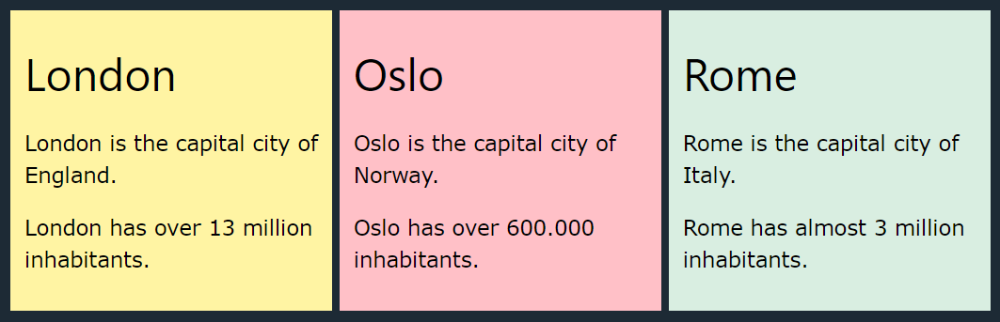
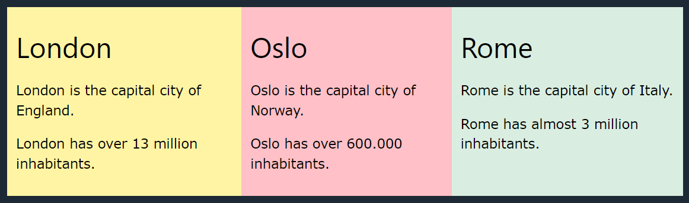
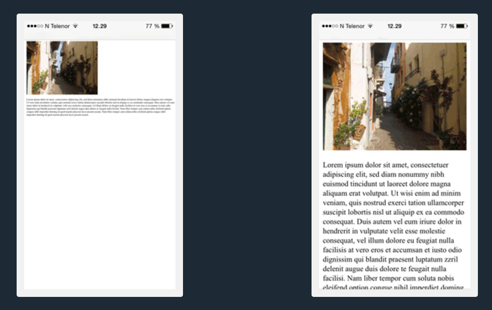
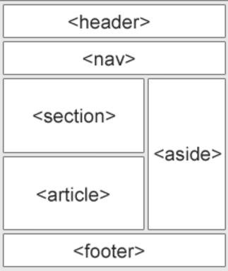
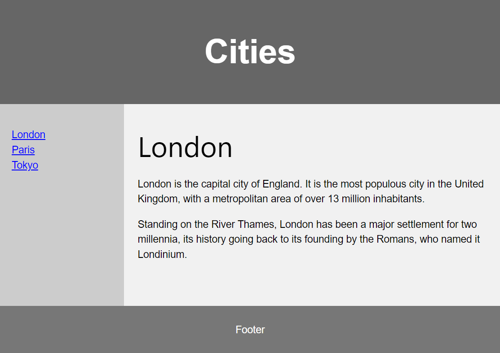

# <u>Chapter 1</u>: HYPER TEXT MARKUP LANGUAGE


## **Topic - 1: Structural Concepts**

### <u>General Format</u>

```
<!DOCTYPE html>

<html>

<head>
	<title> Page title </title>
</head>

<body>
	<h1> Heading </h1>
	<p> Paragraph </p>
</body>

</html>
```


### <u>Introduction</u>

- Invented by Tim Berners Lee in 1991.


### <u>Basics</u>

#### HTML hyperlinks:

```
<a href="https://www.w3schools.com" target="_self"> Link </a>
```

- Attribute `target` is used for defining where the link will open.
- `"_self"` - Opens in same window (default).
- `"_blank"` - Opens in new window.
- `"_self"` - Opens in parent window.
- `"_top"` - Opens in new & full window.
- **<u>Absolute URL</u>:** URL to website.
- **<u>Relative URL</u>:** URL to directory file.

#### Images:

```

```

- `alt` provides text for image, which is shown when image hasn't loaded.
- We call these parameters like `src`, `alt` etc as attributes.


### <u>Elements</u>

#### Breakpoint:

```
<p> Paragraph 1 </p> <br>
<p> Paragraph <br> 2 </p>
```

- None of the HTML tag is case-sensitive.
- Means we could have used `<BR>` instead `<br>` too.


### <u>Attributes</u>

#### Style:

```
<p style="color:red; font-size:60px;"> Red text. </p>
```

- We can also write `130%` for example instead `60px`.
- Text can be aligned to center using `text-align:center`.
#### Title:

- A title defines information about paragraph.

```
<p title="I'm for help"> Paragraph </p>
```


### <u>Paragraph</u>

- HTML automatically removes extra spaces from paragraphs.

#### Horizontal rule:

```
<p> Paragraph 1. </p>
<hr>
<p> Paragraph 2. </p>
```

- **<u>Empty tag</u>:** Tag having no end tag.

#### Pre tags:

- We can display formatting like spacing using `pre` tag instead `p`.


### <u>Formatting Elements</u>

- `<strong>` - Important text
- `<em>` - Emphasized text
- `<mark>` - Marked text
- `<small>` - Smaller text
- `<del>` - Strikethrough text
- `<ins>` - Inserted text
- `<sub>` - Subscript
- `<sup>` - Superscript


### <u>Quotations</u>

#### Blockquote:

- Blockquote is used to quote information which actually belongs to another website.

```
<blockquote cite="http://www.worldwildlife.org/who/index.html">

For 60 years, WWF has worked to help people and nature thrive. As the world's leading conservation organization, WWF works in nearly 100 countries. At every level, we collaborate with people around the world to develop and deliver innovative solutions that protect communities, wildlife, and the places in which they live.  
</blockquote>
```

- For short quotations, we can use `<q>` tag too.

#### Abbreviations:

- Abbreviation tag is used for expanding a short form when it is hovered over.

```
<p>The <abbr title="World Health Organization"> WHO </abbr> was founded in 1948.</p>
```

#### Address:

- Address tag is used to write address of the author.

```
<address> 

Written by John Doe.<br>  
Visit us at:<br>  
Example.com<br>  
Box 564, Disneyland<br>  
USA  

</address>
```

#### Cite:

- Cite tag is used to define title of a creative work like movie, poem, novel etc.

```
<p> <cite> The Scream </cite> by Edvard Munch. Painted in 1893. </p>
```

#### Bi-directional override:

```
<bdo dir="rtl"> This text will be written from right to left </bdo>
```

### <u>Comments</u>

### Multi-line comments:

```
<!--
This
is a
multiline
comment
-->
```

#### Inline comment:

```
<p> This is <!-- Comment --> a paragraph. </p>
```


## **Topic - 2: CSS Oriented**

### <u>Colors</u>

- We can code coloring in various formats, including RGB, HEX & SHL.
- There are two more formats called RGBA & SHLA where **'A'** stands for Alpha.
- **<u>SHL</u>:** Saturation, Hue & Lightness

```
<h1 style="background-color:rgb(255, 99, 71);">...</h1>  
<h1 style="background-color:#ff6347;">...</h1>  
<h1 style="background-color:hsl(9, 100%, 64%);">...</h1>  
  
<h1 style="background-color:rgba(255, 99, 71, 0.5);">...</h1>  
<h1 style="background-color:hsla(9, 100%, 64%, 0.5);">...</h1>
```


### <u>Cascading Style Sheets</u>

#### Internal:

- It is defined inside `<head>` tag only.

```
<head>
	<style>

		body {background-color: powderblue;}  
		h1   {color: blue;}  
		p    {color: red;}  

	</style>
</head>
```

#### External:

- External CSS also has to be defined inside the `<head>` tag.

```
<head>  
  <link rel="stylesheet" href="styles.css">  
</head>
```

#### <u>Mailing Hyperlink</u>

```
<a href="mailto:someone@example.com"> Send email </a>
```


### <u>Button Link</u>

- We implement a button using JavaScript code.

```
<button onclick="document.location='default.asp'"> HTML Tutorial </button>
```


### <u>Color Links</u>

```
<style>

a:link, a:visited
{
	background-color: #f44336;  
	color: white;  
	padding: 15px 25px;  
	text-align: center;  
	text-decoration: none;  
	display: inline-block;
}  
  
a:hover, a:active
{
	background-color: red;
}

</style>
```


## **Topic - 3: Graphical Elements**

### <u>Bookmark</u>

- Bookmark links are used for jumping user to other part of same or another page when clicked.

#### Same page:

```
<h2 id="C4"> Chapter 4 </h2>
<a href="#C4"> Jump to Chapter 4 </a>
```

#### Another page:

```
<h2 id="C4"> Chapter 4 </h2>
<a href="demo.html#C4"> Jump to Chapter 4 </a>
```


### <u>Images</u>

#### Basics:

```

```

#### Image map:

- Image maps are used for creating clickable parts in the image.

```
<map name="workmap">

  

<map name="workmap">  

  <area shape="rect" coords="34,44,270,350" alt="Computer" href="computer.htm">  
  <area shape="rect" coords="290,172,333,250" alt="Phone" href="phone.htm">  
  <area shape="circle" coords="337,300,44" alt="Coffee" href="coffee.htm">  
  
</map>
```

#### Background image:

```
<style> 

body
{
	background-image: url('img_girl.jpg');  
	background-repeat: no-repeat;  
	background-attachment: fixed;  
	background-size: 100% 100%;
} 
   
</style>
```


#### Picture element:

- Tells when to load a picture, which is of a particular type.

```
<picture>  
	<source media="(min-width: 650px)" srcset="img_food.jpg">  
	<source media="(min-width: 465px)" srcset="img_car.jpg">  
	  
</picture>
```


### <u>Favicon</u>

- Favicon is the icon displayed on the website's bar.

```
<head>  
	<title> My Page Title </title>  
	<link rel="icon" type="image/x-icon" href="favicon.ico">  
</head>
```

- Also the title we added is shown on that tab.


### <u>Table</u>

```
<table>

	<tr>  
	    <th>Company</th>  
	    <th>Contact</th>  
	    <th>Country</th>  
	</tr>  
	
	<tr>  
	    <td>Alfreds Futterkiste</td>  
	    <td>Maria Anders</td>  
	    <td>Germany</td>  
	</tr>  
	
	<tr>  
	    <td>Centro comercial Moctezuma</td>  
	    <td>Francisco Chang</td>  
	    <td>Mexico</td>  
	</tr>

</table>
```

- One must make sure that the number of data are same in each row as defined.



#### CSS attributes:

```
table, th, td
{
	border: 1px solid white;  
	border-collapse: collapse;
	border-radius: 10px
	border-style: solid
}
```

- `border-radius` sets rounded borders as per the value set to it.
- `border-style` can be `dotted`, `dashed`, `solid`, `double`, `groove`, `ridge`, `inset`, `outset`, `none` & `hidden`.

>**<u>NOTE</u>:**
>1. Remember that we can set CSS attributes for each cell of table differently too.
>2. Also we can use the `text-align` for aligning the table elements.

#### Header for multiple columns:

```
<tr>  
	<th colspan="2"> Name </th>  
	<th> Age </th>  
</tr>
```

- Now `Name` header will cover two columns.
- There is another attribute called `rowspan`.

#### Captions:

```
<table style="width:100%">  
	<caption>Monthly savings</caption>
	
	...
	
</table>
```

#### Padding:



```
th, td
{
	padding: 15px;
}
```

- We can also use `padding-left`, `padding-right`, `padding-top` & `padding-top`.

#### Spacing:

```
table
{
	border-spacing: 30px;
}
```

>**<u>NOTE</u>:**
>Remember that we can also make hoverable table.


### <u>Description List</u>

```
<dl>  
	<dt>Coffee</dt>  
		<dd>- black hot drink</dd>  
	<dt>Milk</dt>  
		<dd>- white cold drink</dd>  
</dl>
```

- `<dt>` - The list name.
- `<dd>` - Description point.


## **Topic - 4: Division Of Sections**

### <u>Block & Inline</u>

- **<u>Block elements</u>**: These are elements after which some space or margin is added.

#### Division:

- `<div>` tag defines division of a whole section.
- The written text inside it is seen in a box.

```
<div> Hello, World! </div>
```

#### Inline:

- Inline version of `<div>`.
- We use `<span>` tag for it.

```
It's a <span> very pleasant </span> day.
```

>**<u>NOTE</u>:**
>1. Remember that we can add CSS attributes to it too.
>2. Get this fact of adding CSS attribute to any tag hardwired to your mind.


### <u>Flex</u>



- We can use flex to keep divisions side-by-side.
- Let's experiment with the HTML for image shown above.

```
<style>
	.mycontainer {display: flex;}  
	.mycontainer > div {width: 33%;}
</style>
```




### <u>Grid</u>

- Almost same as flex, but we can use it for each individual division inside division (nested division).

```
<style>
	.grid-container
	{
		display: grid;
		grid-template-columns: 33% 33% 33%;
	}  
</style>
```


### <u>Class</u>

```
<style>
.city
{
	background-color: tomato;  
	color: white;  
	border: 2px solid black;  
	margin: 20px;  
	padding: 20px;
}
</style>

<div class="city">  
	<h2> London </h2>  
	<p> London is the capital of England. </p>  
</div>
```


### <u>ID</u>

```
#myHeader
{
	background-color: lightblue;  
	color: black;  
	padding: 40px;  
	text-align: center;
}

<h1 id="myHeader"> My Cities </h1>
```


### <u>Iframe</u>

- Used to embed a website inside website.

```
<iframe src="url"> </iframe>
```

- Its even better to mention `height` and `width`.


#### Removing border around:

```
<iframe src="url" style="border:none;"> </iframe>
```

- A attribute `target` can be used in `<iframe>` which as `name` in `<iframe>` tags.


## **Topic - 5: JavaScript**

### <u>Introduction</u>

```
<script>
	document.getElementById("demo").innerHTML = "Hello JavaScript";
</script>
```

#### No script tag:

- `<noscript>` tag is used to display message when website doesn't support JavaScript.

```
<noscript> Sorry, your website doesn't support JavaScript. </noscript>
```


### <u>CSS Manipulation</u>

```
document.getElementById("demo").style.fontSize = "25px";  
document.getElementById("demo").style.color = "red";  
document.getElementById("demo").style.backgroundColor = "yellow";
```


## **Topic - 6: Back To HTML**

### <u>Meta Character</u>

- `charset` attribute is used for defining character set.
- While `content` is used for defining way to fit content in screen.

```
<meta charset="UTF-8" content="width=device-width">
```




### <u>Layout Format</u>



- Tags being used - `<header>`, `<nav>`, `<section>`, `<article>`, `<aside>`, `<footer>`, `<details>`, `<summary>`.




### <u>Responsive Design</u>

- **<u>Responsive design</u>:** Adaptable web design which looks good on all devices.


## **Topic - 7: Block Elements**

### <u>Computer Code</u>

#### Code:

```
<code>

int x = 2;
int y = 3;

int z = x + y;

</code>
```

#### Keyboard input:

```
<p> <kbd> Ctrl + S </kbd> </p>
```

#### Sample:

- Used for showing sample output.

```
<p> <smp> Press any key to continue... </smp> </p>
```

#### Variable:

- Tag `<var>` is used to define a mathematical expression or code element.
- 