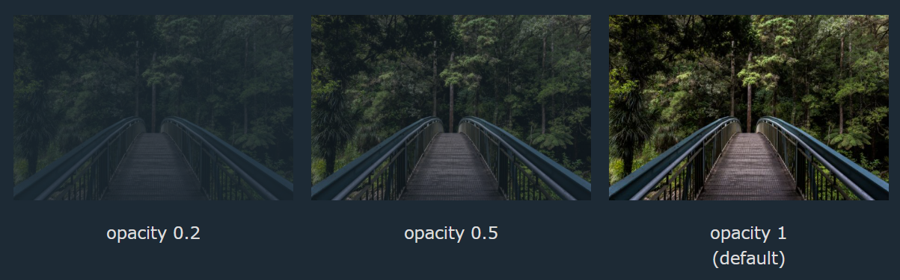

# $\fbox{Chapter 1: CSS}$


## **Topic - 1: 2D Transforms**

### <u>Translate Method</u>

- The `translate()` method moves an element from its current coordinates to the requested coordinates.
- Following example moves the `div` element `50px` right & `100px` down.

```css
div {
	transform: translate(50px, 100px);
}
```

- Similarly, we can use `translateX()` & `translateY()` method by passing a single argument to them.


### <u>Rotate Method</u>

- The `rotate()` method rotates an element by a certain degree.

#### Clockwise:

```css
div {
	transform: rotate(20deg);
}
```

#### Anti-clockwise:

```css
div {
	transform: rotate(-20deg);
}
```


### <u>Scale Method</u>

- The `scale()` method below increases the current element's width by 2 times & height by 3 times.

```css
div {
	transform: scale(2, 3);
}
```

- Similarly, we have `scaleX()` & `scaleY()` methods.
- They take only one argument for scaling on that particular axis.


### <u>Skew Method</u>

- The `skew()` method distorts the text by a certain degree.

```css
div {
	transform: skew(20deg);
}
```

- Similarly we have `skewX()` & `skewY()`.


### <u>Matrix Method</u>

- Combines all the 2D transformation methods altogether.
- Order: `scaleX()`, `skewY()`, `skewX()`, `scaleY()`, `translateX()`, `translateY()`.

```css
div {
	transform: matrix(1, -0.3, 0 , 1, 0, 0);
}
```


## **Topic - 2: 3D Transforms**

- In 3D transforms, we are introduced with an extra rotate method, i.e. `rotateZ()`.


## **Topic - 3: Transition**

### <u>Introduction</u>

```css
div {
	width: 100px;  
	height: 100px;  
	background: red;  
	transition: width 2s, height 4s;
}
```


### <u>Transition Speed</u>

- The `transition-timing-function` defines the speed curve of transforming effect.

```css
#div1 {transition-timing-function: linear;}
```

#### Possible values:

- `linear` - Constant speed throughout
- `ease` - Start slow, go fast & end slow
- `ease-in` - Slow start
- `ease-out` - Slow end
- `ease-in-out` - Similar to `ease`


### <u>Transition Delay</u>

```css
div {
	transition-delay: 1s;
}
```


### <u>Transition & Transformation</u>

```css
div {
	transition: width 2s, height 2s, transform 2s;
}
```


### <u>Example</u>

```css
div {
	transition-property: width;  
	transition-duration: 2s;  
	transition-timing-function: linear;  
	transition-delay: 1s;
}
```


## **Topic - 4: Animations**

```css
@keyframes example {
	from {background-color: red;}  
	to {background-color: yellow;}
}

div {
	animation-name: example;  
	animation-duration: 5s;  
	animation-timing-function: linear;  
	animation-delay: 2s;  
	animation-iteration-count: infinite;  
	animation-direction: alternate;
}
```


## **Topic - 5: Styling Images**

### <u>Rounded Image</u>


```css
img {
	border-radius: 8px;
}
```


### <u>Circled Image</u>


```css
img {
	border-radius: 50%;
}
```


### <u>Opacity</u>



```css
img {opacity: 0.5;}
```


### <u>Flipping Image</u>

- Negative scaling will flip an image.

```css
img:hover {
	transform: scaleX(-1);
}
```


## **Topic - 6: Image Filter**

### <u>Functions</u>

- `blur()`
- `brightness()`
- `contrast()`
- `drop-shadow()`
- `grayscale()`
- `hue-rotate()`
- `invert()`
- `opacity()`
- `saturate()`
- `sepia()`


### <u>Code Example</u>

```css
#img1 {
	filter:
		blur(2px)
		brightness(150%)
		contrast(150%)
		grayscale(60%)
		hue-rotate(90deg)
		invert(0.3)
		saturate(100%)
		sepia(0.4)
		;
}
```

- We don't need to necessarily write percentage form argument or numerical form, they can be altered.

---
