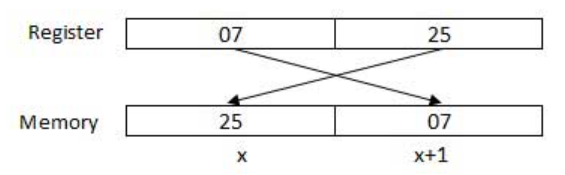

# $\fbox{Chapter 3: ENVIRONMENT SETUP}$


## **Topic – 1: Setting Up GAS In Linux**

1. Check the processor architecture, it must be `x86_64`.

```sh
uname -a
```

2. Install the GNU assembler `as` (packed with other binary tools like the linker `ld`).

```sh
sudo apt update
sudo apt install binutils
```

3. Check version information.

```sh
as --version
```


## **Topic – 2: Assembling & Linking Program**

1. Assemble the AT&T code.

```sh
as -o hello.o hello.s
```

2. Link the libraries.

```sh
ld -o hello hello.o
```

3. Run the program.

```sh
./hello
```


## **Topic – 2: Testing Basic Code**

### <u>Hello, World!</u>

```gas
.section    .data
msg:        .asciz "Hello, world!\n"

.section    .text
.global _start

_start:
    mov     $1, %rax        # syscall: write
    mov     $1, %rdi        # file descriptor: stdout
    mov     $msg, %rsi      # message to write
    mov     $14, %rdx       # message length
    syscall
	
    mov     $60, %rax       # syscall: exit
    xor     %rdi, %rdi      # exit code 0
    syscall
```

- `.data` & `.text` are segments, we will see `.stack` segment later.
- **<u>Literals</u>:** Constants


## **Topic – 3: Facts To Note**

### <u>Addressing Data In Memory</u>

- Each two digit of a number is broken down into a byte.
- For example, `0725H` can be broken down into `07` (MS Byte) & `25` (LS Byte).
- But these bytes will be stored in reverse order at memory.



- When processor reads it from the memory, it is reversed again to be read in right order.
- **<u>Absolute address</u>:** Direct reference to a memory location.
- **<u>Segment address/ offset</u>:** Starting address of a memory address.


## **Topic – 4: Basic Syntax Rules**

### <u>Sections</u>

- **<u>Data section</u>:** Used for declaring global/static data with section `.data`.
- **<u>Bss section</u>:** Used for declaring variables with section `.bss`.
- **<u>Text section</u>:** Used for implementing code with section `.text`.


### <u>Assembly Statements</u>

- Consists of three types that are executable instructions, assembler directives & macros.
- **<u>Executable instruction</u>:** Also simply known as instruction, tells processor what to do through opcodes. They generate machine codes.
- **<u>Assembler directives</u>:** Also known as pseudo-ops, tells about some processor aspects & doesn’t produce machine codes.
- **<u>Macros</u>:** A text substitution mechanism.


### <u>Assembly Syntax</u>

```gas
[label] mnemonic [operands] [;comment]
```

- Fields in square brackets are optional.
- Operands are also known as parameters.

---
