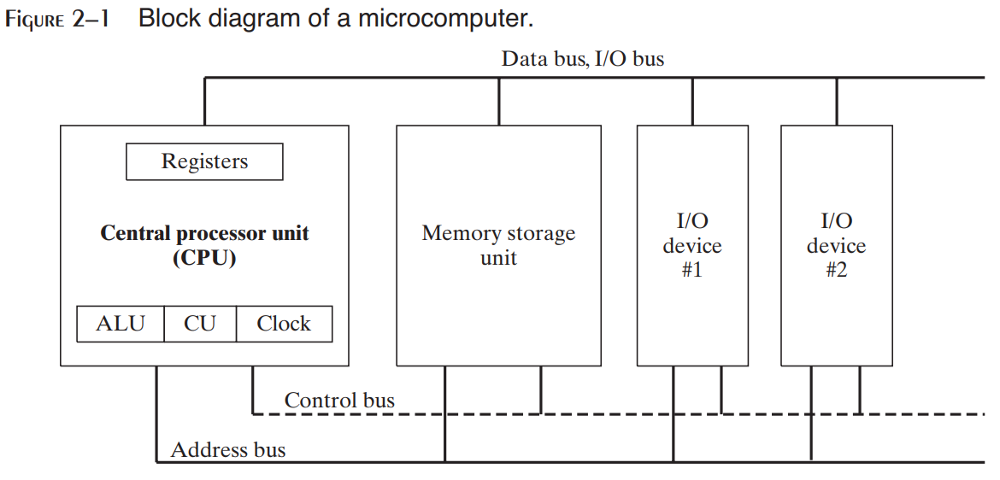
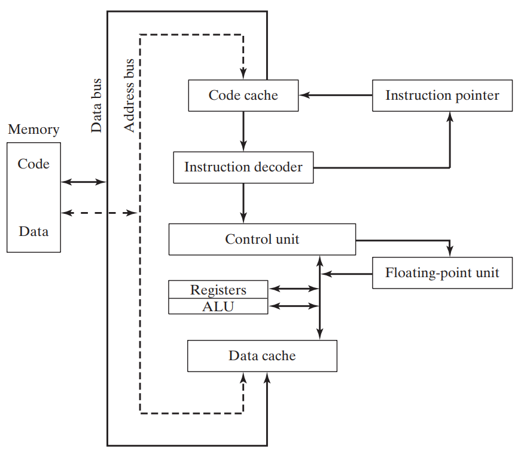

# $\fbox{Chapter 3: INNER WORKING MECHANISM}$

## **Topic – 1: General Concepts**

### <u>Introduction</u>

- x86 microprocessors are used in both Intel & AMD processors.
- This includes Intel IA-32 & Intel 64 processors like Intel Pentium & Core-Duo.
- **<u>AMD</u>:** Advanced micro devices.
- It also includes AMD processors such as Athlon, Phenom, Opteron & AMD64.

### <u>Basic Microcomputer Design</u>

- CPU contains registers, high-frequency clock, a CU (control unit) & ALU.
- **<u>CU</u>:** Puts machine instructions to be executed in a meaningful sequence.
- **<u>ALU</u>:** Performs arithmetic & logical (AND, OR, NOT etc) operations.
- CPU is attached to whole computer via its pins which are connected to socket present in the motherboard.
- Its most pins are connected to the data bus, control bus & address bus.

### <u>Data Transfer Mechanism</u>

- **<u>Memory storage unit</u>:** Stores the instructions & data of a running program.
- HDD & SSD etc are type of memory storage unit.
- For execution of a program, it is first loaded to RAM.
- CPU requests storage unit for data.
- Programs are then copied from RAM to CPU for being processed.
- And finally, data are transferred from CPU to storage unit.

### <u>Buses</u>

- **<u>Bus</u>:** Group of parallel wires that transfer data from one part to another in computer.
- Types of buses are data, I/O, control & address.
- **<u>Data bus</u>:** Transfers instructions & data between CPU & memory.
- **<u>I/O bus</u>:** Transfers data between CPU and peripheral devices.
- **<u>Control bus</u>:** **Synchronizes** all devices connected to bus system by using binary signals.
- **<u>Address bus</u>:** Contains addresses of instructions & data being transferred between CPU & memory.

### **<u>Clock</u>**

- Synchronizes CPU & system bus when they are active.
- Pulses at a constant rate.
- **<u>Machine cycle/ clock cycle</u>:** Unit of time for measuring machine instructions.

- One clock cycle is the time required for one clock pulse to complete.

$$ Duration\;of\;clock\;cycle\;=\;Reciprocal\;of\;clock’s\;speed $$

### <u>Example</u>

- A clock that oscillates 1 billion times per second (clock speed of 1 GHz), has a clock cycle of 1 billionth of a second (1 nano second).
- One machine instruction requires at least one clock cycle to execute.
- Some instructions require more than 50 clock cycles to execute.
- Like multiply instruction in 8088 processor.
- **<u>Wait states</u>:** Empty clock cycles.
- It is called wait state due to unsynchronized CPU, system bus & memory circuits for that duration.
- Instructions requiring memory access often go through wait states.
- Clock pulses are required mainly for executing instructions.
- That’s why when accessing memory, clock pulses are temporarily halted (clock cycle).

### <u>Instruction Execution Cycle</u>

- It is a predefined procedure CPU goes through for executing a machine instruction.
- **<u>Instruction pointer register</u>:** Contains the address of the instruction to be executed.
- The bit pattern of an instruction can also tell us what operands (inputs) it has.

## **Topic – 2: Steps for Instruction Execution**

### <u>Steps In Brief</u>

1. CPU fetches instruction from instruction queue.
2. CPU increments the instruction pointer.
3. CPU decodes the instruction by reading its binary bits signature.
4. If operands are involved, they are fetched from registers & memory.
5. CPU executes the instruction using those operands.
6. CPU updates some status flags (zero, overflow, carry etc).
7. If an output operand is involved, then CPU stores output result in it.

### <u>In Nutshell</u>

- In short – Fetch, decode & execute.

$$ Z = X + Y $$

- $X$ & $Y$ are input operands, $Z$ is output operand.

### <u>Reading Instructions From Memory</u>

- Computer reads memory slower than accessing registers.
- This is because 4 steps are involved when reading a value from memory.

### <u>Steps In Brief - II</u>

1. Address is sent through address bus.
2. Change the processor’s RD (read) pin’s status.
3. Then memory chips take **one** clock cycle to respond.
4. Copy of requested data is sent through data bus to the destination operand.

### <u>About Steps</u>

- Each of these steps take one clock cycle each.
- Whereas the CPU registers are accessed in one clock cycle.
- To solve this issue, the CPU designers created memory cache.
- **<u>Cache</u>:** Fast access memory which stores recently used instructions.
- This is because recently used instructions are expected to be used again soon.
- Cache stores both memory of the instruction & the codes of instructions.
- **<u>Cache hit</u>:** CPU finds something it was finding in cache.
- **<u>Cache miss</u>:** CPU doesn’t find something it was finding in cache.

### <u>Types Of Cache</u>

- **<u>Level – I cache</u>:** Also known as primary cache & stored on CPU itself.
- **<u>Level – II cache</u>:** Also known as secondary cache & stored near the CPU.
- **Level – II cache** is little slower than **level – I cache** & attached to CPU through a high-speed bus.
- Cache is faster than conventional RAM because it uses static RAM.
- **<u>Conventional RAM</u>:** Dynamic RAM
- Static RAM is faster than dynamic RAM because it holds its contents without being refreshed.
- Thus, its expensive too.

### <u>Loading & Executing Program</u>

- Program loader loads the program into memory.
- Then the OS points CPU to the entry point of our program.
- The address of entry point is from where the execution has to start.
- But there are more steps involved in it.

### <u>Steps In Brief - III</u>

1. OS searches for the program using its filename in the current & surrounding directories.
2. Then the OS finds location of next free block of memory in RAM.
3. When found, information like its file size & physical location on disk are fetched. This block is called descriptor table.
4. Then a process ID is given to the running program (process).

>**<u>NOTE</u>:**
>It is OS’s responsibility to manage resources requested by the instruction & keep track of the program.

### <u>Task Manager Processes (Windows)</u>

- Applications processes
- Background processes
- Windows processes

---
