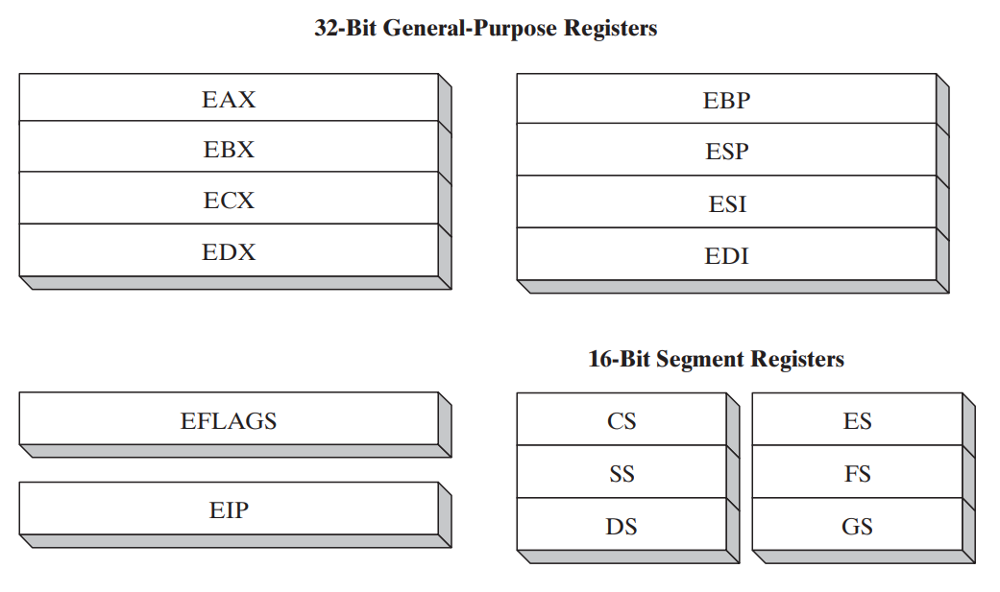
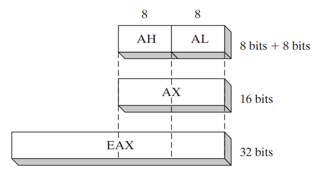
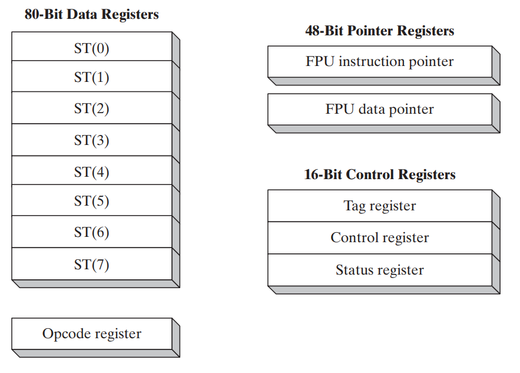

# $\fbox{Chapter 4: x86-32 Processors}$

## **Topic – 1: 32-Bit x86 Processors**

### <u>Included Processors</u>

- It includes 32-bit processors of both Intel and AMD.

### <u>Modes Of Operation</u>

- Protected mode
- Real-address mode
- System management mode (SMM)
- Virtual-8086 mode

### <u>Modes Description</u>

- First three modes are primary modes & last one is secondary mode

### <u>Protected Mode</u>

- It is the default state of the processor.
- Programmer is free to use all features here.
- Each program runs in separate memory spaces called **segments**.
- Processor avoids each program from crossing their segment.
- This ensures that any trouble in a program doesn’t affect other processes running at the same time by entering its memory space.

### <u>Virtual-8086 mode</u>

- Same as protected mode but it has ability to run multiple sessions parallelly.

### <u>Real-Address Mode</u>

- Provides an early Intel processor environment to write instructions.
- But with some extra features, like switching to other modes when within this mode.
- Now an advantage of using old Intel interface is that it provides direct access to memory & devices.

### <u>System Management Mode (SMM)</u>

- Allows programmers to implement features like power management & system security.
- And these are used by computer manufacturers.

## **Topic – 2: Basic Execution Environment**

### <u>Address Space</u>

- In protected mode, a program can address up to **4 GB** of linear space.
- However, a technique called extended physical addressing in **P6 processor** allows up to **64 GB** of linear addressing.
- Whereas in real-addressing mode, a program can address only up to **1 MB** of linear space.
- So, in virtual-8086 mode each session can address up to **1 MB** of linear space.

## **Topic – 3: Basic Program Execution Registers**

### <u>Introduction</u>

- Registers are storage locations which are faster than memory.
- So, when loops are optimized, they are stored in registers instead variables.
- There are 8 general-purpose registers, 6 segment registers, a status flag register & an instruction pointer.

### <u>General Purpose Registers (GPR)</u>

- Primarily used for arithmetic & data movements.
- The **lower** **16-bits** of EAX register is referenced by name AX.

- We can access the lower & higher **8-bits** of lower **16-bits** in half of the general-purpose registers.
- The higher **8-bits** of **AX** is referenced as **AH** & lower **8-bits** are as **AL**.

| 32-Bit | 16-Bit | 8-Bit (High) | 8-Bit (Low) |
| :----: | :----: | :----------: | :---------: |
|  EAX   |   AX   |      AH      |     AL      |
|  EBX   |   BX   |      BH      |     BL      |

- We can access lower **16-bits** of rest half of the general-purpose registers.

| 32-Bit | 16-Bit |
| :----: | :----: |
|  ESI   |   SI   |
|  EDI   |   DI   |
|  EBP   |   BP   |
|  ESP   |   SP   |

## **Topic – 4: Specialized Uses Of GPRs**

### <u>EAX</u>

- Automatically used for multiplication & division.
- Also called extended accumulator register.

### <u>ECX</u>

- Automatically used as a loop counter.

### <u>ESP</u>

- Addresses data in stack.
- **<u>Stack</u>:** A type of memory structure in system.
- It is not used much in arithmetic & data transfer operations.
- Also called extended stack pointer register.

### <u>ESI</u>

- Used in high-speed memory transfers.
- Also called extended source index register.

### <u>EDI</u>

- It is also used in high-speed memory transfers.
- Also called extended destination index register.

### <u>EBP</u>

- Used by high-level languages to reference function parameters & local variables on stack.
- It is advised not to be used in ordinary arithmetic & data transfers.
- Also called extended frame pointer register.

## **Topic – 5: More Types Of Registers**

### <u>Segment Register</u>

- Segment registers are of **16-bits**.
- In real-addressing mode, they hold values of real base addresses of some memory segments.
- In protected mode, they hold pointers to segment descriptor tables.
- Some of it hold the instructions (code), some hold variables (data) & segment stack register holds local function’s variables and parameters.

### <u>Instruction Pointer</u>

- **EIP** is instruction pointer register.
- It contains the address of next instruction to be executed.
- We can manipulate **EIP** through code in order to branch program at new location.

### <u>EFLAGS Register</u>

- Contains individual **bits** that can manipulate operations of CPU & also tell the nature of some operations.
- We call flag as set when it is `1` & clear when it is `0`.

## **Topic – 6: EFLAGS Register (Brief)**

### <u>Control Flags</u>

- Can controls the CPU’s operations.
- Example 1 - Breaking & interrupting when out of range value is detected.
- Example 2 - Entering different modes like virtual-8086 or protected mode etc.
- Flags like direction and interrupt can be set in EFLAGS register.

### <u>Status Flags</u>

- **<u>Carry flag (CF)</u>:** Set when result of an unsigned arithmetic operation is too large to fit at the destination.
- **<u>Overflow flag (OF)</u>:** Set when result of a signed arithmetic operation is too large or too small to fit at the destination.
- **<u>Sign flag (SF)</u>:** Set when result of an operation is negative.
- **<u>Zero flag (ZF)</u>:** Set when result of an operation is zero.
- **<u>Auxiliary carry (AC)</u>:** In an **8-bit** operator, it is set when an arithmetic operation generates a carry on the 4th bit from 3rd bit.
- **<u>Parity flag (PF)</u>:** Set when least significant byte in a result contains even number of 1s.

## **Topic – 7: MMX Registers**

- **MMX** registers are of **64-bit** each.
- **MMX** is a technology that has enhanced performance of Intel processors.
- They are used in advanced multimedia & communication applications.
- There are 8 MMX registers which support special instructions called SIMD.
- **<u>SIMD</u>:** Single-instruction, multiple-data
- **MMX** registers can operate on multiple values in it parallelly.
- Same registers are used by floating-point unit (FPU).

## **Topic – 8: XMM Registers**

### <u>Introduction</u>

- These are set of eight **128-bit** registers.
- They can be used by connecting **SIMD** extensions to the instruction set.

### <u>Floating-Point Unit (FPU)</u>

- Does high-speed floating-point arithmetic.
- Earlier separate chip was required for it, but now it is attached to the main processor.
- There are 8 registers in FPU, from **ST(0)** to **ST(7)**.
- Rest of them are control & pointer registers.

## **Topic – 9: x86 Memory Management**

### <u>Introduction</u>

- Processor’s way of managing memory varies from mode to mode.
- Protected mode is the most powerful mode & it restricts application programs from directly accessing hardware.
- In real-addressing mode **20 MB** of memory can be addressed $(00000)_{16}$ to $(FFFFF)_{16}$.
- And application programs are free to access any location, even those linked directly to system hardware.
- MS-DOS runs in this mode, while ***Windows 95*** and ***98*** can switch to it by booting.

### <u>Nuisance Around Protected Mode</u>

- In protected-mode, programs can’t access each other’s data.
- Modern Windows and Linux run in protected mode.
- In virtual-8086 mode, Windows NT and 2000 had Command window which allowed users to run virtual-8086 machine.
- While in those OSes, some programs using MS-DOS won’t run.

---