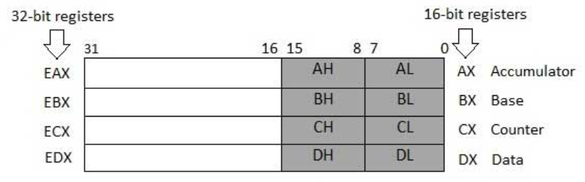
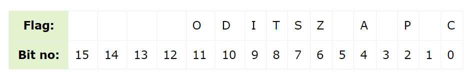

# $\fbox{Chapter 8: REGISTERS REVISION}$


## **Topic – 1: Memory Segments**

### <u>Introduction</u>

- We can replace the `section` keyword with `segment`.
- As per the program we write, system memory is divided into many memory segments to store different types of data.
- One segment stores instructions, one stores data, while another one stores the program stack.


### <u>Comment About Segments</u>

- Data segment is represented by `.data` & `.bss` sections.
- Memory space occupied by `.data` is fixed from starting, while it may change for variables in `bss` section.
- We can change the data present at data section.
- The difference between `data` & `bss` section is that variables at data comes initialized while variables in `bss` is initialized in runtime.
- `text` section is also a fixed area because we can’t modify the program when it is running.
- **<u>Stack segment</u>:** Stores the values of data passed to functions & procedures throughout the program.
- Stores and removes data in style of a stack.


## **Topic – 2: Registers**

### <u>Introduction</u>

- Data can be stored in memory too during execution of a program.
- But this process is slow, as it includes sending signal for data request on the control bus & waiting for the data to be transferred from data bus.
- **<u>Registers</u>:** Fast access memory locations in CPU.


### <u>Types Of Registers</u>

- **General registers –** Data registers, pointer registers & index registers.
- **Control registers**
- **Segment registers**


### <u>Data Registers</u>



- For the **64-bit** registers, same registers are extended by **32-bits**.
- **<u>Primary accumulator (AX)</u>:** Used in I/O & arithmetic operations.
- **<u>Base register (BX)</u>:** Used for addressing through indexes.
- **<u>Count register (CX)</u>:** Generally used to store loop count.
- **<u>Data register (DX)</u>:** Used in I/O & arithmetic operations with AX.


### <u>Pointer Registers</u>

- Includes RIP, RSP & RBP.
- **<u>Instruction pointer (IP)</u>:** Points to the address of next instruction to be executed. Gives **address** of current instruction when combined with bits of CS register.
- **<u>Stack pointer (SP)</u>:** Points to the offset of program stack. Gives position of current instruction when combined with SS register.
- **<u>Base pointer (BP)</u>:** Helps in referencing to parameter variables passed to a sub-routine. Combined with SS register to get address of a particular variable.
- BP is often combined with DI & SI for special addressing purposes.


### <u>Index Registers</u>

- These are RSI & RDI.
- Are primarily used in addressing through indexes & sometimes for addition or subtraction.
- **Source index (SI) –** Used as source index in string operations.
- **Destination index (DI) –** Used as destination index in string operations.


### <u>Control Registers</u>

- **32-bit** IP register & **32-bit** flag register are together known as control registers.
- Some instructions that compare or do mathematical calculations may result in changing status of certain flags.


### <u>Flag Bits</u>

- **Overflow flag (OF)**
- **<u>Direction flag (DF)</u>:** Tells the **direction** of string’s character comparison. `0` means left to right.
- **<u>Interrupt flag (IF)</u>:** Disables external interrupts like keyboard at `0`.
- **<u>Trap flag (TF)</u>:** It is enabled when an instruction is getting executed & no other program can interfere at that time.
- **Sign flag (SF)**
- **Zero flag (ZF)**
- **<u>Auxiliary carry flag (AX)</u>:** Enabled when a carry is generated for 4th bit from 3rd bit.
- **<u>Parity flag (PF)</u>:** Set to `0` when the number of 1s in a result is even.
- **Carry flag (CF)**
- CF also stores last bit of a shift & rotate operation.




### <u>Segment Registers</u>

- CS register stores the starting address of the code segment.
- DS register stores the starting address of the data segment.
- SS register stores the starting address of the stack segment.
- Other segment registers are ES (extra segment), FS & GS.


## **Topic – 3: Memory Address**

- Addresses are stored in hexadecimal form.
- And segment addresses (offsets) are divisible by decimal `16` (hex `10`).
- So, the last digit isn’t stored in segment register, being very obvious.
- To reference any memory location in a segment, the processor combines segment address with offset of location.


## **Topic – 4: Repeated Star Program**

>**<u>TIPS</u>:**
>In new programs, focus on comment line for code & understanding what’s new.

- We will write an AT&T code to print `*` for nine times.

#### 32-bit:

```s
    .section .data

msg:
    .rept 9                # Repeat next given for 9 times
    .byte '*'              # The character
    .endr                  # End repetition

    .section .text
    .globl _start

_start:
    movl    $9, %edx       # Number of bytes to write
    movl    $msg, %ecx     # Address of the message
    movl    %ebx, %eax     # Copy EBX to EAX
    int     $0x80          # Interrupt to terminate (syscall)
```

- Notice that no newline (`0xa`) is used for constant `msg`.

```
OUTPUT:
*********
```

#### 64-bit:

```s
    .section .data

msg:
    .ascii "*********"

    .section .text
    .globl _start

_start:
    movl    $9, %edx           # Number of bytes to write
    leaq    msg(%rip), %rsi    # Address of message into rsi
    movl    $1, %edi           # File descriptor (stdout)
    movl    $1, %eax           # Syscall number for write (1)
    syscall                    # Make the syscall

    movl    $60, %eax          # Syscall number for exit (60)
    xorl    %edi, %edi         # Exit code 0
    syscall
```

- Notice use of `RSI` instead of `ECX` & `EDI` instead of `EBX`.
- `LEA` is load effective address.
- It loads address of the variable using instruction pointer.

---
