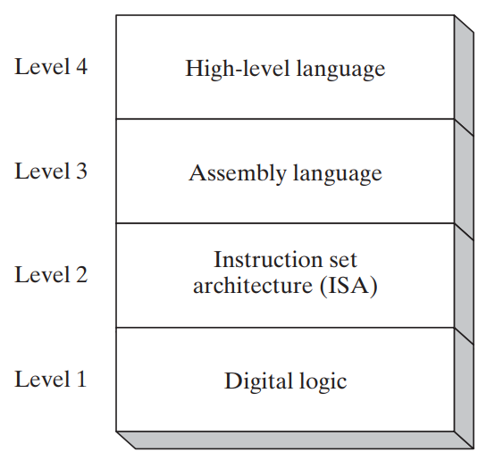

# $\fbox{Chapter 1: VIRTUAL MACHINE}$

## **Topic – 1: Questions You Might Ask**

### <u>Common Terms</u>

- **<u>Assembler</u>:** Converts assembly codes to machine code.
- **<u>Linker</u>:** Combines all related assembly programs into single executable program.
- **<u>Debugger</u>:** Allows programmer to examine registers & memories.

## **Topic – 2: Assembly Languages Rules**

### **<u>Unrestricted Memory Use</u>**

- Java restricts programmers from accessing certain memory addresses.
- To address this problem, JNI is imported for writing C code in that memory space.
- **<u>JNI</u>:** Java native interface
- Assembly on the other hand has no restriction on accessing any memory address.

### <u>Assembly Language Applications</u>

- Benefit of using OOP languages is that they can contain millions of lines of codes.

## **Topic – 3: Virtual Machine Concept**

### <u>Virtual Machines</u>

- Java uses JRE to convert its Java native code into Java byte code.
- And this Java byte code is at immediate lower level of abstraction to Java code.
- So, when executing, this Java byte code which works at lower level is executed by JVM.
- JVM is a virtual machine.
- Means user is seeing something, but there is something else happening in hardware.
- And this JVM implemented on various processor architecture is what makes Java platform independent.

### <u>Virtual Machine Levels</u>

- In ISA (level-2) the computer chip manufacturers embed microprograms.
- **<u>Microprogram</u>:** A program which executes machine code.
- **<u>Microcode Interpreter</u>:** Converts machine code into digital circuit-level operations.
- Assembly codes are easily translated to machine code.

---
