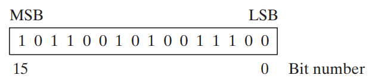

# $\fbox{Chapter 2: DIGITAL ARITHMETIC}$

## **Topic – 1: Binary Integers**

### <u>MSB & LSB</u>

- **<u>Signed binary integer</u>:** Positive or negative.
- **<u>Unsigned binary integer</u>:** Positive only (zero is also positive).
- Dots can be inserted between each **4-bits** or **8-bits** of a binary number, to make it more readable.

### <u>Unsigned Binary Integers</u>

- $2^{n}$ means possible number of values that can be formed of **n-bits**.
- Conversions involving binary values are actually unsigned binary integers.
- When converting decimal to binary, the number of bits after decimal point is ceiling ($log_{2}x$). Where $x$ is given decimal value.

### <u>Binary Addition</u>

- Suppose we add $1111$ & 0001, now we have to consider storage area!
- If storage can handle at least $5$ bits, then: $1111+0001=1\;0000$ 
- Otherwise, it is considered as: $1111+0001=0000$

## **Topic – 2: Integer Storage Sizes**

### <u>Size Measurement Units</u>

|      Unit       |    Size    |
| :-------------: | :--------: |
|      Byte       |  $1$ byte  |
|      Word       | $2$ bytes  |
|   Doubleword    | $4$ bytes  |
|    Quadword     | $8$ bytes  |
| Double quadword | $16$ bytes |

- Decimal value range of any unit above is:  $2^{(bits)}-1$

### <u>Large Size Measurement Units</u>

|   Unit    | Comparison | In Bytes |
| :-------: | :--------: | :------: |
| Petabyte  | $1024$ TB  | $2^{50}$ |
|  Exabyte  | $1024$ PB  | $2^{60}$ |
| Zettabyte | $1024$ EB  | $2^{70}$ |
| Yottabyte | $1024$ ZB  | $2^{80}$ |

## **Topic – 3: Hexadecimal Integers**

**<u>Converting To Decimal</u>**

**Any system to decimal conversion:**

**(Dn-1 \* Bn-1) + (Dn-2 \*
Bn-2) + … + (D1 \* B1) + (D2
\* B2)**

**<u>Hexadecimal Addition</u>**

- **Debuggers** usually display memory addresses in **hexadecimal**
  form.

**<u>Hexadecimal Addition Example</u>**

**When X’s A & Y’s 9 were added:**

**A + 9 = 19 \[In decimal\]**

**So, 19 % B = 3 \[B = base\]**

**Hence, 3 is result & 1 is carried to next digit.**

**Topic – 4: Signed Binary Integers**

**<u>Positive Binary v/s Negative Binary</u>**

- In this, the **MSB** determines if value if positive or negative.

**<u>2’s Complement</u>**

- It is beneficial to processor designers as it can handle both addition
  & subtraction in the same digital circuit.

- **For example:** **A – B -\> A + (-B)**

- **2’s complement is reversible** i.e., two numbers are each other’s
  2’s complement.

**Binary 2’s complement formula:**

**<u>STEP 1</u>: Reverse bits (in pack of 8-bits)**

**<u>STEP 2</u>: Add 1 to it.**

**Hexadecimal 2’s complement formula:**

**<u>STEP 1</u>: Subtract each digit’s value from 15 i.e., reversing.**

**<u>STEP 2</u>: Add 1 to it.**

**Signed binary to decimal conversion:**

**If MSB is 0, directly convert it to decimal.**

**If MSB is 1, then find its 2’s complement & then convert it to
decimal.**

**Decimal to signed binary conversion:**

**For positive integer, simply convert it to binary.**

**For negative integer, convert it to binary & then find its 2’s
complement.**

- Similar steps for decimal to hex and vice versa conversions.

- For hex integers, if MSD is **\<= 7** then its **positive**. Else it
  is **negative**.

**Binary subtraction (alternative method):**

**<u>STEP 1</u>: Keep the first binary integer as it is.**

**<u>STEP 2</u>: Find 2’s complement of the other one.**

**<u>STEP 3</u>: Now add both.**

**Topic – 5: Character Storage**

**<u>Introduction</u>**

- Characters are represented using certain integers (**ASCII code**).

- **<u>ASCII</u>:** American standard code for information interchange

- Character variables earlier used to of **1 byte** (8-bits).

- **IBM computers** still use ASCII codes.

- **8-bits** because the ASCII code is of **8 digited binary number**.

- In which, **7-bits identify character** whereas **extra 1-bit** **is
  for proprietary** over characters.

- **<u>Proprietary</u>:** Reference to ownership to something.

- On IBM compatible microcomputers, values **128 to 255** represent
  **graphic symbol** & **Greek characters**.

**<u>ANSI Character Set</u>**

- **ANSI** defines character set consisting **256 characters**.

- **First 128** characters are **letters & symbols** on standard U.S.
  keyboard.

- The **other 128** characters are **international characters,
  currencies & fractions** etc.

- Early versions of **Windows** used ANSI characters set.

**<u>Unicode Standard</u>**

- It universally defines **characters** & **symbols**.

- It defines **code points**.

- **<u>Code points</u>:** Numeric codes.

- These include characters of major languages, even right-to-left Arabic
  script.

**<u>Code To Graphic Representation Formats</u>**

- **<u>UTF-8</u>:** Used in **HTML** where byte codes are same as
  **ASCII**.

- **<u>UTF-16</u>:** Makes **economical** use of storage, and each
  character is of **2-bytes**. Used by recent versions of **Windows**.

- **<u>UTF-32</u>:** Used where storage is **not** a concern & **width**
  **of characters are fixed**. Each character is of **4-bytes**.

**<u>ASCII Strings</u>**

- Numeric codes of chars are stored **contagiously** in memory.

- **<u>Null terminated string</u>:** String ending with a null
  character.

- **<u>Null character</u>:** 0 (1-bit)

**<u>ASCII Table</u>**

- In the tables above, **2nd row is the MSB** &
  **2nd column is LSB** of hex code.

**<u>ASCII Control Characters</u>**

| **ASCII Code (Decimal)** | **Name** | **Description** |
|:--:|:--:|----|
| **8** | **Backspace** | **Moves one column to the left.** |
| **9** | **Horizontal tab** | **Skips forward n columns.** |
| **10** | **Line feed** | **Moves to next output line.** |
| **12** | **Form feed** | **Moves to next printer page.** |
| **13** | **Carriage return** | **Moves to leftmost output column.** |
| **27** | **Escape character** | **-** |

**<u>Terminology For Numeric Data Representation</u>**

- Remember that numbers & characters are stored in memory & displayed on
  screen in **different** ways.

**<u>For example</u>:**

**Decimal 65 is stored as 0100 0001 in memory.**

**A debugging program may think it is 41h.**

**And if it is copied to video memory then A (ASCII code 0100 0001) will
be displayed on screen.**

- Binary integers are stored in memory in its **raw form** & in
  **multiple of 8-bits**.

- **<u>Digit strings</u>:** Strings which appear to be numbers, like
  **“185”** or **“97”**.

**<u>Types Of Digit Strings</u>**

| **Format**                   |   **Value**    |
|------------------------------|:--------------:|
| **Binary digit string**      | **“01000001”** |
| **Decimal digit string**     |    **“65”**    |
| **Hexadecimal digit string** |    **“41”**    |
| **Octal digit string**       |   **“101”**    |

**Topic – 6: Boolean Expression**

**<u>Introduction</u>**

- Can be defined as operation on values **true** & **false**.

- Invented by **George Boole**.

- Remember all possible symbols for Boolean operators.

**<u>AND</u>**

- AND operation is carried out at **bit-level** (**bitwise**) in
  assembly.

**<u>Operator Precedence</u>**

- As per the brackets.

- If there are no brackets, move from **left to right**.

**Topic – 7: Truth Table for Boolean Functions**

- If S is **false**, then output Z will be **X**.

- Else if S is **true**, output Z will be **Y**.

**Number of S:**

**x = 2/log(n) \[n is number of inputs\]**

**Or simply, 2x = n \[x is number of S\]**
