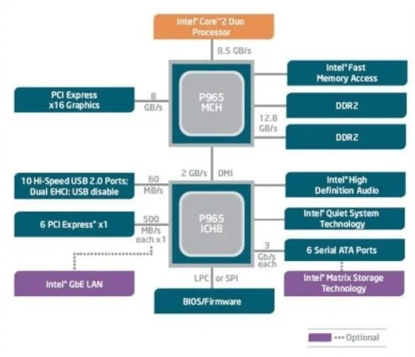
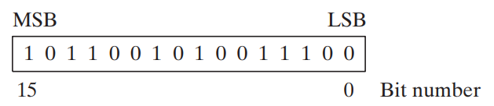
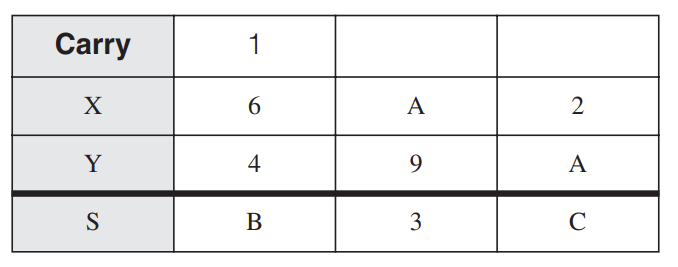

## $\fbox{Chapter 6: x86 HARDWARE COMPONENTS}$

## **Topic – 13: Components Of x86 Computers**

### <u>Motherboard Components</u>

- CPU
- Supporting processors (chipset)
- Main memory
- I/O connectors
- Power supply connectors
- Expansion slots

>**<u>NOTE</u>:**
>These components are connected to each other using bus (wires).

### <u>Expected Components</u>

- CPU socket
- Memory slots (plug-in memory boards)
- BIOS (contains system software)
- CMOS RAM (with circular battery)
- Large storage device connectors (like HDD, CD-ROMs etc)
- USB connectors
- Keyboard & mouse ports
- PCI board connectors (for sound card & graphic card etc)

### <u>Optional Components</u>

- Sound processor
- Parallel & serial device connectors
- Network adapter
- AGP bus connector (for high-speed video card)

### <u>Important Supporting Processors</u>

- **Floating-point unit (FPU)**
- **8284/82C284 clock generator –** Syncs CPU & whole computer.
- **8259A Programmable interrupt controller (PIC) –** Handles external interrupts like keyboard, system clock & hard drive.
- **8253 Programmable interface timer/counter –** Interrupts CPU 18.2 times each second to update date & time of system. Also responsible for refreshing memory because RAM can’t keep its data for more than few milliseconds.
- **8255 Programmable parallel port –** Transfers data from memory using IEEE parallel ports, they are used in devices like printers.

### <u>PCI Express Bus Architecture</u>

- PCI stands for peripheral component interconnect.
- PCI establishes a connection between CPU & other hardware devices.
- These devices can be hard disks, memory, network controllers etc.
- Recent PCIs provide bidirectional connections between CPU, memory & devices.
- And they also transfer data in packets in separate lanes, at high speeds.

### <u>Motherboard Chipset</u>

- **<u>Motherboard chipset</u>:** Set of chips embedded on particular type of motherboard.
- **Intel P965** is used with **Intel Core 2 Duo** or **Pentium D**.

### <u>Features of Intel P965</u>

- Fast memory access uses memory controller hub (MCH).
- MCH can access dual-channel DDR2 memory at **800 MHz** clock speed.
- An I/O controller hub like **Intel ICH8/R/DH** uses Intel’s matrix storage technology (MST) to support multiple hard disks.
- Supports multiple USB ports, PCI express slots, networking etc.
- Also has an HD sound chip.

## **Topic – 14: Memory**

### <u>Introduction</u>

- Types of memory used in Intel system are **ROM**, **EPROM**, **DRAM**, **SRAM**, **VRAM** & **CMOS** **RAM**.

**<u>EPROM</u>**

- Can be erased with **ultraviolet light**.

**<u>DRAM</u>**

- Also known as **main memory**.

- Stores data of **running programs**.

- Refreshed **every** **millisecond**.

- Some systems may use **ECC** (**error checking & correcting**)
  **memory** instead.

**<u>SRAM</u>**

- High speed cache memory.

- Expensive.

**<u>VRAM</u>**

- Dual-ported.

- One port **writes data** to display.

- Another port **refreshes the display** using that data.

**<u>CMOS RAM</u>**

- **CMOS RAM** stands for **Complimentary metal oxide semiconductor
  RAM**.

- Contains **system setup information** & hence **doesn’t** lose its
  content even when powered off.

- Refreshed using **system battery**.

**Topic – 15: Input-Output System**

**<u>Introduction</u>**

- We **not** necessarily need to access the hardware directly.

- This is because **OSes** provide many call functions to do so.

**<u>Levels Of I/O Access</u>**

- **<u>High-level language functions</u>:** These are functions provided
  by **high-level languages** to perform I/O operations.

- **<u>Operating system</u>:** Provides **API libraries** to perform I/O
  operations like writing & reading strings from files, allocating
  memory blocks etc.

- **<u>BIOS</u>:** Contains **subroutines** that directly communicate
  with hardware & is installed by computer manufacturer. **OSes**
  usually communicate with **BIOS**.

**<u>Device Drivers</u>**

- They allow OS to directly communicate with hardware devices.

- These devices also include **BIOS**.

- Device drivers are either **separately installed** or installed when
  **device is attached**.

- In the second case, first **device signature** is detected & then its
  **name**.

**<u>Displaying String On Screen</u>**

- **Step 1:** **HLL** (**high-level language**) statement **displays
  string** on the screen.

- **Step 2:** This function passes the **string pointer** further to an
  **OS function**.

- **Step 3:** This OS function further passes the **ASCII code** &
  **colour** of each character to a **BIOS subroutine**, using a
  **loop**.

- **Step 4:** Another **BIOS subroutine** is called to **advance the
  cursor** on screen as the characters are displayed one-by-one.

- **Step 5:** This character is then **mapped** to a **system font**.

- **Step 6:** The character is sent to a **port** attached to ***video
  controller card***.

- **Step 7:** **Video controller card** produces **hardware signals** to
  the screen which does ***raster scanning*** (lighting pixel LEDs
  horizontally line-by-line).

**<u>Programming At Multiple Levels</u>**

- **<u>Level 3</u>:** Using **libraries** to perform **text I/O** &
  **file I/O** operations.

- **<u>Level 2</u>:** Using **OS** to perform **text I/O** & **file I/O
  operations**. If an OS uses **GUI**, then it can display graphics
  **independent** of device.

- **<u>Level 1</u>:** Using **BIOS** subroutines and **manipulate**
  colours, graphics, sound, keyboard, disk & other hardware devices.

- **<u>Level 0</u>:** Receive data & specifications **directly** from
  hardware ports, but that makes it **unportable** because hardware like
  ports **may vary** across devices.

**<u>Level 1 (BIOS)</u>**

- Code at this level has to be different for **each system**.

- Or a programmer has to write code to **adjust** certain aspects which
  are **varying** across each system.

- For example, **hardware display** might be different across systems,
  so a programmer has to write code to adjust the **resolution** when
  running another system with same code.

**<u>Level 0 (Hardware)</u>**

- Generally, works with **generic devices**.

- **<u>Generic devices</u>:** Devices having many **commonness** in
  hardware design.

- Code at this level **directly communicates** with hardware **without**
  anything coming between **hardware** & **code**.

- These code needs to be modified when being **ported** to a hardware
  having some differences in design.

- Early video games were written at this level & thus had **full
  control** over the hardware.

**<u>More Insights</u>**

- At **BIOS level**, we can interact with hardware components directly.

- For example, we can communicate with **sound card** using its **device
  driver software** installed in **BIOS**.

- We can find out what **class** it belongs to & can even **fine tune**
  its performance as per its features for our needs.

- Though **not** many cards allow to make changes to its program.

- Most general-purpose OSes **don’t** allow users to directly access
  hardware in order to **avoid** making serious accidents with system.

- There are some OSes that are made for **specific devices** which
  directly interact with hardware, in order to keep **minimal memory
  occupation** rather than using complete OS.

- **MS-DOS** was **last Microsoft OS** to allow direct access to
  hardware.

- It was a **single-task** & **single-user** OS.

**Topic – 16: Summary**

**<u>Terminologies</u>**

- **<u>BIOS</u>:** A **collection of functions** that can directly
  communicate with the hardware.

- **<u>Direction flag</u>:** Tells the direction of processing (will
  know more later).

- **<u>PCI express</u>:** High-speed interface used to connect various
  components to motherboard.

- **<u>PCI</u>:** Peripheral Component Interface

- **<u>PIC</u>:** Programmable Interrupt Control

- **<u>Programmable parallel port</u>:** Port to allow transfer of data
  between computer & peripheral devices.

- **<u>SIMD</u>:** **Single-instruction multiple-device**, allows to
  execute programs involving data which are physically on **different**
  locations.

**<u>Clarity To Misconceptions</u>**

- If an arithmetic operation is **too small** or **too large** as per a
  given number bits, then the **overflow flag** is set. There is
  **nothing** like **underflow flag**.

- **REX** is used to **extend** the number of available registers for
  our **operand**.

- On a **32-bit** system, **FPU** is of **80-bits**.

- In **64-bit** chips, **not** all **64-bits** can be used for
  **addressing** because some bits are **reserved**.

- **Itanium** instruction set is completely different from **x86**.

- In **64-bit** **native** mode, you can use **16-bit real** mode but
  not **virtual-8086** mode.

- **x86-64** processors have more GPR than **x86** processors, like
  **R8**, **R9**, **R10** etc.

- Directly providing sound outputs to sound card ports can also
  **enhance audio quality**.
