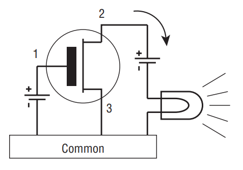
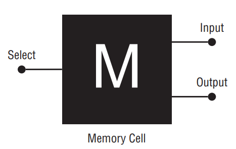
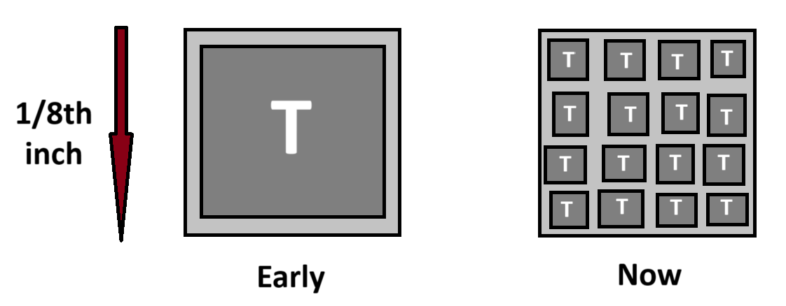
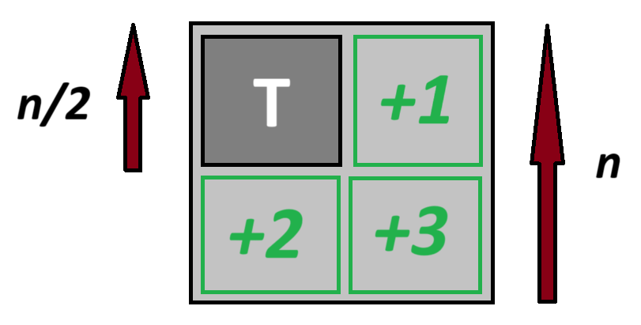
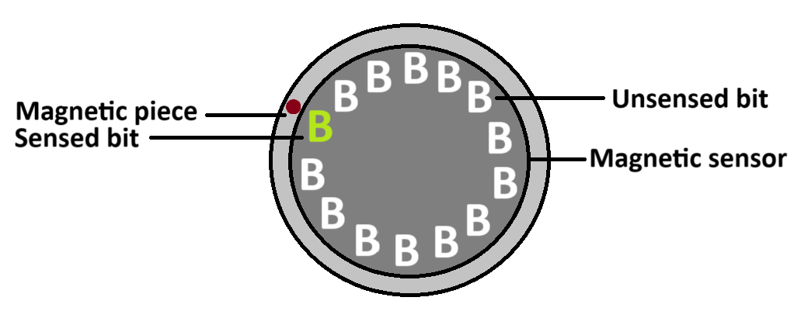
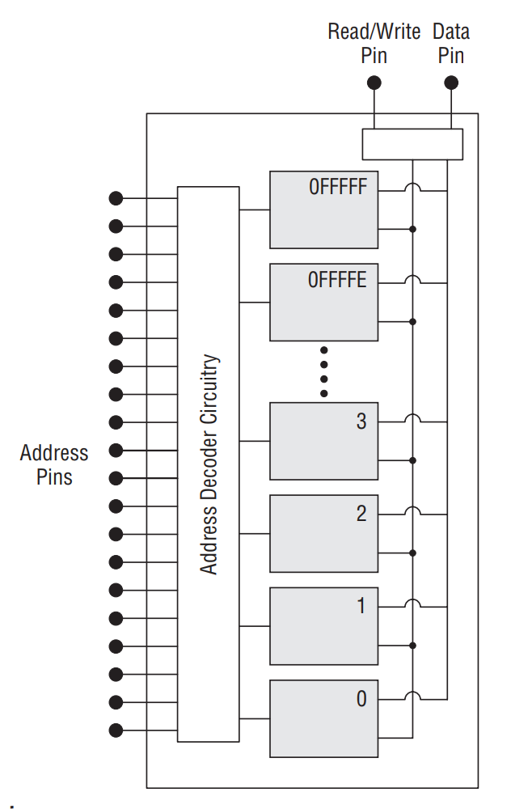
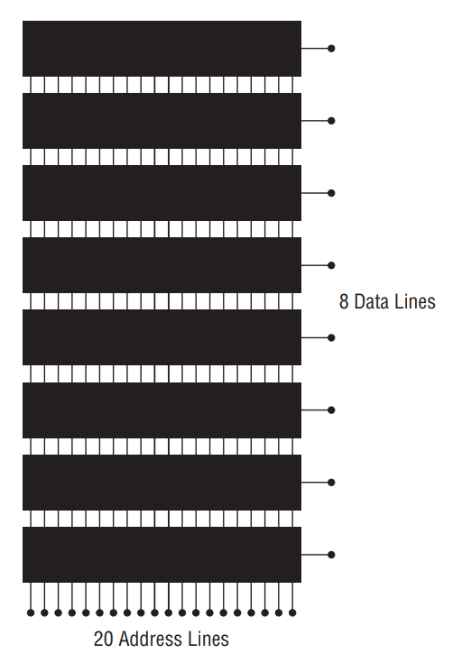
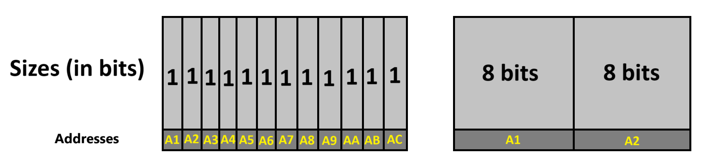
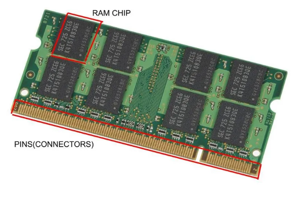

# $\fbox{Chapter 1: LIFTING THE HOOD}$

## **Topic – 1: Switches, Transistors & Memory**

### <u>Early History</u>

- Light’s **ON/OFF** switch inspired development of **memories** in
  computers.
- Type of switches used to tell machine’s state is irrelevant
  (**mechanical**, **electrical**, **steam-powered**, **hydraulic**
  etc).

### <u>Switches & Memory</u>

- **<u>Memory</u>:** A **pattern retained** by the elements in machine.
- **<u>Relay</u>:** Mechanical switch controlled by **electricity**.
- **Output** is decided by the **electrical contacts** (**patterns**)
  made by those **relays**.
- Also, memory was made with **vacuum tubes** earlier.
- Nowadays, it is made using **transistor switches**.

### <u>Transistors</u>

- **<u>Transistors</u>:** Tiny silicon crystal switches.

- When electricity is supplied to **pin 1**, it flows through **pin 2 &
  3** to activate the output bulb.
- Its simple representation would be as shown below.

- Actually, **transistors** work with **diodes** & **capacitors**.
- **<u>Diode</u>:** A semiconductor device used to make electricity flow
  in **one direction**.
- Earlier, transistors & these components were connected via **wires**.
- Transistor & these components together are known as a ***memory
  cell***, as we saw in previous diagram.

### <u>Voltage</u>

- We pass a very **minimal voltage** which is enough for circuit &
  avoids **overheating**.
- In memory cell, voltage is **constantly** always applied on **select**
  **pin**.
- If we pass it to **input pin** too, then voltage comes at the **output
  pin**.
- This level of voltage applied to any unit is **consistent** &
  magnitude **doesn’t** change.
- Capacity of this unit is a **bit**.

### <u>Silicon Chips</u>

- Early transistors were made from **silicon** or **germanium** crystal
  chips.
- Their sizes were **1/8th** of an **inch**.
- These days, the size of crystal **remains same** but **transistor**
  size has **shrunk** a lot.
- So, **more** transistors are packed into **one** crystal chip.

- Early chips were very **fragile** like **chewing gum**.

### <u>Evolution Of Chip Capacity</u>

- Chip capacity has evolved by a **factor** of **4**.
- For example, **16K** **chip** (**16,000** transistors) then becomes
  **64K chip**.
- This is because the length of transistors is **halved** in current
  generation, creating space for **3 times more** transistors to be
  added.

- Transistor sizes are **"halved"** because that’s the **minimum
  shrinking size** to properly fit more transistors over whole chip.
- But physicists warn reaching the **limit for shrinking** transistor
  sizes to a size where it becomes difficult passing **electrons**
  through them.

### <u>Serial Access Device</u>

- Memory before being evolved to be stored in **silicon chips**, were
  stored in **electromagnetic devices** called ***serial-access
  device***.
- They had rotating **magnetic piece** which stored data to the **bit**
  behind **magnetic sensor** it was crossing in circumference.

- **Hard drives** can be roughly called as **serial-access devices**.

### <u>Random Access Memory</u>

- All **bits** in **RAM** have a **unique address** for itself.
- Figure below shows **circuit diagram** of a **RAM chip**.

- ***Address pins*** carry **binary address code**.
- If a pin carries **1**, means a certain **voltage** is present there.
- Though the value of voltage **varies** from machine to machine, most
  use **5V** in them.
- So, when the **binary pattern** made by address pins is decoded, it
  lights up the matching memory cell with **5V**.
- These memory cells can be both **read** or **written** as clearly
  evident by presence of a ***read/write pin***.
- When the address pin matches to given input, data pin is light up with
  5V.

### <u>Memory Access Time</u>

- Typical memory chip access time nowadays is **30 nanoseconds**.
- The **less** the **memory access**, the **better** the
  **performance**.

### <u>Size</u>

- The way to **organize memory chips** depends on **how** we want to
  organize our information.
- When it comes to technical details, memory is measured in **bytes**.
- For units like **word**, **double** **word** or **quad word** etc, we
  mean that bytes are arranged **consecutive**.
- Similarly for a **byte**, **eight bits** are **consecutive**.

$$ 1 \; byte \; character = \; 8-bit \; binary \; code $$ 

- Computers nowadays are just increasing in processing **multiple
  bytes** at a time.
- Though having capacity of typically a **billion bits**, RAM chips
  **don’t** have more than **4 data pins**. Some even have just **1**.
- For example, take a look at the diagram below.

- This diagram shows **parallelly connected** RAM chips.
- Number of **address lines** shows how many **unique addresses** it
  contains (**220** here).
- And number of **data lines** shows its **capacity** (**8-bit** here).
- Nowadays, per address **multiple bits** are being stored.
- Refer to figure below, showing **old-style** on **left** &
  **new-style** on **right**.

- **<u>DIMM</u>:** Dual Inline Memory Modules
- **DIMMs** keep all memory chips **together**, **not** requiring each
  one to be plugged separately like old times.
- It looks as shown below.

- They usually come in **pairs**, each address with capacity of
  **32-bits** (total **64-bits**).
- This means that processors fetches & processes **64-bits** (**8
  bytes**) at a time.

>**<u>NOTE</u>:**
>Tolkien’s ***Lord Of The Rings*** reference…

- But each **byte** in **memory** has its own address, as per the
  convention.
- This means that **64-bit** CPU accesses **8 bytes** starting from the
  **requested byte**.
- Capacity of each module is around **512 MB** or **1-2 GB**.
- **How** memory chips are arranged in the system affect the **speed**
  of reading, writing or accessing memory in general.
- Basically, reading & writing is done by these chips.
