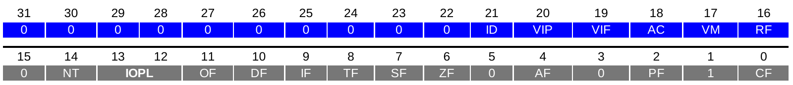

# $\fbox{Chapter 2: x86 ARCHITECTURE}$

## **Topic - 1: Registers**

### <u>Register Groups</u>

- 8 general purpose registers (GPR).
- 6 segment registers (SR).
- 1 flag register (FR).
- 1 instruction pointer (IP).

>**<u>NOTE</u>:**
>64-bit architecture contains even more registers.

### <u>General Purpose Registers</u>

1. **<u>Accumulator register (AX)</u>:** Used in arithmetic operations.
2. **<u>Base register (BX)</u>:** Pointer to data.
3. **<u>Counter register (CX)</u>:** Used in shift, rotate & loop instructions.
4. **<u>Stack pointer register (SP)</u>:** Pointer to top of the stack.
5. **<u>Stack base pointer register (BP)</u>:** Pointer to base of the stack.
6. **<u>Destination index register (DI)</u>:** Pointer to destination in stream operations.
7. **<u>Source index register (SI)</u>:** Pointer to source in stream operations.
8. **<u>Data register (DX)</u>:** Used in arithmetic & I/O operations.

>**<u>NOTE</u>:**
>1. The order above is used in push-to-stack operations.
>2. In 16-bit addressing, we address lower significant byte as AL, BL, CL etc.
>3. And AH, BH, CH etc when addressing most significant byte.
>4. 'R' in RAX, RBX, RCX etc stands for 'register'.
>5. For registers like stack pointer, stack base pointer, destination & source, higher 8-bits can not be addressed.

### <u>Segment Register</u>

1. **<u>Stack segment (SS)</u>:** Pointer to the stack.
2. **<u>Code segment (CS)</u>:** Pointer to the code.
3. **<u>Data segment (DS)</u>:** Pointer to the data.
4. **<u>Extra segment (ES)</u>:** Pointer to extra data.
5. **<u>F segment (FS)</u>:** Pointer to more extra data.
6. **<u>G segment (GS)</u>:** Pointer to even more extra data.

>**<u>NOTE</u>:**
>Notice how all the data pointing segment registers are in order D, E, F & G.

### <u>EFLAGS Register</u>

- EFLAGS register has a capacity of storing 32-bits.
- Each of it bit represents a different flag.

>**<u>WARNING</u>:**
>Bits named 0 and 1 shouldn't be changed.

#### Use cases of flags:

| Bit Number | Flag Symbol |           Flag Name            | Usage                                                                               |
| :--------: | :---------: | :----------------------------: | :---------------------------------------------------------------------------------- |
|     0      |     CF      |           Carry flag           | Set to 1 if last arithmetic operation led to borrow which is beyond register limit. |
|     2      |     PF      |          Parity flag           | Set if number of bits set in LSB are in multiple of 2.                              |
|     4      |     AF      |          Adjust flag           | Carry of arithmetic calculation among BCD numbers.                                  |
|     6      |     ZF      |           Zero flag            | Set if result of last operation was zero.                                           |
|     7      |     SF      |           Sign flag            | Set if result of last operation was negative.                                       |
|     8      |     TF      |           Trap flag            | Set if debugging step-by-step.                                                      |
|     9      |     IF      |       Interruption flag        | Set if interrupts are enabled.                                                      |
|     10     |     DF      |         Direction flag         | If set, memory will now be read backwards.                                          |
|     11     |     OF      |         Overflow flag          | Set if signed arithmetic operation results in too large value for contain.          |
|   12,13    |    IOPL     |       I/O privilege flag       | Sets I/O privilege level in 2-bits.                                                 |
|     14     |     NT      |        Nested task flag        | Set if current process is linked to upcoming process.                               |
|     16     |     RF      |          Resume flag           | Gives response to debug exceptions.                                                 |
|     17     |     VM      |       Virtual-8086 mode        | Set if in 8086 compatibility.                                                       |
|     18     |     AC      |        Alignment check         | Set if memory alignment checking has been done.                                     |
|     19     |     VIF     |     Virtual interrupt flag     | Virtual image of IF.                                                                |
|     20     |     VIP     | Virtual interrupt pending flag | Set if an interrupt is pending.                                                     |
|     21     |     ID      |      Identification flag       | Support for CPUID.                                                                  |

### <u>Instruction Pointer</u>

- EIP register contains address of next instruction to be executed.
- Can be read only after `call` instruction.

### <u>Memory</u>

- x86 architecture is little-endian.
- **<u>Little-endian</u>:** Bytes get placed from LSB.
